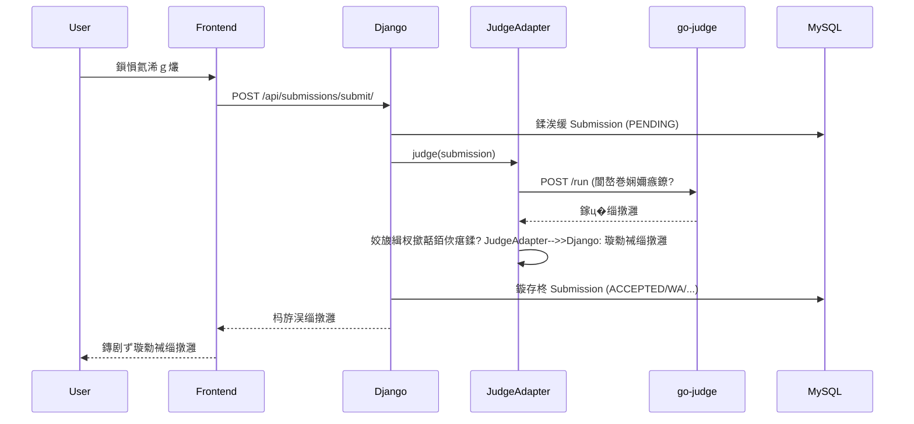
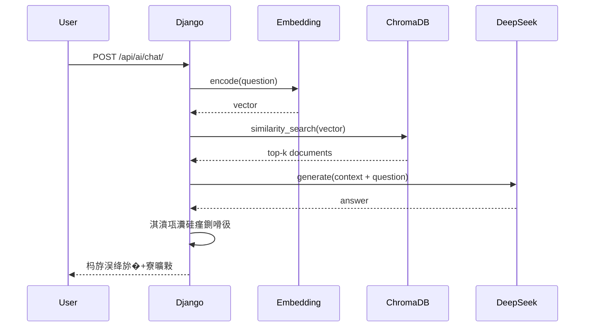

# 绯荤粺鏋舵瀯

> 馃搻 ZJOJ 鐨勬妧鏈��璁″拰鏋舵瀯鍐崇瓥

---

## 馃彈锔?鏁翠綋鏋舵瀯

```
鈹屸攢鈹€鈹€鈹€鈹€鈹€鈹€鈹€鈹€鈹€鈹€鈹€鈹€鈹€鈹?    HTTP/REST      鈹屸攢鈹€鈹€鈹€鈹€鈹€鈹€鈹€鈹€鈹€鈹€鈹€鈹€鈹€鈹€鈹€鈹€鈹?鈹?  Frontend   鈹?鈼勨攢鈹€鈹€鈹€鈹€鈹€鈹€鈹€鈹€鈹€鈹€鈹€鈹€鈹€鈹€鈹€鈻?鈹? Django Backend 鈹?鈹?(React/Vue)  鈹?                   鈹?  (ZJOJ Core)   鈹?鈹斺攢鈹€鈹€鈹€鈹€鈹€鈹€鈹€鈹€鈹€鈹€鈹€鈹€鈹€鈹?                   鈹斺攢鈹€鈹€鈹€鈹€鈹€鈹€鈹€鈹�攢鈹€鈹€鈹€鈹€鈹€鈹€鈹€鈹?                                            鈹?                    鈹屸攢鈹€鈹€鈹€鈹€鈹€鈹€鈹€鈹€鈹€鈹€鈹€鈹€鈹€鈹€鈹€鈹€鈹€鈹€鈹€鈹€鈹€鈹€鈹尖攢鈹€鈹€鈹€鈹€鈹€鈹€鈹€鈹€鈹€鈹€鈹€鈹€鈹€鈹€鈹€鈹€鈹€鈹€鈹?                    鈹?                      鈹?                  鈹?              鈹屸攢鈹€鈹€鈹€鈹€鈻尖攢鈹€鈹€鈹€鈹€鈹€鈹?        鈹屸攢鈹€鈹€鈹€鈹€鈻尖攢鈹€鈹€鈹€鈹€鈹€鈹?   鈹屸攢鈹€鈹€鈹€鈹€鈹€鈻尖攢鈹€鈹€鈹€鈹€鈹€鈹?              鈹?  MySQL    鈹?        鈹?go-judge   鈹?   鈹?ChromaDB    鈹?              鈹?Database   鈹?        鈹?Sandbox    鈹?   鈹?Vector DB   鈹?              鈹斺攢鈹€鈹€鈹€鈹€鈹€鈹€鈹€鈹€鈹€鈹€鈹€鈹?        鈹斺攢鈹€鈹€鈹€鈹€鈹€鈹€鈹€鈹€鈹€鈹€鈹€鈹?   鈹斺攢鈹€鈹€鈹€鈹€鈹€鈹€鈹€鈹€鈹€鈹€鈹€鈹€鈹?                                                            鈹?                                                      鈹屸攢鈹€鈹€鈹€鈹€鈻尖攢鈹€鈹€鈹€鈹€鈹€鈹?                                                      鈹?DeepSeek   鈹?                                                      鈹?LLM API    鈹?                                                      鈹斺攢鈹€鈹€鈹€鈹€鈹€鈹€鈹€鈹€鈹€鈹€鈹€鈹?```

---

## 馃敡 鎶€鏈�爤

### 鍚庣�鏍稿績

| 缁勪欢 | 鎶€鏈?| 鐗堟湰 | 璇存槑 |
|------|------|------|------|
| **Web妗嗘灦** | Django | 6.0.3 | MTV 鏋舵瀯锛孫RM |
| **API妗嗘灦** | DRF | Latest | RESTful API |
| **鏁版嵁搴?* | MySQL | 5.7+ | 鍏崇郴鍨嬫暟鎹�瓨鍌?|
| **璁よ瘉** | PyJWT | Latest | JWT Token |

### 璇勬祴绯荤粺

| 缁勪欢 | 鎶€鏈?| 鐗堟湰 | 璇存槑 |
|------|------|------|------|
| **娌欑�** | go-judge | v1.11.4 | 浠ｇ爜鎵ц�鐜�� |
| **閫傞厤鍣?* | Python | 3.8+ | JudgeAdapter |
| **閫氫俊** | HTTP | REST | /run API |

### AI 绯荤粺

| 缁勪欢 | 鎶€鏈?| 閮ㄧ讲鏂瑰紡 | 璇存槑 |
|------|------|----------|------|
| **Embedding** | text2vec-base-chinese | 鏈�湴 | 390MB锛孍鐩樺瓨鍌?|
| **鍚戦噺搴?* | ChromaDB | 鏈�湴 | HNSW 绱㈠紩 |
| **LLM** | DeepSeek Chat | 浜戠� | API 璋冪敤 |

---

## 馃摝 鏍稿績妯″潡

### 1. 鐢ㄦ埛璁よ瘉妯″潡 (ojauth)

**鑱岃矗**:
- 鐢ㄦ埛娉ㄥ唽鍜岀櫥褰?- JWT Token 鐢熸垚鍜岄獙璇?- 鏉冮檺绠＄悊

**鍏抽敭绫?*:
```python
OJUser(AbstractUser)       # 鑷�畾涔夌敤鎴锋ā鍨?MyJWTAuthentication        # DRF JWT 璁よ瘉绫?generate_jwt_token()       # Token 鐢熸垚鍑芥暟
```

**鏁版嵁娴?*:
```
鐧诲綍璇锋眰 鈫?楠岃瘉鐢ㄦ埛鍚嶅瘑鐮?鈫?鐢熸垚 JWT Token 鈫?杩斿洖缁欏�鎴风�
鍚庣画璇锋眰 鈫?鎼哄甫 Token 鈫?楠岃瘉绛惧悕 鈫?鑾峰彇鐢ㄦ埛淇℃伅
```

---

### 2. 棰樼洰绠＄悊妯″潡 (problem)

**鑱岃矗**:
- 棰樼洰 CRUD
- 鏍囩�鍒嗙被
- 娴嬭瘯鐢ㄤ緥绠＄悊锛圸IP 鏍煎紡锛?
**鍏抽敭妯″瀷**:
```python
Problem          # 棰樼洰锛堟爣棰樸€佹弿杩般€侀檺鍒讹級
Tag              # 鏍囩�锛堝�瀵瑰�鍏崇郴锛?TestCase         # 娴嬭瘯鐢ㄤ緥锛圸IP 鏂囦欢锛?```

**娴嬭瘯鐢ㄤ緥缁撴瀯**:
```
testcases.zip
鈹斺攢鈹€ testdata/
    鈹溾攢鈹€ 1.in
    鈹溾攢鈹€ 1.out
    鈹溾攢鈹€ 2.in
    鈹斺攢鈹€ 2.out
```

---

### 3. 璇勬祴绯荤粺妯″潡 (judge)

**鑱岃矗**:
- 浠ｇ爜缂栬瘧鍜屾墽琛?- 璧勬簮闄愬埗锛堟椂闂淬€佸唴瀛橈級
- 杈撳嚭姣旇緝鍜岃瘎鍒?
**鏋舵瀯**:
```
Submission 鈫?GoJudgeClient 鈫?JudgeAdapter 鈫?go-judge
                鈫?                                    
           璇诲彇 ZIP                               鎵ц�娌欑�
                鈫?                                     鈫?           鎻愬彇娴嬭瘯鐢ㄤ緥                          杩斿洖缁撴灉
                鈫?                                     鈫?           閬嶅巻娴嬭瘯鐐?鈫愨攢鈹€鈹€鈹€鈹€鈹€鈹€鈹€鈹€鈹€鈹€鈹€鈹€鈹€鈹€鈹€鈹€鈹€鈹€鈹€鈹€鈹€鈹€鈹€鈹€ 鎹曡幏杈撳嚭
                鈫?           姣旇緝杈撳嚭 鈫?璁＄畻鍒嗘暟 鈫?鏇存柊 Submission
```

**鏍稿績缁勪欢**:

1. **go-judge** (localhost:5050)
   - 瀹夊叏鐨勪唬鐮佹墽琛岀幆澧?   - cgroup 璧勬簮闄愬埗
   - 鏂囦欢绯荤粺闅旂�

2. **JudgeAdapter** (Python)
   - 灏佽� go-judge API
   - 澶氭祴璇曠偣閬嶅巻
   - 杈撳嚭姣旇緝锛堣�鑼冨寲绌虹櫧锛?   - 鐘舵€佸垽鏂�拰璇勫垎

3. **GoJudgeClient** (Django)
   - 涓?Django 妯″瀷闆嗘垚
   - 璇诲彇娴嬭瘯鐢ㄤ緥鏂囦欢
   - 璋冪敤 Adapter
   - 杩斿洖鏍囧噯鍖栫粨鏋?
**璇勬祴鐘舵€?*:
- `AC` - Accepted
- `WA` - Wrong Answer
- `TLE` - Time Limit Exceeded
- `MLE` - Memory Limit Exceeded
- `RE` - Runtime Error
- `CE` - Compilation Error
- `SE` - System Error

---

### 4. AI 鍔╂墜妯″潡 (ai_assistant)

**鑱岃矗**:
- RAG 鏅鸿兘闂�瓟
- 鐭ヨ瘑搴撶�鐞?- 瀵硅瘽鍘嗗彶

**鏋舵瀯**:
```
鐢ㄦ埛鎻愰棶 鈫?Embedding 缂栫爜 鈫?ChromaDB 妫€绱?
         鈫?缁勮�涓婁笅鏂?鈫?DeepSeek LLM 鈫?杩斿洖绛旀�
```

**鏍稿績缁勪欢**:

1. **EmbeddingService**
   - text2vec-base-chinese 妯″瀷
   - 鏈�湴閮ㄧ讲锛?90MB
   - 瀛樺偍璺�緞锛歚E:/ai_models/cache`

2. **VectorStore**
   - ChromaDB 鍚戦噺鏁版嵁搴?   - HNSW 绱㈠紩鍔犻€?   - 瀛樺偍璺�緞锛歚E:/ai_data/chroma_db`

3. **LLMClient**
   - DeepSeek API 瀹㈡埛绔?   - 浜戠�璋冪敤锛屾寜閲忎粯璐?   - 妯″瀷锛歞eepseek-chat

4. **RAGEngine**
   - 妫€绱㈠�寮虹敓鎴愬紩鎿?   - Top-K 鐩镐技搴︽�绱?   - 涓婁笅鏂囩粍瑁呭拰鎻愮ず璇嶅伐绋?
**閰嶉�绠＄悊**:
- 姣忔棩闄愰�锛?0 娆?- 棰戠巼闄愬埗锛?0绉掑唴鏈€澶?10 娆?- 鍘嗗彶璁板綍锛氭渶澶?100 鏉?
---

## 馃攧 鏁版嵁娴?
### 浠ｇ爜鎻愪氦娴佺▼



### AI 闂�瓟娴佺▼



---

## 馃敀 瀹夊叏璁捐�

### 璁よ瘉鍜屾巿鏉?
1. **JWT Token**
   - HS256 绛惧悕绠楁硶
   - 鏈夋晥鏈燂細24 灏忔椂
   - 鍖呭惈鐢ㄦ埛 ID 鍜岃�鑹?
2. **鏉冮檺鎺у埗**
   - DRF Permission Classes
   - 鍩轰簬瑙掕壊鐨勮�闂�帶鍒讹紙RBAC锛?   - 缁嗙矑搴︽潈闄愶紙璇?鍐?鍒犻櫎锛?
### 浠ｇ爜娌欑�瀹夊叏

1. **璧勬簮闄愬埗**
   - CPU 鏃堕棿锛歝group cpuLimit
   - 鍐呭瓨锛歝group memoryLimit
   - 杩涚▼鏁帮細procLimit = 50

2. **鏂囦欢绯荤粺闅旂�**
   - chroot 鏍规枃浠剁郴缁?   - mount namespace
   - 鍙��鎸傝浇绯荤粺鐩�綍

3. **缃戠粶绂佺敤**
   - 娌欑�鍐呮棤娉曡�闂�綉缁?   - 闃叉�鎭舵剰浠ｇ爜澶栬仈

---

## 馃搳 鎬ц兘浼樺寲

### 鏁版嵁搴撲紭鍖?
- 绱㈠紩绛栫暐锛氬父鐢ㄦ煡璇㈠瓧娈垫坊鍔犵储寮?- 杩炴帴姹狅細Django 榛樿�杩炴帴姹?- 鏌ヨ�浼樺寲锛氫娇鐢?`select_related` 鍜?`prefetch_related`

### 璇勬祴浼樺寲

- 骞惰�璇勬祴锛氬�涓�祴璇曠偣鍙�苟琛屾墽琛岋紙鏈�潵锛?- 缂栬瘧缂撳瓨锛氱浉鍚屼唬鐮佷笉閲嶅�缂栬瘧锛堟湭鏉ワ級
- 寮傛�澶勭悊锛欳elery 寮傛�浠诲姟闃熷垪锛堝彲閫夛級

### AI 浼樺寲

- 鍚戦噺绱㈠紩锛欻NSW 鍔犻€熸�绱?- 缂撳瓨鏈哄埗锛氬父瑙侀棶棰樼瓟妗堢紦瀛橈紙鏈�潵锛?- 鎵归噺 Embedding锛氬噺灏戞ā鍨嬪姞杞芥�鏁?
---

## 馃殌 鎵╁睍鎬?
### 姘村钩鎵╁睍

- **Django**: Gunicorn + Nginx锛屽� Worker
- **MySQL**: 涓讳粠澶嶅埗锛岃�鍐欏垎绂?- **go-judge**: 澶氬疄渚嬭礋杞藉潎琛★紙鏈�潵锛?
### 鍨傜洿鎵╁睍

- 澧炲姞鏈嶅姟鍣ㄨ祫婧愰厤缃?- 浼樺寲鏁版嵁搴撴煡璇?- 缂撳瓨鐑�偣鏁版嵁

---

## 馃摑 鏋舵瀯鍐崇瓥璁板綍

### ADR-001: 閫夋嫨 go-judge 鑰岄潪 Hydro Judge

**鑳屾櫙**: 鏈€鍒濆皾璇曚娇鐢ㄥ畬鏁寸殑 Hydro Judge锛屼絾閬囧埌 cgroup v1 鍏煎�鎬ч棶棰樸€?
**鍐崇瓥**: 鐩存帴浣跨敤 go-judge + Python Adapter 鏂规�銆?
**鐞嗙敱**:
- 鉁?鏇寸畝鍗曪紝灏戜竴灞傛娊璞?- 鉁?鏇存槗璋冭瘯鍜岀淮鎶?- 鉁?鎬ц兘鏇村ソ锛堝皯涓€娆＄綉缁滆皟鐢�級
- 鉂?闇€瑕佽嚜宸卞疄鐜板�娴嬭瘯鐐归€昏緫

**鍚庢灉**: 闇€瑕佸湪 Python 灞傚疄鐜拌緭鍑烘瘮杈冨拰璇勫垎閫昏緫銆?
---

### ADR-002: 娣峰悎閮ㄧ讲 AI 鏈嶅姟

**鑳屾櫙**: Embedding 妯″瀷杈冨ぇ锛?90MB锛夛紝LLM 鎺ㄧ悊鎴愭湰楂樸€?
**鍐崇瓥**: Embedding 鏈�湴閮ㄧ讲锛孡LM 浜戠�璋冪敤銆?
**鐞嗙敱**:
- 鉁?Embedding 棰戠箒璋冪敤锛屾湰鍦版洿蹇?- 鉁?LLM 鎸夐渶璋冪敤锛屼簯绔�洿缁忔祹
- 鉁?閬垮厤鏈�湴 GPU 渚濊禆

**鍚庢灉**: 闇€瑕佺ǔ瀹氱殑缃戠粶杩炴帴璁块棶 DeepSeek API銆?
---

<div align="center">

**缁х画闃呰� 鈫?* [閮ㄧ讲鎸囧崡](03-DEPLOYMENT.md)

</div>
