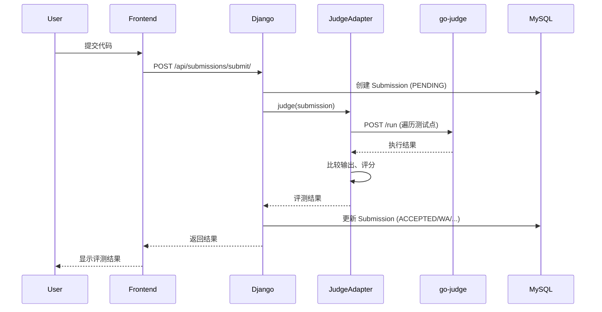
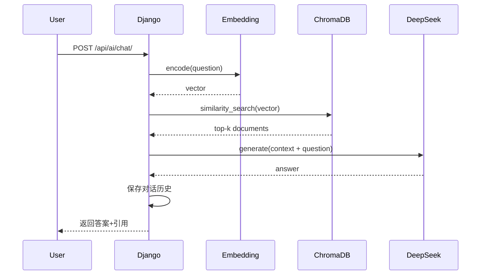

# 系统架构

> 📐 ZJOJ 的技术设计和架构决策

---

## 🏗️ 整体架构

```
┌──────────────┐     HTTP/REST      ┌─────────────────┐
│   Frontend   │ ◄────────────────► │  Django Backend │
│ (React/Vue)  │                    │   (ZJOJ Core)   │
└──────────────┘                    └────────┬────────┘
                                            │
                    ┌───────────────────────┼───────────────────┐
                    │                       │                   │
              ┌─────▼──────┐         ┌─────▼──────┐    ┌──────▼──────┐
              │   MySQL    │         │ go-judge   │    │ ChromaDB    │
              │ Database   │         │ Sandbox    │    │ Vector DB   │
              └────────────┘         └────────────┘    └─────────────┘
                                                            │
                                                      ┌─────▼──────┐
                                                      │ DeepSeek   │
                                                      │ LLM API    │
                                                      └────────────┘
```

---

## 🔧 技术栈

### 后端核心

| 组件 | 技术 | 版本 | 说明 |
|------|------|------|------|
| **Web框架** | Django | 6.0.3 | MTV 架构，ORM |
| **API框架** | DRF | Latest | RESTful API |
| **数据库** | MySQL | 5.7+ | 关系型数据存储 |
| **认证** | PyJWT | Latest | JWT Token |

### 评测系统

| 组件 | 技术 | 版本 | 说明 |
|------|------|------|------|
| **沙箱** | go-judge | v1.11.4 | 代码执行环境 |
| **适配器** | Python | 3.8+ | JudgeAdapter |
| **通信** | HTTP | REST | /run API |

### AI 系统

| 组件 | 技术 | 部署方式 | 说明 |
|------|------|----------|------|
| **Embedding** | text2vec-base-chinese | 本地 | 390MB，E盘存储 |
| **向量库** | ChromaDB | 本地 | HNSW 索引 |
| **LLM** | DeepSeek Chat | 云端 | API 调用 |

---

## 📦 核心模块

### 1. 用户认证模块 (ojauth)

**职责**:
- 用户注册和登录
- JWT Token 生成和验证
- 权限管理

**关键类**:
```python
OJUser(AbstractUser)       # 自定义用户模型
MyJWTAuthentication        # DRF JWT 认证类
generate_jwt_token()       # Token 生成函数
```

**数据流**:
```
登录请求 → 验证用户名密码 → 生成 JWT Token → 返回给客户端
后续请求 → 携带 Token → 验证签名 → 获取用户信息
```

---

### 2. 题目管理模块 (problem)

**职责**:
- 题目 CRUD
- 标签分类
- 测试用例管理（ZIP 格式）

**关键模型**:
```python
Problem          # 题目（标题、描述、限制）
Tag              # 标签（多对多关系）
TestCase         # 测试用例（ZIP 文件）
```

**测试用例结构**:
```
testcases.zip
└── testdata/
    ├── 1.in
    ├── 1.out
    ├── 2.in
    └── 2.out
```

---

### 3. 评测系统模块 (judge)

**职责**:
- 代码编译和执行
- 资源限制（时间、内存）
- 输出比较和评分

**架构**:
```
Submission → HydroJudgeClient → JudgeAdapter → go-judge
                ↓                                     
           读取 ZIP                               执行沙箱
                ↓                                      ↓
           提取测试用例                          返回结果
                ↓                                      ↓
           遍历测试点 ←───────────────────────── 捕获输出
                ↓
           比较输出 → 计算分数 → 更新 Submission
```

**核心组件**:

1. **go-judge** (localhost:5050)
   - 安全的代码执行环境
   - cgroup 资源限制
   - 文件系统隔离

2. **JudgeAdapter** (Python)
   - 封装 go-judge API
   - 多测试点遍历
   - 输出比较（规范化空白）
   - 状态判断和评分

3. **HydroJudgeClient** (Django)
   - 与 Django 模型集成
   - 读取测试用例文件
   - 调用 Adapter
   - 返回标准化结果

**评测状态**:
- `AC` - Accepted
- `WA` - Wrong Answer
- `TLE` - Time Limit Exceeded
- `MLE` - Memory Limit Exceeded
- `RE` - Runtime Error
- `CE` - Compilation Error
- `SE` - System Error

---

### 4. AI 助手模块 (ai_assistant)

**职责**:
- RAG 智能问答
- 知识库管理
- 对话历史

**架构**:
```
用户提问 → Embedding 编码 → ChromaDB 检索 
         → 组装上下文 → DeepSeek LLM → 返回答案
```

**核心组件**:

1. **EmbeddingService**
   - text2vec-base-chinese 模型
   - 本地部署，390MB
   - 存储路径：`E:/ai_models/cache`

2. **VectorStore**
   - ChromaDB 向量数据库
   - HNSW 索引加速
   - 存储路径：`E:/ai_data/chroma_db`

3. **LLMClient**
   - DeepSeek API 客户端
   - 云端调用，按量付费
   - 模型：deepseek-chat

4. **RAGEngine**
   - 检索增强生成引擎
   - Top-K 相似度检索
   - 上下文组装和提示词工程

**配额管理**:
- 每日限额：50 次
- 频率限制：60秒内最多 10 次
- 历史记录：最多 100 条

---

## 🔄 数据流

### 代码提交流程



### AI 问答流程



---

## 🔒 安全设计

### 认证和授权

1. **JWT Token**
   - HS256 签名算法
   - 有效期：24 小时
   - 包含用户 ID 和角色

2. **权限控制**
   - DRF Permission Classes
   - 基于角色的访问控制（RBAC）
   - 细粒度权限（读/写/删除）

### 代码沙箱安全

1. **资源限制**
   - CPU 时间：cgroup cpuLimit
   - 内存：cgroup memoryLimit
   - 进程数：procLimit = 50

2. **文件系统隔离**
   - chroot 根文件系统
   - mount namespace
   - 只读挂载系统目录

3. **网络禁用**
   - 沙箱内无法访问网络
   - 防止恶意代码外联

---

## 📊 性能优化

### 数据库优化

- 索引策略：常用查询字段添加索引
- 连接池：Django 默认连接池
- 查询优化：使用 `select_related` 和 `prefetch_related`

### 评测优化

- 并行评测：多个测试点可并行执行（未来）
- 编译缓存：相同代码不重复编译（未来）
- 异步处理：Celery 异步任务队列（可选）

### AI 优化

- 向量索引：HNSW 加速检索
- 缓存机制：常见问题答案缓存（未来）
- 批量 Embedding：减少模型加载次数

---

## 🚀 扩展性

### 水平扩展

- **Django**: Gunicorn + Nginx，多 Worker
- **MySQL**: 主从复制，读写分离
- **go-judge**: 多实例负载均衡（未来）

### 垂直扩展

- 增加服务器资源配置
- 优化数据库查询
- 缓存热点数据

---

## 📝 架构决策记录

### ADR-001: 选择 go-judge 而非 Hydro Judge

**背景**: 最初尝试使用完整的 Hydro Judge，但遇到 cgroup v1 兼容性问题。

**决策**: 直接使用 go-judge + Python Adapter 方案。

**理由**:
- ✅ 更简单，少一层抽象
- ✅ 更易调试和维护
- ✅ 性能更好（少一次网络调用）
- ❌ 需要自己实现多测试点逻辑

**后果**: 需要在 Python 层实现输出比较和评分逻辑。

---

### ADR-002: 混合部署 AI 服务

**背景**: Embedding 模型较大（390MB），LLM 推理成本高。

**决策**: Embedding 本地部署，LLM 云端调用。

**理由**:
- ✅ Embedding 频繁调用，本地更快
- ✅ LLM 按需调用，云端更经济
- ✅ 避免本地 GPU 依赖

**后果**: 需要稳定的网络连接访问 DeepSeek API。

---

<div align="center">

**继续阅读 →** [部署指南](03-DEPLOYMENT.md)

</div>
