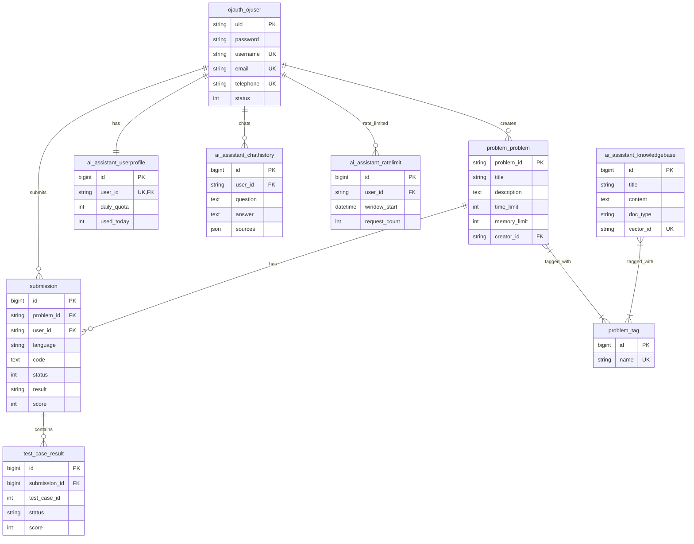

# ZJOJ 数据库设计文档

> **最后更新**: 2026年4月16日  
> **数据库**: MySQL 5.7+  
> **字符集**: utf8mb4_unicode_ci

---

## 📋 目录

- [数据库概述](#数据库概述)
- [已实现的数据表](#已实现的数据表)
  - [1. 用户表 (ojauth_ojuser)](#1-用户表-ojauth_ojuser)
  - [2. 题目表 (problem_problem)](#2-题目表-problem_problem)
  - [3. 标签表 (problem_tag)](#3-标签表-problem_tag)
  - [4. 提交记录表 (submission)](#4-提交记录表-submission)
  - [5. 测试点结果表 (test_case_result)](#5-测试点结果表-test_case_result)
  - [6. 知识库文档表 (ai_assistant_knowledgebase)](#6-知识库文档表-ai_assistant_knowledgebase)
  - [7. 用户AI配置表 (ai_assistant_userprofile)](#7-用户ai配置表-ai_assistant_userprofile)
  - [8. 对话历史表 (ai_assistant_chathistory)](#8-对话历史表-ai_assistant_chathistory)
  - [9. 频率限制表 (ai_assistant_ratelimit)](#9-频率限制表-ai_assistant_ratelimit)
- [ER关系图](#er关系图)
- [数据库优化建议](#数据库优化建议)

---

## 数据库概述

### 数据库环境

- **数据库类型**: MySQL 5.7+
- **字符集**: utf8mb4
- **排序规则**: utf8mb4_unicode_ci
- **存储引擎**: InnoDB
- **自定义用户模型**: `AUTH_USER_MODEL = "ojauth.OJUser"`

### 数据表分类

| 模块 | 表数量 | 说明 |
|------|--------|------|
| 用户认证 | 1 | OJUser自定义用户模型 |
| 题目管理 | 2 | Problem、Tag及关联表 |
| 代码评测 | 2 | Submission、TestCaseResult |
| AI助手 | 4 | KnowledgeBase、UserProfile、ChatHistory、RateLimit |
| Django系统 | 5 | 权限、会话等自动生成的表 |

**总计**: 14张表（不含Django自动生成表）

---

## 已实现的数据表

### 1. 用户表 (ojauth_ojuser) ✅

#### 表结构

```sql
CREATE TABLE `ojauth_ojuser` (
  `uid` varchar(255) NOT NULL COMMENT 'Short UUID主键',
  `password` varchar(128) NOT NULL COMMENT '密码哈希值',
  `last_login` datetime DEFAULT NULL COMMENT '最后登录时间',
  `is_superuser` tinyint(1) NOT NULL DEFAULT 0 COMMENT '是否为超级用户',
  `username` varchar(150) NOT NULL COMMENT '用户名',
  `realname` varchar(150) NOT NULL COMMENT '真实姓名',
  `email` varchar(254) NOT NULL COMMENT '邮箱地址',
  `telephone` varchar(20) NOT NULL COMMENT '电话号码',
  `is_staff` tinyint(1) NOT NULL DEFAULT 0 COMMENT '是否为工作人员',
  `is_active` tinyint(1) NOT NULL DEFAULT 1 COMMENT '是否激活',
  `status` int NOT NULL DEFAULT 2 COMMENT '用户状态: 1-激活, 2-未激活, 3-锁定',
  `date_joined` datetime NOT NULL COMMENT '注册日期',
  PRIMARY KEY (`uid`),
  UNIQUE KEY `username` (`username`),
  UNIQUE KEY `email` (`email`),
  UNIQUE KEY `telephone` (`telephone`)
) ENGINE=InnoDB DEFAULT CHARSET=utf8mb4 COLLATE=utf8mb4_unicode_ci;
```

#### 字段说明

| 字段名 | 类型 | 约束 | 说明 | 示例 |
|--------|------|------|------|------|
| uid | VARCHAR(255) | PRIMARY KEY | Short UUID主键 | BxeWkhbZf2nWiznoay37Zr |
| password | VARCHAR(128) | NOT NULL | 密码哈希（PBKDF2） | pbkdf2_sha256$... |
| last_login | DATETIME | NULL | 最后登录时间 | 2026-04-16 12:00:00 |
| is_superuser | TINYINT(1) | NOT NULL | 是否为超级用户 | 0/1 |
| username | VARCHAR(150) | UNIQUE, NOT NULL | 用户名 | john_doe |
| realname | VARCHAR(150) | NOT NULL | 真实姓名 | 张三 |
| email | VARCHAR(254) | UNIQUE, NOT NULL | 邮箱（登录账号） | john@example.com |
| telephone | VARCHAR(20) | UNIQUE, NOT NULL | 电话号码 | 13800138000 |
| is_staff | TINYINT(1) | NOT NULL | 是否为工作人员 | 0/1 |
| is_active | TINYINT(1) | NOT NULL | 是否激活 | 0/1 |
| status | INT | NOT NULL | 用户状态 | 1/2/3 |
| date_joined | DATETIME | NOT NULL | 注册日期 | 2026-04-16 10:30:00 |

#### 用户状态枚举

| 值 | 常量 | 说明 |
|----|------|------|
| 1 | UserStatusChoices.ACTIVE | 已激活 |
| 2 | UserStatusChoices.UNACTIVE | 未激活 |
| 3 | UserStatusChoices.LOCKED | 锁定 |

#### 索引设计

- **主键索引**: uid
- **唯一索引**: username, email, telephone

#### 备注

- 使用Short UUID作为主键，避免自增ID暴露信息
- 邮箱作为登录账号（USERNAME_FIELD = "email"）
- 密码使用Django的PBKDF2算法加密存储
- telephone字段必须有值且唯一

---

### 2. 题目表 (problem_problem) ✅

#### 表结构

```sql
CREATE TABLE `problem_problem` (
  `problem_id` varchar(20) NOT NULL COMMENT '题目编号',
  `title` varchar(100) NOT NULL COMMENT '题目标题',
  `description` longtext NOT NULL COMMENT '题目描述（Markdown）',
  `time_limit` int unsigned NOT NULL COMMENT '时间限制（毫秒）',
  `memory_limit` int unsigned NOT NULL COMMENT '内存限制（MB）',
  `upload_time` datetime(6) NOT NULL COMMENT '上传时间',
  `update_time` datetime(6) NOT NULL COMMENT '更新时间',
  `creator_id` varchar(255) DEFAULT NULL COMMENT '创建者UID',
  PRIMARY KEY (`problem_id`),
  UNIQUE KEY `problem_id` (`problem_id`),
  KEY `fk_problem_creator` (`creator_id`),
  CONSTRAINT `fk_problem_creator` FOREIGN KEY (`creator_id`) REFERENCES `ojauth_ojuser` (`uid`) ON DELETE SET NULL
) ENGINE=InnoDB DEFAULT CHARSET=utf8mb4 COLLATE=utf8mb4_unicode_ci;
```

#### 字段说明

| 字段名 | 类型 | 约束 | 说明 | 示例 |
|--------|------|------|------|------|
| problem_id | VARCHAR(20) | PRIMARY KEY | 题目编号 | P1001 |
| title | VARCHAR(100) | NOT NULL | 题目标题 | A+B Problem |
| description | LONGTEXT | NOT NULL | 题目描述（Markdown格式） | ## 题目描述... |
| time_limit | INT UNSIGNED | NOT NULL | 时间限制（毫秒） | 1000 |
| memory_limit | INT UNSIGNED | NOT NULL | 内存限制（MB） | 256 |
| upload_time | DATETIME(6) | NOT NULL | 上传时间（自动） | 2026-04-16 10:00:00.000000 |
| update_time | DATETIME(6) | NOT NULL | 更新时间（自动） | 2026-04-16 12:00:00.000000 |
| creator_id | VARCHAR(255) | NULL | 创建者UID（外键） | BxeWkhbZf2nWiznoay37Zr |

#### 索引设计

- **主键索引**: problem_id
- **外键索引**: creator_id → ojauth_ojuser.uid (ON DELETE SET NULL)

#### 备注

- problem_id为字符串类型，支持自定义编号格式（如P1001、A001等）
- description支持Markdown格式
- creator外键设置为SET NULL，删除用户时保留题目

---

### 3. 标签表 (problem_tag) ✅

#### 表结构

```sql
CREATE TABLE `problem_tag` (
  `id` bigint NOT NULL AUTO_INCREMENT COMMENT '标签ID',
  `name` varchar(50) NOT NULL COMMENT '标签名称',
  `create_time` datetime(6) NOT NULL COMMENT '创建时间',
  PRIMARY KEY (`id`),
  UNIQUE KEY `name` (`name`)
) ENGINE=InnoDB DEFAULT CHARSET=utf8mb4 COLLATE=utf8mb4_unicode_ci;
```

#### 字段说明

| 字段名 | 类型 | 约束 | 说明 | 示例 |
|--------|------|------|------|------|
| id | BIGINT | PRIMARY KEY, AUTO_INCREMENT | 标签ID | 1 |
| name | VARCHAR(50) | UNIQUE, NOT NULL | 标签名称 | 动态规划 |
| create_time | DATETIME(6) | NOT NULL | 创建时间 | 2026-04-16 10:00:00.000000 |

#### 多对多关联表 (problem_problem_tags)

```sql
CREATE TABLE `problem_problem_tags` (
  `id` bigint NOT NULL AUTO_INCREMENT,
  `problem_id` varchar(20) NOT NULL,
  `tag_id` bigint NOT NULL,
  PRIMARY KEY (`id`),
  UNIQUE KEY `problem_problem_tags_problem_id_tag_id_unique` (`problem_id`, `tag_id`),
  KEY `problem_problem_tags_tag_id` (`tag_id`),
  CONSTRAINT `problem_problem_tags_problem_id` FOREIGN KEY (`problem_id`) REFERENCES `problem_problem` (`problem_id`) ON DELETE CASCADE,
  CONSTRAINT `problem_problem_tags_tag_id` FOREIGN KEY (`tag_id`) REFERENCES `problem_tag` (`id`) ON DELETE CASCADE
) ENGINE=InnoDB DEFAULT CHARSET=utf8mb4 COLLATE=utf8mb4_unicode_ci;
```

#### 备注

- 标签名称唯一
- Problem与Tag为多对多关系
- 删除题目或标签时自动清理关联关系

---

### 4. 提交记录表 (submission) ✅

#### 表结构

```sql
CREATE TABLE `submission` (
  `id` bigint NOT NULL AUTO_INCREMENT COMMENT '提交ID',
  `problem_id` varchar(20) NOT NULL COMMENT '题目编号',
  `user_id` varchar(255) NOT NULL COMMENT '用户UID',
  `language` varchar(20) NOT NULL COMMENT '编程语言',
  `code` longtext NOT NULL COMMENT '源代码',
  `code_length` int unsigned NOT NULL DEFAULT 0 COMMENT '代码长度（字节）',
  `status` int NOT NULL DEFAULT 0 COMMENT '评测状态',
  `result` varchar(10) DEFAULT NULL COMMENT '评测结果',
  `score` int unsigned NOT NULL DEFAULT 0 COMMENT '得分',
  `execution_time` int unsigned NOT NULL DEFAULT 0 COMMENT '运行时间（ms）',
  `memory_usage` int unsigned NOT NULL DEFAULT 0 COMMENT '内存使用（KB）',
  `submit_time` datetime(6) NOT NULL COMMENT '提交时间',
  `judge_time` datetime(6) DEFAULT NULL COMMENT '评测时间',
  PRIMARY KEY (`id`),
  KEY `submission_problem_id` (`problem_id`),
  KEY `submission_user_id` (`user_id`),
  KEY `submission_submit_time` (`submit_time`),
  KEY `submission_user_submit_time` (`user_id`, `submit_time`),
  KEY `submission_problem_submit_time` (`problem_id`, `submit_time`),
  CONSTRAINT `submission_problem_id` FOREIGN KEY (`problem_id`) REFERENCES `problem_problem` (`problem_id`) ON DELETE CASCADE,
  CONSTRAINT `submission_user_id` FOREIGN KEY (`user_id`) REFERENCES `ojauth_ojuser` (`uid`) ON DELETE CASCADE
) ENGINE=InnoDB DEFAULT CHARSET=utf8mb4 COLLATE=utf8mb4_unicode_ci;
```

#### 字段说明

| 字段名 | 类型 | 约束 | 说明 | 示例 |
|--------|------|------|------|------|
| id | BIGINT | PRIMARY KEY, AUTO_INCREMENT | 提交ID | 1 |
| problem_id | VARCHAR(20) | NOT NULL, FK | 题目编号 | P1001 |
| user_id | VARCHAR(255) | NOT NULL, FK | 用户UID | BxeWkhbZf2nWiznoay37Zr |
| language | VARCHAR(20) | NOT NULL | 编程语言 | cpp/c/java/python3 |
| code | LONGTEXT | NOT NULL | 源代码 | #include <stdio.h>... |
| code_length | INT UNSIGNED | NOT NULL | 代码长度（字节） | 1234 |
| status | INT | NOT NULL | 评测状态 | 0-等待, 1-评测中, 2-已完成, 3-编译错误, 4-系统错误 |
| result | VARCHAR(10) | NULL | 评测结果 | AC/WA/TLE/MLE/RE/CE/SE |
| score | INT UNSIGNED | NOT NULL | 得分（0-100） | 100 |
| execution_time | INT UNSIGNED | NOT NULL | 运行时间（ms） | 45 |
| memory_usage | INT UNSIGNED | NOT NULL | 内存使用（KB） | 1024 |
| submit_time | DATETIME(6) | NOT NULL | 提交时间（自动） | 2026-04-16 12:00:00.000000 |
| judge_time | DATETIME(6) | NULL | 评测完成时间 | 2026-04-16 12:00:05.000000 |

#### 枚举值

**评测状态 (status)**:
- 0: 等待评测 (Pending)
- 1: 评测中 (Judging)
- 2: 已完成 (Completed)
- 3: 编译错误 (Compilation Error)
- 4: 系统错误 (System Error)

**评测结果 (result)**:
- AC: Accepted
- WA: Wrong Answer
- TLE: Time Limit Exceeded
- MLE: Memory Limit Exceeded
- RE: Runtime Error
- CE: Compilation Error
- SE: System Error

**编程语言 (language)**:
- cpp: C++
- c: C
- java: Java
- python3: Python 3
- python2: Python 2

#### 索引设计

- **主键索引**: id
- **外键索引**: problem_id, user_id
- **复合索引**: 
  - (user_id, submit_time) - 查询用户提交历史
  - (problem_id, submit_time) - 查询题目提交历史
  - (submit_time) - 按时间排序

#### 备注

- code_length在save()方法中自动计算
- 删除题目或用户时级联删除提交记录
- 支持异步评测（Celery + HydroJudge）

---

### 5. 测试点结果表 (test_case_result) ✅

#### 表结构

```sql
CREATE TABLE `test_case_result` (
  `id` bigint NOT NULL AUTO_INCREMENT COMMENT '结果ID',
  `submission_id` bigint NOT NULL COMMENT '提交ID',
  `test_case_id` int unsigned NOT NULL COMMENT '测试点ID',
  `status` varchar(10) NOT NULL COMMENT '测试点状态',
  `execution_time` int unsigned NOT NULL DEFAULT 0 COMMENT '运行时间（ms）',
  `memory_usage` int unsigned NOT NULL DEFAULT 0 COMMENT '内存使用（KB）',
  `score` int unsigned NOT NULL DEFAULT 0 COMMENT '该测试点得分',
  `message` text NOT NULL COMMENT '详细信息',
  PRIMARY KEY (`id`),
  UNIQUE KEY `test_case_result_submission_id_test_case_id_unique` (`submission_id`, `test_case_id`),
  KEY `test_case_result_submission_id` (`submission_id`),
  CONSTRAINT `test_case_result_submission_id` FOREIGN KEY (`submission_id`) REFERENCES `submission` (`id`) ON DELETE CASCADE
) ENGINE=InnoDB DEFAULT CHARSET=utf8mb4 COLLATE=utf8mb4_unicode_ci;
```

#### 字段说明

| 字段名 | 类型 | 约束 | 说明 | 示例 |
|--------|------|------|------|------|
| id | BIGINT | PRIMARY KEY, AUTO_INCREMENT | 结果ID | 1 |
| submission_id | BIGINT | NOT NULL, FK | 提交ID | 123 |
| test_case_id | INT UNSIGNED | NOT NULL | 测试点ID | 1 |
| status | VARCHAR(10) | NOT NULL | 测试点状态 | AC/WA/TLE/MLE/RE |
| execution_time | INT UNSIGNED | NOT NULL | 运行时间（ms） | 12 |
| memory_usage | INT UNSIGNED | NOT NULL | 内存使用（KB） | 512 |
| score | INT UNSIGNED | NOT NULL | 该测试点得分 | 10 |
| message | TEXT | NOT NULL | 详细错误信息 | Output differs... |

#### 索引设计

- **主键索引**: id
- **唯一索引**: (submission_id, test_case_id) - 确保每个测试点只有一条记录
- **外键索引**: submission_id

#### 备注

- 每个提交可能有多个测试点结果
- 删除提交时级联删除所有测试点结果
- message字段存储详细的错误输出

---

### 6. 知识库文档表 (ai_assistant_knowledgebase) ✅

#### 表结构

```sql
CREATE TABLE `ai_assistant_knowledgebase` (
  `id` bigint NOT NULL AUTO_INCREMENT COMMENT '文档ID',
  `title` varchar(200) NOT NULL COMMENT '文档标题',
  `content` longtext NOT NULL COMMENT '文档内容',
  `doc_type` varchar(20) NOT NULL COMMENT '文档类型',
  `source` varchar(500) NOT NULL COMMENT '来源',
  `vector_id` varchar(100) NOT NULL COMMENT 'ChromaDB向量ID',
  `is_active` tinyint(1) NOT NULL DEFAULT 1 COMMENT '是否启用',
  `created_at` datetime(6) NOT NULL COMMENT '创建时间',
  `updated_at` datetime(6) NOT NULL COMMENT '更新时间',
  PRIMARY KEY (`id`),
  UNIQUE KEY `vector_id` (`vector_id`),
  KEY `ai_assistant_knowledgebase_doc_type` (`doc_type`),
  KEY `ai_assistant_knowledgebase_is_active` (`is_active`)
) ENGINE=InnoDB DEFAULT CHARSET=utf8mb4 COLLATE=utf8mb4_unicode_ci;
```

#### 字段说明

| 字段名 | 类型 | 约束 | 说明 | 示例 |
|--------|------|------|------|------|
| id | BIGINT | PRIMARY KEY, AUTO_INCREMENT | 文档ID | 1 |
| title | VARCHAR(200) | NOT NULL | 文档标题 | 二分查找算法 |
| content | LONGTEXT | NOT NULL | 文档内容 | 二分查找是一种... |
| doc_type | VARCHAR(20) | NOT NULL | 文档类型 | algorithm/solution/template/concept |
| source | VARCHAR(500) | NOT NULL | 来源URL或说明 | https://... |
| vector_id | VARCHAR(100) | UNIQUE, NOT NULL | ChromaDB向量ID | kb_abc123def456 |
| is_active | TINYINT(1) | NOT NULL | 是否启用 | 0/1 |
| created_at | DATETIME(6) | NOT NULL | 创建时间 | 2026-04-16 10:00:00.000000 |
| updated_at | DATETIME(6) | NOT NULL | 更新时间 | 2026-04-16 12:00:00.000000 |

#### 文档类型枚举

| 值 | 说明 |
|----|------|
| algorithm | 算法讲解 |
| solution | 题解 |
| template | 代码模板 |
| concept | 概念说明 |

#### 多对多关联表 (ai_assistant_knowledgebase_tags)

```sql
CREATE TABLE `ai_assistant_knowledgebase_tags` (
  `id` bigint NOT NULL AUTO_INCREMENT,
  `knowledgebase_id` bigint NOT NULL,
  `tag_id` bigint NOT NULL,
  PRIMARY KEY (`id`),
  UNIQUE KEY `ai_assistant_knowledgebase_tags_knowledgebase_id_tag_id_unique` (`knowledgebase_id`, `tag_id`),
  KEY `ai_assistant_knowledgebase_tags_tag_id` (`tag_id`),
  CONSTRAINT FOREIGN KEY (`knowledgebase_id`) REFERENCES `ai_assistant_knowledgebase` (`id`) ON DELETE CASCADE,
  CONSTRAINT FOREIGN KEY (`tag_id`) REFERENCES `problem_tag` (`id`) ON DELETE CASCADE
) ENGINE=InnoDB DEFAULT CHARSET=utf8mb4 COLLATE=utf8mb4_unicode_ci;
```

#### 索引设计

- **主键索引**: id
- **唯一索引**: vector_id
- **普通索引**: doc_type, is_active

#### 备注

- vector_id对应ChromaDB中的文档ID
- 与problem.Tag多对多关联（复用标签系统）
- is_active控制文档是否参与检索

---

### 7. 用户AI配置表 (ai_assistant_userprofile) ✅

#### 表结构

```sql
CREATE TABLE `ai_assistant_userprofile` (
  `id` bigint NOT NULL AUTO_INCREMENT COMMENT '配置ID',
  `user_id` varchar(255) NOT NULL COMMENT '用户UID',
  `daily_quota` int NOT NULL DEFAULT 50 COMMENT '每日配额',
  `used_today` int NOT NULL DEFAULT 0 COMMENT '今日已用次数',
  `last_reset_date` date NOT NULL COMMENT '上次重置日期',
  `max_history` int NOT NULL DEFAULT 100 COMMENT '最大历史记录数',
  PRIMARY KEY (`id`),
  UNIQUE KEY `user_id` (`user_id`),
  CONSTRAINT `ai_assistant_userprofile_user_id` FOREIGN KEY (`user_id`) REFERENCES `ojauth_ojuser` (`uid`) ON DELETE CASCADE
) ENGINE=InnoDB DEFAULT CHARSET=utf8mb4 COLLATE=utf8mb4_unicode_ci;
```

#### 字段说明

| 字段名 | 类型 | 约束 | 说明 | 示例 |
|--------|------|------|------|------|
| id | BIGINT | PRIMARY KEY, AUTO_INCREMENT | 配置ID | 1 |
| user_id | VARCHAR(255) | UNIQUE, NOT NULL, FK | 用户UID | BxeWkhbZf2nWiznoay37Zr |
| daily_quota | INT | NOT NULL | 每日配额上限 | 50 |
| used_today | INT | NOT NULL | 今日已使用次数 | 3 |
| last_reset_date | DATE | NOT NULL | 上次重置日期 | 2026-04-16 |
| max_history | INT | NOT NULL | 最大历史记录数 | 100 |

#### 索引设计

- **主键索引**: id
- **唯一索引**: user_id（一对一关系）
- **外键索引**: user_id → ojauth_ojuser.uid

#### 备注

- 与OJUser为一对一关系
- last_reset_date用于判断是否需要重置used_today
- 删除用户时级联删除配置

---

### 8. 对话历史表 (ai_assistant_chathistory) ✅

#### 表结构

```sql
CREATE TABLE `ai_assistant_chathistory` (
  `id` bigint NOT NULL AUTO_INCREMENT COMMENT '对话ID',
  `user_id` varchar(255) NOT NULL COMMENT '用户UID',
  `question` longtext NOT NULL COMMENT '问题',
  `answer` longtext NOT NULL COMMENT '答案',
  `sources` json NOT NULL COMMENT '引用来源（JSON数组）',
  `model_used` varchar(50) NOT NULL DEFAULT 'glm-4' COMMENT '使用的模型',
  `tokens_used` int NOT NULL DEFAULT 0 COMMENT '消耗Token数',
  `created_at` datetime(6) NOT NULL COMMENT '创建时间',
  PRIMARY KEY (`id`),
  KEY `ai_assistant_chathistory_user_id` (`user_id`),
  KEY `ai_assistant_chathistory_user_created_at` (`user_id`, `created_at`),
  CONSTRAINT `ai_assistant_chathistory_user_id` FOREIGN KEY (`user_id`) REFERENCES `ojauth_ojuser` (`uid`) ON DELETE CASCADE
) ENGINE=InnoDB DEFAULT CHARSET=utf8mb4 COLLATE=utf8mb4_unicode_ci;
```

#### 字段说明

| 字段名 | 类型 | 约束 | 说明 | 示例 |
|--------|------|------|------|------|
| id | BIGINT | PRIMARY KEY, AUTO_INCREMENT | 对话ID | 1 |
| user_id | VARCHAR(255) | NOT NULL, FK | 用户UID | BxeWkhbZf2nWiznoay37Zr |
| question | LONGTEXT | NOT NULL | 用户问题 | 什么是二分查找？ |
| answer | LONGTEXT | NOT NULL | AI回答 | 二分查找是一种... |
| sources | JSON | NOT NULL | 引用来源（JSON数组） | [{"id": "...", "content": "..."}] |
| model_used | VARCHAR(50) | NOT NULL | 使用的LLM模型 | deepseek-chat |
| tokens_used | INT | NOT NULL | 消耗的Token数 | 270 |
| created_at | DATETIME(6) | NOT NULL | 创建时间 | 2026-04-16 12:00:00.000000 |

#### sources JSON格式示例

```json
[
  {
    "id": "kb_abc123",
    "content": "二分查找是一种...",
    "metadata": {
      "doc_id": 1,
      "title": "二分查找算法",
      "doc_type": "algorithm"
    },
    "similarity": 0.9822
  }
]
```

#### 索引设计

- **主键索引**: id
- **外键索引**: user_id
- **复合索引**: (user_id, created_at) - 查询用户对话历史

#### 备注

- sources字段存储RAG检索的引用来源
- 支持JSON查询（MySQL 5.7+）
- 删除用户时级联删除对话历史

---

### 9. 频率限制表 (ai_assistant_ratelimit) ✅

#### 表结构

```sql
CREATE TABLE `ai_assistant_ratelimit` (
  `id` bigint NOT NULL AUTO_INCREMENT COMMENT '记录ID',
  `user_id` varchar(255) NOT NULL COMMENT '用户UID',
  `window_start` datetime(6) NOT NULL COMMENT '时间窗口开始',
  `request_count` int NOT NULL DEFAULT 0 COMMENT '请求次数',
  PRIMARY KEY (`id`),
  UNIQUE KEY `ai_assistant_ratelimit_user_id_window_start_unique` (`user_id`, `window_start`),
  KEY `ai_assistant_ratelimit_user_id` (`user_id`),
  CONSTRAINT `ai_assistant_ratelimit_user_id` FOREIGN KEY (`user_id`) REFERENCES `ojauth_ojuser` (`uid`) ON DELETE CASCADE
) ENGINE=InnoDB DEFAULT CHARSET=utf8mb4 COLLATE=utf8mb4_unicode_ci;
```

#### 字段说明

| 字段名 | 类型 | 约束 | 说明 | 示例 |
|--------|------|------|------|------|
| id | BIGINT | PRIMARY KEY, AUTO_INCREMENT | 记录ID | 1 |
| user_id | VARCHAR(255) | NOT NULL, FK | 用户UID | BxeWkhbZf2nWiznoay37Zr |
| window_start | DATETIME(6) | NOT NULL | 时间窗口开始时间 | 2026-04-16 12:00:00.000000 |
| request_count | INT | NOT NULL | 窗口内请求次数 | 5 |

#### 索引设计

- **主键索引**: id
- **唯一索引**: (user_id, window_start) - 确保每个用户在每个时间窗口只有一条记录
- **外键索引**: user_id

#### 备注

- 用于实现滑动窗口频率限制
- 默认窗口大小：60秒
- 默认最大请求数：10次/窗口
- 删除用户时级联删除限制记录

---

## ER关系图



---

## 数据库优化建议

### 1. 索引优化

#### 用户表
```sql
-- 为常用查询字段添加索引
ALTER TABLE `ojauth_ojuser` ADD INDEX `idx_status` (`status`);
ALTER TABLE `ojauth_ojuser` ADD INDEX `idx_is_active` (`is_active`);
```

#### 题目表
```sql
ALTER TABLE `problem_problem` ADD INDEX `idx_upload_time` (`upload_time`);
ALTER TABLE `problem_problem` ADD FULLTEXT INDEX `ft_title_description` (`title`, `description`(500));
```

#### 提交表
```sql
-- 已自动创建复合索引，无需额外添加
-- submission_user_submit_time: (user_id, submit_time)
-- submission_problem_submit_time: (problem_id, submit_time)
```

#### AI助手表
```sql
-- ChatHistory已创建(user_id, created_at)复合索引
-- KnowledgeBase已创建doc_type和is_active索引
```

### 2. 分区策略

对于大数据量表（如submission），可以考虑按时间分区：

```sql
ALTER TABLE `submission` 
PARTITION BY RANGE (YEAR(submit_time)) (
    PARTITION p2025 VALUES LESS THAN (2026),
    PARTITION p2026 VALUES LESS THAN (2027),
    PARTITION p2027 VALUES LESS THAN (2028),
    PARTITION pmax VALUES LESS THAN MAXVALUE
);
```

### 3. 读写分离

对于高并发场景，可以配置主从复制，实现读写分离：

```python
# settings.py
DATABASE_ROUTERS = ['ZJOJ.db_router.PrimaryReplicaRouter']

DATABASES = {
    'default': {
        # 主库（写）
        'ENGINE': 'django.db.backends.mysql',
        'NAME': 'ZJOJ',
        'USER': 'root',
        'PASSWORD': 'password',
        'HOST': 'master-db.example.com',
    },
    'replica': {
        # 从库（读）
        'ENGINE': 'django.db.backends.mysql',
        'NAME': 'ZJOJ',
        'USER': 'readonly',
        'PASSWORD': 'password',
        'HOST': 'slave-db.example.com',
    }
}
```

### 4. 缓存策略

- **Redis缓存**: 题目列表、用户信息等热点数据
- **Query Cache**: MySQL查询缓存（MySQL 8.0已移除，建议使用应用层缓存）
- **CDN**: 静态资源（题目图片、测试用例文件）

### 5. 数据清理策略

```python
# 定期清理旧数据
# 1. 清理超过1年的对话历史
ChatHistory.objects.filter(
    created_at__lt=timezone.now() - timedelta(days=365)
).delete()

# 2. 清理过期的频率限制记录
RateLimit.objects.filter(
    window_start__lt=timezone.now() - timedelta(hours=1)
).delete()

# 3. 归档旧的提交记录（可选）
# 将超过2年的提交记录移动到归档表
```

### 6. 备份策略

```bash
# 每日全量备份
mysqldump -u root -p ZJOJ > /backup/zjoj_$(date +%Y%m%d).sql

# 每小时增量备份（开启binlog）
# 在my.cnf中配置：
# log-bin=mysql-bin
# binlog-format=ROW
```

---

## 附录：Django自动生成的表

以下表由Django框架自动生成，通常不需要手动修改：

1. **auth_group** - 用户组
2. **auth_permission** - 权限
3. **auth_user_groups** - 用户-组关联
4. **auth_user_user_permissions** - 用户-权限关联
5. **django_content_type** - 内容类型
6. **django_session** - 会话
7. **django_admin_log** - Admin操作日志
8. **django_migrations** - 迁移记录

---

<div align="center">

**Made with ❤️ by 铸剑团队**

[返回顶部](#zjoJ-数据库设计文档)

</div>
