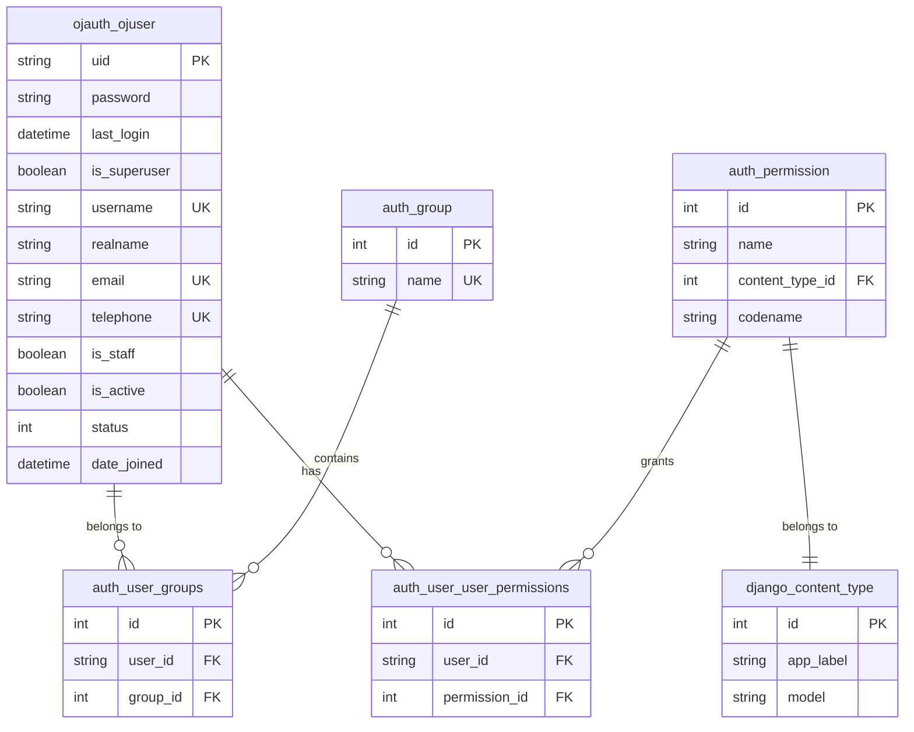

# ZJOJ 数据库设计文档

## 概述

本文档详细描述 ZJOJ 在线评测系统的数据库设计，包括表结构、字段说明、关系图等。

## 数据库环境

- **数据库类型**: MySQL
- **字符集**: utf8mb4
- **排序规则**: utf8mb4_unicode_ci
- **存储引擎**: InnoDB

---

## 数据表设计

### 1. 用户表 (ojauth_ojuser)

#### 表结构

```sql
CREATE TABLE `ojauth_ojuser` (
  `uid` varchar(255) NOT NULL,
  `password` varchar(128) NOT NULL,
  `last_login` datetime DEFAULT NULL,
  `is_superuser` tinyint(1) NOT NULL,
  `username` varchar(150) NOT NULL,
  `realname` varchar(150) NOT NULL,
  `email` varchar(254) NOT NULL,
  `telephone` varchar(20) NOT NULL,
  `is_staff` tinyint(1) NOT NULL,
  `is_active` tinyint(1) NOT NULL,
  `status` int NOT NULL,
  `date_joined` datetime NOT NULL,
  PRIMARY KEY (`uid`),
  UNIQUE KEY `username` (`username`),
  UNIQUE KEY `email` (`email`),
  UNIQUE KEY `telephone` (`telephone`)
) ENGINE=InnoDB DEFAULT CHARSET=utf8mb4 COLLATE=utf8mb4_unicode_ci;
```

#### 字段说明

| 字段名 | 类型 | 约束 | 说明 | 示例 |
|--------|------|------|------|------|
| uid | VARCHAR(255) | PRIMARY KEY | Short UUID 主键 | abc123xyz |
| password | VARCHAR(128) | NOT NULL | 密码哈希值 | pbkdf2_sha256$... |
| last_login | DATETIME | NULL | 最后登录时间 | 2026-03-24 12:00:00 |
| is_superuser | TINYINT(1) | NOT NULL | 是否为超级用户 | 0/1 |
| username | VARCHAR(150) | UNIQUE, NOT NULL | 用户名（唯一） | john_doe |
| realname | VARCHAR(150) | NOT NULL | 真实姓名 | 张三 |
| email | VARCHAR(254) | UNIQUE, NOT NULL | 邮箱地址（唯一，用于登录） | john@example.com |
| telephone | VARCHAR(20) | UNIQUE, NOT NULL | 电话号码（唯一） | 13800138000 |
| is_staff | TINYINT(1) | NOT NULL | 是否为工作人员 | 0/1 |
| is_active | TINYINT(1) | NOT NULL | 是否激活 | 0/1 |
| status | INT | NOT NULL | 用户状态 | 1/2/3 |
| date_joined | DATETIME | NOT NULL | 注册日期 | 2026-03-24 10:30:00 |

#### 用户状态枚举

| 值 | 常量 | 说明 |
|----|------|------|
| 1 | UserStatusChoices.ACTIVE | 已激活 |
| 2 | UserStatusChoices.UNACTIVE | 未激活 |
| 3 | UserStatusChoices.LOCKED | 锁定 |

#### 索引设计

- **主键索引**: uid
- **唯一索引**: username, email, telephone

#### 备注

- 使用 Short UUID 作为主键，避免自增 ID 暴露信息
- 邮箱作为登录账号（USERNAME_FIELD = "email"）
- 密码使用 Django 的 PBKDF2 算法加密存储

---

### 2. Django 权限相关表（自动生成）

以下表由 Django 的 PermissionsMixin 自动创建：

#### 2.1 组表 (auth_group)

```sql
CREATE TABLE `auth_group` (
  `id` int NOT NULL AUTO_INCREMENT,
  `name` varchar(150) NOT NULL,
  PRIMARY KEY (`id`),
  UNIQUE KEY `name` (`name`)
) ENGINE=InnoDB DEFAULT CHARSET=utf8mb4;
```

#### 2.2 权限表 (auth_permission)

```sql
CREATE TABLE `auth_permission` (
  `id` int NOT NULL AUTO_INCREMENT,
  `name` varchar(255) NOT NULL,
  `content_type_id` int NOT NULL,
  `codename` varchar(100) NOT NULL,
  PRIMARY KEY (`id`),
  UNIQUE KEY `content_type_id` (`content_type_id`, `codename`)
) ENGINE=InnoDB DEFAULT CHARSET=utf8mb4;
```

#### 2.3 用户 - 组关联表 (auth_user_groups)

```sql
CREATE TABLE `auth_user_groups` (
  `id` int NOT NULL AUTO_INCREMENT,
  `user_id` varchar(255) NOT NULL,
  `group_id` int NOT NULL,
  PRIMARY KEY (`id`),
  UNIQUE KEY `user_id` (`user_id`, `group_id`)
) ENGINE=InnoDB DEFAULT CHARSET=utf8mb4;
```

#### 2.4 用户 - 权限关联表 (auth_user_user_permissions)

```sql
CREATE TABLE `auth_user_user_permissions` (
  `id` int NOT NULL AUTO_INCREMENT,
  `user_id` varchar(255) NOT NULL,
  `permission_id` int NOT NULL,
  PRIMARY KEY (`id`),
  UNIQUE KEY `user_id` (`user_id`, `permission_id`)
) ENGINE=InnoDB DEFAULT CHARSET=utf8mb4;
```

---

### 3. Django Admin 表（自动生成）

#### 3.1 内容类型表 (django_content_type)

```sql
CREATE TABLE `django_content_type` (
  `id` int NOT NULL AUTO_INCREMENT,
  `app_label` varchar(100) NOT NULL,
  `model` varchar(100) NOT NULL,
  PRIMARY KEY (`id`),
  UNIQUE KEY `app_label` (`app_label`, `model`)
) ENGINE=InnoDB DEFAULT CHARSET=utf8mb4;
```

#### 3.2 会话表 (django_session)

```sql
CREATE TABLE `django_session` (
  `session_key` varchar(40) NOT NULL,
  `session_data` longtext NOT NULL,
  `expire_date` datetime(6) NOT NULL,
  PRIMARY KEY (`session_key`)
) ENGINE=InnoDB DEFAULT CHARSET=utf8mb4;
```

---

## ER 关系图



---

## 未来扩展表设计

以下是后续开发中可能需要创建的表：

### 4. 题目表 (problem)

```sql
CREATE TABLE `problem` (
  `id` bigint NOT NULL AUTO_INCREMENT,
  `title` varchar(200) NOT NULL,
  `description` longtext NOT NULL,
  `input` longtext NOT NULL,
  `output` longtext NOT NULL,
  `time_limit` int NOT NULL DEFAULT 1,
  `memory_limit` int NOT NULL DEFAULT 256,
  `difficulty` int NOT NULL DEFAULT 1,
  `tags` varchar(500) DEFAULT NULL,
  `created_by` varchar(255) NOT NULL,
  `created_at` datetime(6) NOT NULL,
  `updated_at` datetime(6) NOT NULL,
  `is_public` tinyint(1) NOT NULL DEFAULT 0,
  PRIMARY KEY (`id`),
  KEY `created_by` (`created_by`),
  CONSTRAINT `fk_problem_creator` FOREIGN KEY (`created_by`) REFERENCES `ojauth_ojuser` (`uid`)
) ENGINE=InnoDB DEFAULT CHARSET=utf8mb4;
```

**字段说明：**
- `time_limit`: 时间限制（秒）
- `memory_limit`: 内存限制（MB）
- `difficulty`: 难度等级（1-5）
- `is_public`: 是否公开

---

### 5. 提交记录表 (submission)

```sql
CREATE TABLE `submission` (
  `id` bigint NOT NULL AUTO_INCREMENT,
  `submitter_id` varchar(255) NOT NULL,
  `problem_id` bigint NOT NULL,
  `code` longtext NOT NULL,
  `language` varchar(20) NOT NULL,
  `status` int NOT NULL DEFAULT 0,
  `result` json DEFAULT NULL,
  `execution_time` int DEFAULT NULL,
  `memory_usage` int DEFAULT NULL,
  `submitted_at` datetime(6) NOT NULL,
  `judged_at` datetime(6) DEFAULT NULL,
  PRIMARY KEY (`id`),
  KEY `submitter_id` (`submitter_id`),
  KEY `problem_id` (`problem_id`),
  CONSTRAINT `fk_submission_user` FOREIGN KEY (`submitter_id`) REFERENCES `ojauth_ojuser` (`uid`),
  CONSTRAINT `fk_submission_problem` FOREIGN KEY (`problem_id`) REFERENCES `problem` (`id`)
) ENGINE=InnoDB DEFAULT CHARSET=utf8mb4;
```

**字段说明：**
- `status`: 提交状态（0-待评测，1-评测中，2-已完成）
- `result`: 评测结果 JSON（包含 AC/WA/TLE 等）
- `execution_time`: 执行时间（ms）
- `memory_usage`: 内存使用（MB）

---

### 6. 比赛表 (contest)

```sql
CREATE TABLE `contest` (
  `id` bigint NOT NULL AUTO_INCREMENT,
  `title` varchar(200) NOT NULL,
  `description` longtext NOT NULL,
  `start_time` datetime(6) NOT NULL,
  `end_time` datetime(6) NOT NULL,
  `created_by` varchar(255) NOT NULL,
  `is_public` tinyint(1) NOT NULL DEFAULT 0,
  `created_at` datetime(6) NOT NULL,
  PRIMARY KEY (`id`),
  KEY `created_by` (`created_by`),
  CONSTRAINT `fk_contest_creator` FOREIGN KEY (`created_by`) REFERENCES `ojauth_ojuser` (`uid`)
) ENGINE=InnoDB DEFAULT CHARSET=utf8mb4;
```

---

### 7. 比赛 - 题目关联表 (contest_problem)

```sql
CREATE TABLE `contest_problem` (
  `id` bigint NOT NULL AUTO_INCREMENT,
  `contest_id` bigint NOT NULL,
  `problem_id` bigint NOT NULL,
  `order` int NOT NULL DEFAULT 0,
  `points` int NOT NULL DEFAULT 100,
  PRIMARY KEY (`id`),
  UNIQUE KEY `contest_problem_unique` (`contest_id`, `problem_id`),
  KEY `problem_id` (`problem_id`),
  CONSTRAINT `fk_cp_contest` FOREIGN KEY (`contest_id`) REFERENCES `contest` (`id`),
  CONSTRAINT `fk_cp_problem` FOREIGN KEY (`problem_id`) REFERENCES `problem` (`id`)
) ENGINE=InnoDB DEFAULT CHARSET=utf8mb4;
```

---

### 8. 排行榜表 (ranking)

```sql
CREATE TABLE `ranking` (
  `id` bigint NOT NULL AUTO_INCREMENT,
  `user_id` varchar(255) NOT NULL,
  `total_solved` int NOT NULL DEFAULT 0,
  `total_submissions` int NOT NULL DEFAULT 0,
  `rating` decimal(10,2) DEFAULT 0.00,
  `last_updated` datetime(6) NOT NULL,
  PRIMARY KEY (`id`),
  UNIQUE KEY `user_id` (`user_id`),
  CONSTRAINT `fk_ranking_user` FOREIGN KEY (`user_id`) REFERENCES `ojauth_ojuser` (`uid`)
) ENGINE=InnoDB DEFAULT CHARSET=utf8mb4;
```

---

## 数据库优化建议

### 1. 索引优化

#### 用户表
```sql
-- 为常用查询字段添加索引
ALTER TABLE `ojauth_ojuser` ADD INDEX `idx_status` (`status`);
ALTER TABLE `ojauth_ojuser` ADD INDEX `idx_is_active` (`is_active`);
```

#### 题目表（未来）
```sql
ALTER TABLE `problem` ADD INDEX `idx_difficulty` (`difficulty`);
ALTER TABLE `problem` ADD INDEX `idx_is_public` (`is_public`);
ALTER TABLE `problem` ADD FULLTEXT INDEX `ft_title_description` (`title`, `description`(500));
```

#### 提交表（未来）
```sql
ALTER TABLE `submission` ADD INDEX `idx_submitter_status` (`submitter_id`, `status`);
ALTER TABLE `submission` ADD INDEX `idx_problem_submitted` (`problem_id`, `submitted_at`);
```

### 2. 分区策略

对于大数据量表（如 submission），可以考虑按时间分区：

```sql
ALTER TABLE `submission` 
PARTITION BY RANGE (YEAR(submitted_at)) (
    PARTITION p2025 VALUES LESS THAN (2026),
    PARTITION p2026 VALUES LESS THAN (2027),
    PARTITION p2027 VALUES LESS THAN (2028)
);
```

### 3. 读写分离

对于高并发场景，可以配置主从复制，实现读写分离：

```python
DATABASE_ROUTERS = ['ZJOJ.db_router.PrimaryReplicaRouter']

DATABASES = {
    'default': {
        # 主库（写）
        'ENGINE': 'django.db.backends.mysql',
        'NAME': 'ZJOJ',
        'USER': 'root',
        'PASSWORD': '***',
        'HOST': 'master-db.example.com',
    },
    'replica': {
        # 从库（读）
        'ENGINE': 'django.db.backends.mysql',
        'NAME': 'ZJOJ',
        'USER': 'readonly',
        'PASSWORD': '***',
        'HOST': 'replica-db.example.com',
    }
}
```

---

## 数据迁移策略

### 初始迁移

```bash
# 生成迁移文件
python manage.py makemigrations ojauth

# 查看迁移 SQL
python manage.py sqlmigrate ojauth 0001

# 应用迁移
python manage.py migrate
```

### 添加新字段

```bash
# 修改 models.py 后
python manage.py makemigrations

# 如果需要为现有记录设置默认值
python manage.py migrate
```

### 数据迁移示例

```python
from django.db import migrations

def add_initial_data(apps, schema_editor):
    OJUser = apps.get_model('ojauth', 'OJUser')
    # 创建初始管理员
    OJUser.objects.create_superuser(
        username='admin',
        realname='Administrator',
        email='admin@zjoj.com',
        password='admin123',
        telephone='123456789'
    )

class Migration(migrations.Migration):
    dependencies = [
        ('ojauth', '0001_initial'),
    ]

    operations = [
        migrations.RunPython(add_initial_data),
    ]
```

---

## 数据库备份与恢复

### 备份

```bash
# 完整备份
mysqldump -u root -p --databases ZJOJ > zjoj_backup.sql

# 仅结构
mysqldump -u root -p --no-data ZJOJ > zjoj_structure.sql

# 仅数据
mysqldump -u root -p --no-create-info ZJOJ > zjoj_data.sql
```

### 恢复

```bash
mysql -u root -p < zjoj_backup.sql
```

---

## 安全建议

### 1. 数据库用户权限

创建专用数据库用户，限制权限：

```sql
CREATE USER 'zjoj_user'@'localhost' IDENTIFIED BY 'strong_password';
GRANT SELECT, INSERT, UPDATE, DELETE ON ZJOJ.* TO 'zjoj_user'@'localhost';
FLUSH PRIVILEGES;
```

### 2. 敏感数据保护

- 密码必须加密存储（Django 默认使用 PBKDF2）
- 不要在日志中记录敏感信息
- 生产环境使用 SSL 连接数据库

### 3. 防止 SQL 注入

- 始终使用 ORM 的参数化查询
- 避免直接拼接 SQL 字符串

```python
# ✅ 正确
OJUser.objects.filter(email=email)

# ❌ 错误
cursor.execute(f"SELECT * FROM ojauth_ojuser WHERE email='{email}'")
```

---

*最后更新：2026 年 3 月 24 日*
