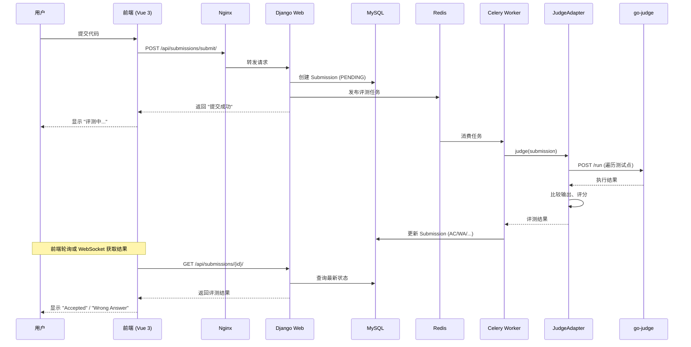
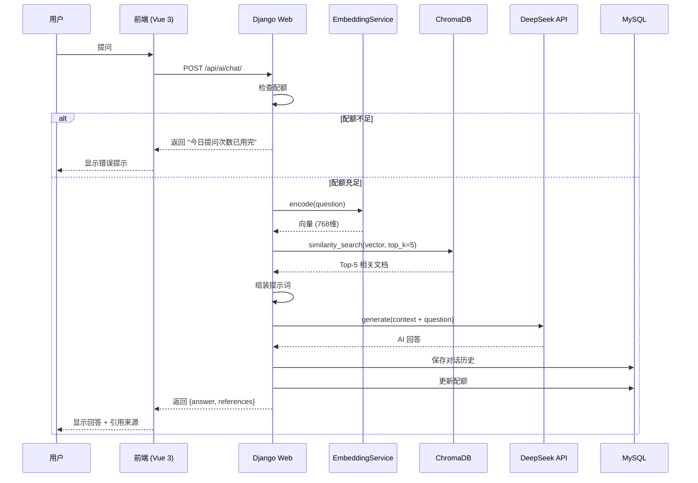
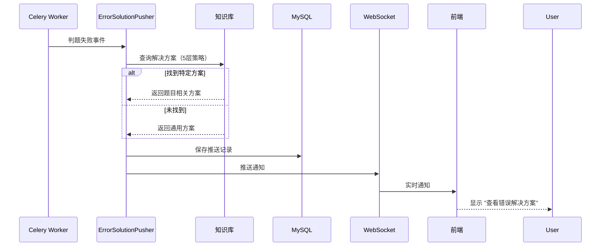

# ZJOJ 系统架构设计文档

> 🏗️ ZJOJ（铸剑在线评测系统）的完整技术架构与系统设计

**版本**: v1.1.0  
**最后更新**: 2026-04-14  
**作者**: 铸剑团队

---

## 📋 目录

- [1. 系统概述](#1-系统概述)
- [2. 整体架构](#2-整体架构)
- [3. 技术栈选型](#3-技术栈选型)
- [4. 核心模块设计](#4-核心模块设计)
- [5. 数据流设计](#5-数据流设计)
- [6. 部署架构](#6-部署架构)
- [7. 安全设计](#7-安全设计)
- [8. 性能优化](#8-性能优化)
- [9. 扩展性设计](#9-扩展性设计)
- [10. 架构决策记录](#10-架构决策记录)

---

## 1. 系统概述

### 1.1 项目简介

ZJOJ（铸剑 Online Judge）是一个基于 Django 框架开发的现代化在线评测系统，专为编程竞赛和算法训练设计。系统采用微服务架构思想，通过 Docker 容器化部署，提供高效、安全的代码评测服务。

### 1.2 核心功能

#### 基础功能
- 🔐 **用户认证系统** - JWT Token 认证，支持角色权限管理
- 📝 **题目管理** - 完整的题目 CRUD，支持标签分类和测试用例管理
- ⚡ **在线评测** - 基于 go-judge 沙箱的安全代码执行
- 📊 **实时排名** - 动态更新的排行榜系统
- 🔒 **权限控制** - 细粒度的访问权限管理（RBAC）

#### AI 增强功能（v1.1.0）
- 🤖 **AI 智能问答** - 基于 RAG 架构的智能编程助手（DeepSeek）
- 📈 **学情分析报告** - 学生个性化分析 + 教练班级共性分析
- 💡 **错误解决方案推送** - 判题失败后自动推送相关建议
- ⚡ **API 调用优化** - 24小时缓存 + 指数退避重试机制
- 🎯 **知识库增强** - 支持错误解决方案、关联题目检索

### 1.3 设计目标

| 目标 | 说明 |
|------|------|
| **安全性** | 代码沙箱隔离，防止恶意代码攻击 |
| **高性能** | 并发评测，低延迟响应 |
| **可扩展** | 模块化设计，易于功能扩展 |
| **易维护** | 清晰的代码结构，完善的文档 |
| **智能化** | AI 辅助教学，提升学习效率 |

---

## 2. 整体架构

### 2.1 系统架构图

```
┌─────────────────────────────────────────────────────────────┐
│                        客户端层                              │
│  ┌──────────┐  ┌──────────┐  ┌──────────┐                 │
│  │ Web前端  │  │ 移动端   │  │ API调用  │                 │
│  └────┬─────┘  └────┬─────┘  └────┬─────┘                 │
└───────┼──────────────┼──────────────┼──────────────────────┘
        │              │              │
        └──────────────┴──────────────┘
                       │ HTTP/REST (HTTPS)
┌──────────────────────┼──────────────────────────────────────┐
│                   网关层 (Nginx)                             │
│  ┌──────────────────────────────────────────────────────┐  │
│  │  • 反向代理     • 负载均衡     • SSL终止              │  │
│  │  • 静态文件服务  • 请求限流     • 访问日志             │  │
│  └──────────────────────┬───────────────────────────────┘  │
└──────────────────────────┼──────────────────────────────────┘
                           │
        ┌──────────────────┼──────────────────┐
        │                  │                  │
┌───────▼──────┐  ┌───────▼──────┐  ┌───────▼──────┐
│  Django Web  │  │ Celery Worker│  │  Nginx       │
│  (Gunicorn)  │  │ (异步任务)   │  │  (静态文件)  │
│  :8000       │  │              │  │              │
└───────┬──────┘  └───────┬──────┘  └──────────────┘
        │                  │
        │    ┌─────────────┴─────────────┐
        │    │      Redis (消息队列)      │
        │    │      Broker & Cache       │
        │    └─────────────┬─────────────┘
        │                  │
┌───────▼──────────────────▼──────────────────────────────┐
│                    业务逻辑层                             │
│  ┌──────────┐ ┌──────────┐ ┌──────────┐ ┌──────────┐  │
│  │ ojauth   │ │ problem  │ │  judge   │ │ai_assist │  │
│  │ 用户认证 │ │ 题目管理 │ │ 评测系统 │ │ AI助手   │  │
│  └──────────┘ └──────────┘ └──────────┘ └──────────┘  │
└───────────────────────┬─────────────────────────────────┘
                        │
        ┌───────────────┼───────────────┐
        │               │               │
┌───────▼──────┐ ┌─────▼──────┐ ┌─────▼──────┐
│   MySQL      │ │ go-judge   │ │ ChromaDB   │
│  (数据库)    │ │ (沙箱服务) │ │(向量数据库)│
│  :3306       │ │ :5050      │ │ (本地)     │
└──────────────┘ └────────────┘ └────────────┘
                                        │
                                   ┌────▼────┐
                                   │DeepSeek │
                                   │ LLM API │
                                   └─────────┘
```

### 2.2 分层架构

#### 表现层 (Presentation Layer)
- **Nginx**: 反向代理、负载均衡、静态文件服务
- **Django REST Framework**: RESTful API 接口

#### 应用层 (Application Layer)
- **Django Web**: 核心业务逻辑处理
- **Celery Worker**: 异步任务处理（评测任务、AI 分析）

#### 领域层 (Domain Layer)
- **ojauth**: 用户认证与权限管理
- **problem**: 题目管理与测试用例
- **judge**: 代码评测引擎
- **ai_assistant**: AI 智能助手

#### 基础设施层 (Infrastructure Layer)
- **MySQL**: 关系型数据存储
- **Redis**: 消息队列与缓存
- **go-judge**: 代码执行沙箱
- **ChromaDB**: 向量数据库
- **DeepSeek API**: 大语言模型服务

---

## 3. 技术栈选型

### 3.1 后端技术栈

| 组件 | 技术 | 版本 | 用途 | 选型理由 |
|------|------|------|------|----------|
| **Web框架** | Django | 6.0.4 | MTV架构，ORM，Admin | 成熟稳定，生态丰富 |
| **API框架** | DRF | 3.17.1 | RESTful API | 与 Django 完美集成 |
| **数据库** | MySQL | 8.0 | 关系型数据存储 | ACID事务，成熟可靠 |
| **缓存/队列** | Redis | 7.x | 消息队列，会话缓存 | 高性能，支持多种数据结构 |
| **异步任务** | Celery | 5.4.0 | 后台任务处理 | Python 生态标准方案 |
| **WSGI服务器** | Gunicorn | 25.3.0 | WSGI HTTP 服务器 | 稳定，支持多 worker |
| **HTTP客户端** | Requests | 2.31+ | HTTP 请求 | 简洁易用 |
| **JWT认证** | PyJWT | 2.12.1 | Token 生成验证 | 轻量级，无状态 |

### 3.2 评测系统

| 组件 | 技术 | 版本 | 用途 | 选型理由 |
|------|------|------|------|----------|
| **沙箱引擎** | go-judge | 1.11.4 | 代码执行沙箱 | 高性能，多语言支持 |
| **适配器** | Python | 3.12+ | API 封装 | 自定义评测逻辑 |
| **通信协议** | HTTP/REST | - | 进程间通信 | 简单通用 |
| **容器技术** | Docker | 20.10+ | 环境隔离 | 标准化部署 |

### 3.3 AI 系统

| 组件 | 技术 | 部署方式 | 用途 | 选型理由 |
|------|------|----------|------|----------|
| **Embedding** | text2vec-base-chinese | 本地 | 文本向量化 | 中文效果好，离线可用 |
| **向量数据库** | ChromaDB | 0.6.3 | 向量存储检索 | 轻量级，Python 原生 |
| **LLM** | DeepSeek Chat | 云端 API | 智能对话生成 | 性价比高，中文优秀 |
| **相似度算法** | Cosine Similarity | - | 向量匹配 | 计算简单，效果好 |

### 3.4 前端技术栈

| 组件 | 技术 | 版本 | 用途 | 选型理由 |
|------|------|------|------|----------|
| **框架** | Vue 3 | 3.5.30 | 响应式 UI 框架 | Composition API，性能优秀 |
| **构建工具** | Vite | 7.3.1 | 开发服务器和打包工具 | 极速热更新，开箱即用 |
| **状态管理** | Pinia | 3.0.4 | 全局状态管理 | Vue 官方推荐，TypeScript 友好 |
| **路由** | Vue Router | 5.0.3 | 前端路由管理 | Vue 生态标准方案 |
| **UI库** | Element Plus | 2.13.6 | UI 组件库 | 丰富的组件，中文文档完善 |
| **HTTP客户端** | Axios | 1.14.0 | API 请求 | 拦截器支持，易用性强 |
| **Markdown渲染** | marked | 18.0.2 | Markdown 解析 | 轻量级，速度快 |
| **图标库** | @element-plus/icons-vue | 2.3.2 | 图标组件 | 与 Element Plus 完美集成 |

### 3.5 运维工具

| 工具 | 用途 |
|------|------|
| **Docker Compose** | 容器编排 |
| **Nginx** | 反向代理，负载均衡 |
| **PM2** | 进程管理（可选） |
| **Prometheus + Grafana** | 监控告警（未来） |
| **ELK Stack** | 日志收集分析（未来） |

---

## 4. 核心模块设计

### 4.1 用户认证模块 (ojauth)

#### 职责
- 用户注册、登录、登出
- JWT Token 生成与验证
- 用户信息管理
- 班级管理（学生-教师关系）
- 权限控制（RBAC）

#### 核心类

```python
# 用户模型
class OJUser(AbstractUser):
    """自定义用户模型"""
    role = CharField(choices=[('student', '学生'), ('teacher', '教师'), ('admin', '管理员')])
    class_id = ForeignKey(Class, null=True)  # 所属班级
    avatar = ImageField(upload_to='avatars/')  # 头像
    
# JWT 认证
class MyJWTAuthentication(BaseAuthentication):
    """DRF JWT 认证类"""
    def authenticate(self, request):
        # 从 Header 提取 Token
        # 验证签名和有效期
        # 返回用户对象
        
# Token 生成
def generate_jwt_token(user):
    """生成 JWT Token"""
    payload = {
        'user_id': user.id,
        'username': user.username,
        'role': user.role,
        'exp': datetime.utcnow() + timedelta(hours=24)
    }
    return jwt.encode(payload, settings.JWT_SECRET_KEY, algorithm='HS256')
```

#### 数据流

```
登录流程:
用户提交账号密码 → 验证用户名密码 → 生成 JWT Token → 返回给客户端

后续请求:
客户端携带 Token → 中间件验证签名 → 解析用户信息 → 执行业务逻辑
```

#### 权限设计

| 角色 | 权限 |
|------|------|
| **学生** | 查看题目、提交代码、查看自己的提交记录 |
| **教师** | 创建题目、查看所有学生提交、班级管理、学情分析 |
| **管理员** | 系统配置、用户管理、数据统计 |

#### 前端实现

**API 模块** (`src/api/modules/auth.js`)

```javascript
import authHttp from '../authHttp'

// 用户登录
export const login = (data) => {
  return authHttp.post('/api/login/', data)
}

// 用户注册
export const register = (data) => {
  return authHttp.post('/api/register/', data)
}

// 获取用户信息
export const getUserProfile = () => {
  return authHttp.get('/api/user/profile/')
}

// 更新用户信息
export const updateUserProfile = (data) => {
  return authHttp.put('/api/user/profile/', data)
}
```

**状态管理** (`src/stores/auth.js`)

```javascript
import { defineStore } from 'pinia'
import { ref, computed } from 'vue'
import { login as loginApi, getUserProfile } from '@/api/modules/auth'

export const useAuthStore = defineStore('auth', () => {
  const token = ref(localStorage.getItem('token') || '')
  const user = ref(null)
  
  const isLoggedIn = computed(() => !!token.value)
  const userRole = computed(() => user.value?.role || 'guest')
  
  // 登录
  async function login(username, password) {
    const response = await loginApi({ username, password })
    token.value = response.data.token
    localStorage.setItem('token', token.value)
    await fetchUserProfile()
  }
  
  // 获取用户信息
  async function fetchUserProfile() {
    const response = await getUserProfile()
    user.value = response.data
  }
  
  // 登出
  function logout() {
    token.value = ''
    user.value = null
    localStorage.removeItem('token')
  }
  
  return { token, user, isLoggedIn, userRole, login, logout, fetchUserProfile }
})
```

**HTTP 拦截器** (`src/api/authHttp.js`)

```javascript
import http from './http'
import { useAuthStore } from '@/stores/auth'
import router from '@/router'

// 添加请求拦截器 - 自动携带 Token
http.interceptors.request.use(
  (config) => {
    const authStore = useAuthStore()
    if (authStore.token) {
      config.headers.Authorization = `Bearer ${authStore.token}`
    }
    return config
  },
  (error) => Promise.reject(error)
)

// 添加响应拦截器 - 处理 401 错误
http.interceptors.response.use(
  (response) => response,
  (error) => {
    if (error.response?.status === 401) {
      // Token 过期或无效，跳转到登录页
      const authStore = useAuthStore()
      authStore.logout()
      router.push('/login')
    }
    return Promise.reject(error)
  }
)

export default http
```

---

### 4.2 题目管理模块 (problem)

#### 职责
- 题目的 CRUD 操作
- 题目标签分类（动态规划、图论、字符串等）
- 测试用例管理（ZIP 格式）
- 题目难度评级
- 题目统计（提交数、通过率）

#### 核心模型

```python
class Problem(models.Model):
    """题目模型"""
    title = CharField(max_length=200)  # 题目标题
    description = TextField()  # 题目描述（Markdown）
    input_format = TextField()  # 输入格式
    output_format = TextField()  # 输出格式
    time_limit = IntegerField(default=1000)  # 时间限制 (ms)
    memory_limit = IntegerField(default=256)  # 内存限制 (MB)
    difficulty = CharField(choices=[('easy', '简单'), ('medium', '中等'), ('hard', '困难')])
    tags = ManyToManyField(Tag)  # 标签（多对多）
    testcases_file = FileField(upload_to='problems/%Y/%m/')  # 测试用例 ZIP
    created_by = ForeignKey(OJUser)  # 创建者
    created_at = DateTimeField(auto_now_add=True)
    
class Tag(models.Model):
    """标签模型"""
    name = CharField(max_length=50, unique=True)  # 标签名称
    color = CharField(max_length=7, default='#007bff')  # 标签颜色
    
class Submission(models.Model):
    """提交记录模型"""
    problem = ForeignKey(Problem)
    user = ForeignKey(OJUser)
    code = TextField()  # 提交的代码
    language = CharField(choices=[('cpp', 'C++'), ('c', 'C'), ('python', 'Python'), ('java', 'Java')])
    status = CharField(choices=[('PENDING', '待评测'), ('AC', '正确'), ('WA', '错误'), ...])
    score = IntegerField(default=0)  # 得分 (0-100)
    time_used = IntegerField(default=0)  # 运行时间 (ms)
    memory_used = IntegerField(default=0)  # 内存使用 (KB)
    submitted_at = DateTimeField(auto_now_add=True)
    judged_at = DateTimeField(null=True)  # 评测完成时间
```

#### 测试用例结构

```
testcases.zip
└── testdata/
    ├── 1.in      # 测试点 1 输入
    ├── 1.out     # 测试点 1 期望输出
    ├── 2.in
    ├── 2.out
    └── ...
```

#### 评分规则

- 每个测试点分值 = 100 / 测试点数量
- 最终得分 = 通过的测试点分值之和
- 状态优先级：SE > CE > RE > TLE > MLE > WA > AC

---

### 4.3 评测系统模块 (judge)

#### 职责
- 代码编译（C/C++/Java）
- 代码执行（沙箱隔离）
- 资源限制（CPU 时间、内存、进程数）
- 输出比较（规范化空白字符）
- 结果判定（AC/WA/TLE/MLE/RE/CE）

#### 系统架构

```
┌─────────────────────────────────────────────┐
│         Django Backend (Python)             │
│                                             │
│  ┌──────────────────────────────────────┐  │
│  │  GoJudgeClient                       │  │
│  │  - 读取测试用例 ZIP                  │  │
│  │  - 提取输入/输出数据                 │  │
│  └──────────────┬───────────────────────┘  │
│                 │                            │
│  ┌──────────────▼───────────────────────┐  │
│  │  JudgeAdapter                        │  │
│  │  - 遍历所有测试点                    │  │
│  │  - 构建 go-judge 请求                │  │
│  │  - 比较输出（规范化空白）            │  │
│  │  - 计算分数                          │  │
│  └──────────────┬───────────────────────┘  │
└─────────────────┼──────────────────────────┘
                  │ HTTP POST /run
┌─────────────────▼──────────────────────────┐
│         go-judge (hydro-sandbox)           │
│         localhost:5050                     │
│                                            │
│  - 编译代码（g++/gcc/python/java）         │
│  - 沙箱执行（cgroup 资源限制）             │
│  - 捕获 stdout/stderr                      │
│  - 文件系统隔离（chroot）                  │
│  - 网络禁用                                │
└────────────────────────────────────────────┘
```

#### 核心组件

**1. GoJudgeClient** (`apps/judge/gojudge_client.py`)

```python
class GoJudgeClient:
    """go-judge 评测客户端"""
    
    def judge(self, submission):
        """
        提交代码进行评测
        
        Returns:
            dict: {
                'status': 'success' or 'error',
                'result': 'AC/WA/TLE/MLE/RE/CE',
                'score': 总分 (0-100),
                'time': 最大运行时间 (ms),
                'memory': 最大内存使用 (KB),
                'test_cases': [测试点详情列表]
            }
        """
        # 1. 读取测试用例 ZIP
        test_cases = self._get_test_cases(submission.problem)
        
        # 2. 调用 JudgeAdapter
        result = judge_adapter.judge(
            code=submission.code,
            language=submission.language,
            test_cases=test_cases,
            time_limit=submission.problem.time_limit,
            memory_limit=submission.problem.memory_limit
        )
        
        # 3. 更新 Submission 状态
        submission.status = result['result']
        submission.score = result['score']
        submission.time_used = result['time']
        submission.memory_used = result['memory']
        submission.save()
        
        return result
```

**2. JudgeAdapter** (`apps/judge/adapter.py`)

```python
class JudgeAdapter:
    """评测适配器 - 封装 go-judge API"""
    
    def judge(self, code, language, test_cases, time_limit, memory_limit):
        """
        执行评测
        
        Args:
            code: 源代码字符串
            language: 编程语言 (cpp/c/python/java)
            test_cases: [{'input': '...', 'output': '...'}]
            time_limit: 时间限制 (ms)
            memory_limit: 内存限制 (MB)
        """
        results = []
        
        for tc in test_cases:
            # 1. 编译阶段（C/C++/Java）
            if language in ['cpp', 'c', 'java']:
                compile_result = self._compile(code, language)
                if compile_result['status'] != 'Accepted':
                    return {'result': 'CE', 'error': compile_result['stderr']}
            
            # 2. 执行阶段
            exec_result = self._execute(
                code=code,
                language=language,
                input_data=tc['input'],
                time_limit=time_limit,
                memory_limit=memory_limit
            )
            
            # 3. 比较输出
            status = self._compare_output(
                actual=exec_result['stdout'],
                expected=tc['output']
            )
            
            results.append({
                'status': status,
                'time': exec_result['time'],
                'memory': exec_result['memory']
            })
        
        # 4. 聚合结果
        final_result = self._aggregate_results(results)
        return final_result
    
    def _compare_output(self, actual, expected):
        """比较输出（规范化空白字符）"""
        # 去除首尾空白
        # 将多个连续空白替换为单个空格
        # 逐行比较
        actual_normalized = self._normalize_whitespace(actual)
        expected_normalized = self._normalize_whitespace(expected)
        return 'AC' if actual_normalized == expected_normalized else 'WA'
```

#### go-judge 请求示例

```json
{
  "cmd": [{
    "args": ["./a"],
    "env": ["PATH=/usr/bin:/bin"],
    "files": [
      {"content": "1 2"},
      {"name": "stdout", "max": 10240},
      {"name": "stderr", "max": 10240}
    ],
    "cpuLimit": 1000000000,
    "memoryLimit": 268435456,
    "procLimit": 50,
    "copyIn": {
      "a": {"fileId": "5LWIZAA45JHX4Y4Z"}
    }
  }]
}
```

#### 评测状态说明

| 状态码 | 含义 | 触发条件 |
|--------|------|----------|
| **AC** | Accepted | 所有测试点输出正确 |
| **WA** | Wrong Answer | 至少一个测试点输出错误 |
| **TLE** | Time Limit Exceeded | 运行时间超过限制 |
| **MLE** | Memory Limit Exceeded | 内存使用超过限制 |
| **RE** | Runtime Error | 运行时错误（段错误、除零等） |
| **CE** | Compilation Error | 编译失败 |
| **SE** | System Error | 系统错误（沙箱异常） |

---

### 4.4 AI 助手模块 (ai_assistant)

#### 职责
- RAG 智能问答（检索增强生成）
- 知识库管理（题目解析、错误解决方案）
- 对话历史管理
- 学情分析报告生成
- 错误解决方案推送

#### 系统架构

```
┌─────────────────────────────────────────────────┐
│              AI Assistant Module                 │
│                                                  │
│  ┌──────────────────────────────────────────┐  │
│  │  RAGEngine (检索增强生成引擎)            │  │
│  │  - 接收用户问题                          │  │
│  │  - 检索相关知识                          │  │
│  │  - 组装上下文                            │  │
│  │  - 调用 LLM 生成回答                     │  │
│  └──────────────┬───────────────────────────┘  │
│                 │                               │
│  ┌──────────────▼───────────────────────────┐  │
│  │  EmbeddingService (文本向量化)           │  │
│  │  - text2vec-base-chinese 模型            │  │
│  │  - 本地部署 (~390MB)                     │  │
│  │  - 异步初始化（单例模式）                │  │
│  └──────────────┬───────────────────────────┘  │
│                 │                               │
│  ┌──────────────▼───────────────────────────┐  │
│  │  VectorStore (向量数据库)                │  │
│  │  - ChromaDB                              │  │
│  │  - HNSW 索引加速                         │  │
│  │  - 持久化存储                            │  │
│  └──────────────┬───────────────────────────┘  │
│                 │                               │
│  ┌──────────────▼───────────────────────────┐  │
│  │  LLMClient (大语言模型客户端)            │  │
│  │  - DeepSeek API                          │  │
│  │  - 24小时缓存机制                        │  │
│  │  - 指数退避重试                          │  │
│  └──────────────────────────────────────────┘  │
└─────────────────────────────────────────────────┘
```

#### 核心组件

**1. RAGEngine** (`apps/ai_assistant/rag_engine.py`)

```python
class RAGEngine:
    """检索增强生成引擎"""
    
    def __init__(self):
        self.embedding_service = EmbeddingService()
        self.vector_store = VectorStore()
        self.llm_client = LLMClient()
    
    async def chat(self, question: str, user_id: int, context: dict = None):
        """
        智能对话
        
        Args:
            question: 用户问题
            user_id: 用户 ID
            context: 上下文信息（题目 ID、错误类型等）
        
        Returns:
            dict: {
                'answer': 'AI 回答',
                'references': [引用的文档列表],
                'confidence': 置信度
            }
        """
        # 1. 检查配额
        if not self._check_quota(user_id):
            raise QuotaExceededError("今日提问次数已用完")
        
        # 2. 向量化问题
        question_vector = await self.embedding_service.encode(question)
        
        # 3. 检索相关知识（Top-K）
        documents = await self.vector_store.similarity_search(
            query_vector=question_vector,
            top_k=5,
            filters=context  # 可选过滤条件
        )
        
        # 4. 组装提示词
        prompt = self._build_prompt(question, documents)
        
        # 5. 调用 LLM 生成回答
        answer = await self.llm_client.generate(prompt)
        
        # 6. 保存对话历史
        await self._save_conversation(user_id, question, answer, documents)
        
        # 7. 更新配额
        self._update_quota(user_id)
        
        return {
            'answer': answer,
            'references': documents,
            'confidence': self._calculate_confidence(documents)
        }
```

**2. EmbeddingService** (`apps/ai_assistant/embedding_service.py`)

```python
class EmbeddingService:
    """文本向量化服务"""
    
    _instance = None
    _model = None
    
    @classmethod
    async def get_instance(cls):
        """单例模式，异步初始化模型"""
        if cls._instance is None:
            cls._instance = cls()
            await cls._instance._initialize_model()
        return cls._instance
    
    async def _initialize_model(self):
        """异步加载 embedding 模型"""
        from sentence_transformers import SentenceTransformer
        self._model = SentenceTransformer('shibing624/text2vec-base-chinese')
    
    async def encode(self, text: str) -> List[float]:
        """将文本转换为向量"""
        if self._model is None:
            await self._initialize_model()
        embedding = self._model.encode(text)
        return embedding.tolist()
```

**3. ErrorSolutionPusher** (`apps/ai_assistant/error_pusher.py`)

```python
class ErrorSolutionPusher:
    """错误解决方案推送器"""
    
    def push_on_judge_failure(self, submission):
        """
        当判题失败时，推送错误解决方案
        
        查询策略（5层优先级）:
        1. 题目ID + 错误类型（最精确）
        2. 题目ID + 标签 + 错误类型
        3. 标签 + 错误类型
        4. 仅错误类型（通用方案）
        5. 兜底方案（常见错误分析）
        """
        error_type = submission.status  # WA/TLE/RE/etc.
        problem = submission.problem
        tags = list(problem.tags.values_list('name', flat=True))
        
        # 第1层：题目ID + 错误类型
        solution = self._search_solution(
            problem_id=problem.id,
            error_type=error_type
        )
        
        if not solution and tags:
            # 第2层：题目ID + 标签 + 错误类型
            solution = self._search_solution(
                problem_id=problem.id,
                tags=tags,
                error_type=error_type
            )
        
        if not solution and tags:
            # 第3层：标签 + 错误类型
            solution = self._search_solution(
                tags=tags,
                error_type=error_type
            )
        
        if not solution:
            # 第4层：仅错误类型
            solution = self._search_solution(
                error_type=error_type
            )
        
        if not solution:
            # 第5层：兜底方案
            solution = self._get_fallback_solution(error_type)
        
        return {
            'title': solution.title,
            'content': solution.content,  # 完整内容，不截断
            'error_type': error_type,
            'source': solution.source
        }
```

#### 知识库设计

| 文档类型 | 说明 | 示例 |
|----------|------|------|
| **题目解析** | 题目的详细解题思路 | "动态规划入门：背包问题" |
| **错误解决方案** | 常见错误的调试方法 | "WA 常见原因及调试技巧" |
| **算法模板** | 常用算法代码模板 | "Dijkstra 最短路径模板" |
| **学习指南** | 知识点总结 | "图论基础概念" |

#### 配额管理

```python
# 每日限额
DAILY_QUOTA = 20  # 每用户每天最多 20 次提问

# 频率限制
RATE_LIMIT = {
    'window': 60,  # 60 秒窗口
    'max_requests': 10  # 最多 10 次请求
}

# 历史记录
MAX_HISTORY = 100  # 每用户最多保存 100 条对话
```

---

## 5. 数据流设计

### 5.1 代码提交流程



#### 前端实现细节

**提交 API** (`src/api/modules/submit.js`)

```javascript
import authHttp from '../authHttp'

// 提交代码
export const submitCode = (data) => {
  return authHttp.post('/api/submissions/submit/', data)
}

// 获取提交列表
export const getSubmissionList = (params) => {
  return authHttp.get('/api/submissions/', { params })
}

// 获取提交详情
export const getSubmissionDetail = (id) => {
  return authHttp.get(`/api/submissions/${id}/`)
}
```

**提交组件** (`src/components/SubmissionList.vue`)

```vue
<template>
  <div class="submission-list">
    <el-table :data="submissions" v-loading="loading">
      <el-table-column prop="problem_title" label="题目" />
      <el-table-column prop="status" label="状态">
        <template #default="{ row }">
          <el-tag :type="getStatusType(row.status)">
            {{ getStatusText(row.status) }}
          </el-tag>
        </template>
      </el-table-column>
      <el-table-column prop="score" label="得分" />
      <el-table-column prop="time_used" label="时间(ms)" />
      <el-table-column prop="memory_used" label="内存(KB)" />
      <el-table-column label="操作">
        <template #default="{ row }">
          <el-button @click="viewDetail(row.id)">详情</el-button>
        </template>
      </el-table-column>
    </el-table>
    
    <el-pagination
      :current-page="currentPage"
      :page-size="pageSize"
      :total="total"
      @current-change="handlePageChange"
    />
  </div>
</template>

<script setup>
import { ref, onMounted } from 'vue'
import { getSubmissionList } from '@/api/modules/submit'

const submissions = ref([])
const loading = ref(false)
const currentPage = ref(1)
const pageSize = ref(20)
const total = ref(0)

// 加载提交列表
async function loadSubmissions() {
  loading.value = true
  try {
    const response = await getSubmissionList({
      page: currentPage.value,
      page_size: pageSize.value
    })
    submissions.value = response.data.results
    total.value = response.data.count
  } finally {
    loading.value = false
  }
}

// 状态映射
function getStatusType(status) {
  const map = {
    'AC': 'success',
    'WA': 'danger',
    'TLE': 'warning',
    'MLE': 'warning',
    'RE': 'danger',
    'CE': 'info'
  }
  return map[status] || ''
}

onMounted(() => {
  loadSubmissions()
})
</script>
```

### 5.2 AI 问答流程



#### 前端实现细节

**AI API** (`src/api/modules/ai.js`)

```javascript
import authHttp from '../authHttp'

// AI 智能问答
export const aiChat = (data) => {
  return authHttp.post('/api/ai/chat/', data)
}

// 获取对话历史
export const getChatHistory = (params) => {
  return authHttp.get('/api/ai/history/', { params })
}

// 获取使用统计
export const getUsageStats = () => {
  return authHttp.get('/api/ai/usage/')
}
```

**AI 问答组件** (`src/components/KnowledgeQA.vue`)

```vue
<template>
  <div class="knowledge-qa">
    <!-- 对话历史 -->
    <div class="chat-history" ref="chatContainer">
      <div v-for="msg in messages" :key="msg.id" 
           :class="['message', msg.role]">
        <div class="avatar">
          {{ msg.role === 'user' ? '👤' : '🤖' }}
        </div>
        <div class="content">
          <div v-if="msg.role === 'assistant'" 
               v-html="renderMarkdown(msg.content)"></div>
          <div v-else>{{ msg.content }}</div>
          
          <!-- 引用来源 -->
          <div v-if="msg.references?.length" class="references">
            <el-tag size="small" type="info">
              引用 {{ msg.references.length }} 个来源
            </el-tag>
          </div>
        </div>
      </div>
      
      <!-- 加载中 -->
      <div v-if="loading" class="message assistant">
        <div class="avatar">🤖</div>
        <div class="content">
          <el-skeleton :rows="3" animated />
        </div>
      </div>
    </div>
    
    <!-- 输入框 -->
    <div class="input-area">
      <el-input
        v-model="question"
        type="textarea"
        :rows="3"
        placeholder="请输入您的问题..."
        @keyup.enter.ctrl="sendMessage"
      />
      <el-button 
        type="primary" 
        :loading="loading"
        @click="sendMessage"
      >
        发送 (Ctrl+Enter)
      </el-button>
    </div>
    
    <!-- 使用统计 -->
    <div class="usage-stats">
      今日剩余: {{ remainingQuota }} / {{ totalQuota }} 次
    </div>
  </div>
</template>

<script setup>
import { ref, nextTick } from 'vue'
import { marked } from 'marked'
import { aiChat, getUsageStats } from '@/api/modules/ai'
import { ElMessage } from 'element-plus'

const messages = ref([])
const question = ref('')
const loading = ref(false)
const remainingQuota = ref(20)
const totalQuota = ref(20)
const chatContainer = ref(null)

// 渲染 Markdown
function renderMarkdown(text) {
  return marked.parse(text)
}

// 发送消息
async function sendMessage() {
  if (!question.value.trim()) return
  
  // 添加用户消息
  messages.value.push({
    role: 'user',
    content: question.value
  })
  
  const userQuestion = question.value
  question.value = ''
  loading.value = true
  
  try {
    // 调用 AI API
    const response = await aiChat({
      question: userQuestion,
      context: {}  // 可选上下文
    })
    
    // 添加 AI 回答
    messages.value.push({
      role: 'assistant',
      content: response.data.answer,
      references: response.data.references
    })
    
    // 更新配额
    remainingQuota.value = response.data.remaining_quota
    
    // 滚动到底部
    await nextTick()
    chatContainer.value.scrollTop = chatContainer.value.scrollHeight
  } catch (error) {
    ElMessage.error(error.response?.data?.error || '请求失败')
  } finally {
    loading.value = false
  }
}

// 加载使用统计
async function loadUsageStats() {
  const response = await getUsageStats()
  remainingQuota.value = response.data.remaining
  totalQuota.value = response.data.total
}

onMounted(() => {
  loadUsageStats()
})
</script>

<style scoped>
.knowledge-qa {
  display: flex;
  flex-direction: column;
  height: 600px;
}

.chat-history {
  flex: 1;
  overflow-y: auto;
  padding: 20px;
}

.message {
  display: flex;
  margin-bottom: 20px;
}

.message.user {
  flex-direction: row-reverse;
}

.content {
  max-width: 70%;
  padding: 12px 16px;
  border-radius: 8px;
  background: #f5f7fa;
}

.message.user .content {
  background: #409eff;
  color: white;
}

.input-area {
  padding: 20px;
  border-top: 1px solid #e4e7ed;
}

.usage-stats {
  padding: 10px 20px;
  text-align: right;
  color: #909399;
  font-size: 12px;
}
</style>
```

### 5.3 错误解决方案推送流程



---

## 6. 部署架构

### 6.1 完整架构图（含前端）

```
┌─────────────────────────────────────────────────────────────┐
│                      用户浏览器                              │
│  ┌──────────────────────────────────────────────────────┐  │
│  │         Vue 3 SPA (单页应用)                         │  │
│  │  • Vue Router 路由    • Pinia 状态管理               │  │
│  │  • Element Plus UI    • Axios HTTP 请求              │  │
│  └──────────────────────┬───────────────────────────────┘  │
└──────────────────────────┼──────────────────────────────────┘
                           │ HTTPS/HTTP
┌──────────────────────────▼──────────────────────────────────┐
│                   Nginx (反向代理 + 静态文件)                │
│  ┌──────────────────────────────────────────────────────┐  │
│  │  • 前端静态文件服务 (dist/)                           │  │
│  │  • API 请求转发 (/api → Django:8000)                 │  │
│  │  • SSL 终止     • 负载均衡     • Gzip 压缩           │  │
│  └──────────────────────┬───────────────────────────────┘  │
└──────────────────────────┼──────────────────────────────────┘
                           │
        ┌──────────────────┼──────────────────┐
        │                  │                  │
        │          API 请求 (REST)            │
        │                  │                  │
┌───────▼──────┐  ┌───────▼──────┐           │
│  Django Web  │  │ Celery Worker│           │
│  (Gunicorn)  │  │ (异步任务)   │           │
│  :8000       │  │              │           │
└───────┬──────┘  └───────┬──────┘           │
        │                  │                  │
        │    ┌─────────────┴─────────────┐   │
        │    │      Redis (消息队列)      │   │
        │    │      Broker & Cache       │   │
        │    └─────────────┬─────────────┘   │
        │                  │                  │
┌───────▼──────────────────▼──────────────────▼──────────┐
│                    业务逻辑层                             │
│  ┌──────────┐ ┌──────────┐ ┌──────────┐ ┌──────────┐  │
│  │ ojauth   │ │ problem  │ │  judge   │ │ai_assist │  │
│  │ 用户认证 │ │ 题目管理 │ │ 评测系统 │ │ AI助手   │  │
│  └──────────┘ └──────────┘ └──────────┘ └──────────┘  │
└───────────────────────┬─────────────────────────────────┘
                        │
        ┌───────────────┼───────────────┐
        │               │               │
┌───────▼──────┐ ┌─────▼──────┐ ┌─────▼──────┐
│   MySQL      │ │ go-judge   │ │ ChromaDB   │
│  (数据库)    │ │ (沙箱服务) │ │(向量数据库)│
│  :3306       │ │ :5050      │ │ (本地)     │
└──────────────┘ └────────────┘ └────────────┘
                                        │
                                   ┌────▼────┐
                                   │DeepSeek │
                                   │ LLM API │
                                   └─────────┘
```

### 6.2 Docker Compose 架构（完整版）

```yaml
version: '3.8'

services:
  # Nginx 反向代理 + 前端静态文件
  nginx:
    image: nginx:alpine
    ports:
      - "80:80"
      - "443:443"
    volumes:
      - ./deploy/nginx.conf:/etc/nginx/conf.d/default.conf
      - ./frontend/dist:/usr/share/nginx/html:ro  # 前端静态文件
      - static_volume:/home/zjoj/staticfiles
      - media_volume:/home/zjoj/media
  
  # Django Web 服务
  web:
    build: .
    command: gunicorn --workers 4 --worker-class gevent --bind 0.0.0.0:8000
    environment:
      - DB_HOST=db
      - REDIS_HOST=redis
      - GO_JUDGE_URL=http://gojudge:5050
      - DEEPSEEK_API_KEY=${DEEPSEEK_API_KEY}
    depends_on:
      db:
        condition: service_healthy
      redis:
        condition: service_healthy
  
  # Celery Worker
  celery:
    build: .
    command: celery -A ZJOJ worker --loglevel=info --concurrency=2
    depends_on:
      - redis
      - db
  
  # MySQL 数据库
  db:
    image: mysql:8.0
    volumes:
      - mysql_data:/var/lib/mysql
    healthcheck:
      test: ["CMD", "mysqladmin", "ping"]
  
  # Redis 消息队列
  redis:
    image: redis:7-alpine
    volumes:
      - redis_data:/data
    healthcheck:
      test: ["CMD", "redis-cli", "ping"]
  
  # go-judge 沙箱服务
  gojudge:
    build:
      context: .
      dockerfile: deploy/Dockerfile.gojudge
    privileged: true
    shm_size: 256m
    ports:
      - "5050:5050"
```

### 6.2 容器网络拓扑

```
┌──────────────────────────────────────────────┐
│          Docker Network (zjoj-network)       │
│                                              │
│  ┌────────┐  ┌────────┐  ┌────────┐        │
│  │ nginx  │──│  web   │──│  db    │        │
│  └────────┘  └────────┘  └────────┘        │
│                  │           │               │
│                  │  ┌────────▼────┐          │
│                  └──│   redis     │          │
│                     └────────┬────┘          │
│                              │               │
│                     ┌────────▼────┐          │
│                     │  celery     │          │
│                     └────────┬────┘          │
│                              │               │
│                     ┌────────▼────┐          │
│                     │  gojudge    │          │
│                     └─────────────┘          │
└──────────────────────────────────────────────┘
         ↑
    Port 8000 (外部访问)
```

### 6.3 数据持久化

| 卷名 | 挂载路径 | 用途 |
|------|----------|------|
| `mysql_data` | `/var/lib/mysql` | MySQL 数据库文件 |
| `redis_data` | `/data` | Redis 持久化数据 |
| `static_volume` | `/home/zjoj/staticfiles` | Django 静态文件 |
| `media_volume` | `/home/zjoj/media` | 用户上传文件（测试用例、头像） |

### 6.4 生产环境部署

#### 服务器要求

| 配置项 | 最低配置 | 推荐配置 |
|--------|---------|---------|
| **CPU** | 4核 | 8核+ |
| **内存** | 8GB | 16GB+ |
| **磁盘** | 50GB SSD | 100GB NVMe SSD |
| **网络** | 10Mbps | 100Mbps |
| **操作系统** | Ubuntu 20.04+ | Ubuntu 22.04 LTS |

#### 部署步骤

```bash
# 1. 克隆代码
git clone https://github.com/hhdhhy/ZJOJ-backend.git
cd ZJOJ-backend

# 2. 配置环境变量
cp .env.example .env
vim .env  # 设置数据库密码、API Key 等

# 3. 启动服务
docker compose up -d

# 4. 初始化数据库
docker compose exec web python manage.py migrate
docker compose exec web python manage.py createsuperuser

# 5. 验证服务
curl http://localhost:8000/api/health/
```

---

## 7. 安全设计

### 7.1 认证与授权

#### JWT Token 安全

```python
# Token 配置
JWT_SETTINGS = {
    'ALGORITHM': 'HS256',  # HMAC-SHA256 签名
    'SECRET_KEY': settings.JWT_SECRET_KEY,  # 从环境变量读取
    'EXPIRATION_DELTA': timedelta(hours=24),  # 24小时有效期
    'REFRESH_EXPIRATION_DELTA': timedelta(days=7),  # Refresh Token 7天
}

# Token Payload
{
    "user_id": 123,
    "username": "zhangsan",
    "role": "student",
    "exp": 1712345678,  # 过期时间戳
    "iat": 1712259278   # 签发时间戳
}
```

#### 权限控制（RBAC）

```python
# DRF Permission Classes
class IsStudentOrReadOnly(BasePermission):
    """学生只能查看，教师和管理员可编辑"""
    def has_permission(self, request, view):
        if request.method in SAFE_METHODS:
            return True
        return request.user.role in ['teacher', 'admin']

class IsOwnerOrAdmin(BasePermission):
    """只有所有者或管理员可操作"""
    def has_object_permission(self, request, view, obj):
        return obj.created_by == request.user or request.user.role == 'admin'
```

### 7.2 代码沙箱安全

#### 资源限制

```python
# go-judge 资源配置
payload = {
    'cmd': [{
        'cpuLimit': time_limit * 1000000,  # ms -> ns
        'memoryLimit': memory_limit * 1024 * 1024,  # MB -> bytes
        'procLimit': 50,  # 进程数限制（防止 fork bomb）
        'clockLimit': 60 * 1000000000,  # 总时钟限制 60s
    }]
}
```

#### 文件系统隔离

```yaml
# mount.yaml 配置
mount:
  - type: bind
    source: /host-bin
    target: /bin
    readonly: true  # 只读挂载
  - type: tmpfs
    target: /w
    data: size=128m,nr_inodes=4k  # 临时工作目录
  - type: tmpfs
    target: /tmp
    data: size=128m,nr_inodes=4k

# 禁止访问的文件
- /etc/passwd
- /etc/shadow
- /proc/kcore
- /sys/fs/cgroup
```

#### 网络禁用

- 沙箱内无法访问网络
- 防止恶意代码外联（挖矿、DDoS、数据泄露）
- DNS 解析被禁用

### 7.3 数据安全

#### 密码加密

```python
# Django 默认使用 PBKDF2 + SHA256
PASSWORD_HASHERS = [
    'django.contrib.auth.hashers.PBKDF2PasswordHasher',
    'django.contrib.auth.hashers.PBKDF2SHA1PasswordHasher',
]
```

#### SQL 注入防护

- 使用 Django ORM，避免原始 SQL
- 参数化查询
- 输入验证和清洗

#### XSS 防护

- Django 模板自动转义
- CSP (Content Security Policy) 头部
- HTTP-only Cookie

### 7.4 API 安全

#### 速率限制

```python
# DRF Throttling
REST_FRAMEWORK = {
    'DEFAULT_THROTTLE_CLASSES': [
        'rest_framework.throttling.AnonRateThrottle',
        'rest_framework.throttling.UserRateThrottle'
    ],
    'DEFAULT_THROTTLE_RATES': {
        'anon': '100/hour',  # 匿名用户每小时 100 次
        'user': '1000/hour'  # 认证用户每小时 1000 次
    }
}
```

#### CORS 配置

```python
CORS_ALLOWED_ORIGINS = [
    "https://zjoj.com",
    "https://www.zjoj.com",
]

CORS_ALLOW_CREDENTIALS = True
```

---

## 8. 性能优化

### 8.1 数据库优化

#### 索引策略

```python
class Submission(models.Model):
    class Meta:
        indexes = [
            models.Index(fields=['user', '-submitted_at']),  # 用户提交记录查询
            models.Index(fields=['problem', '-score']),  # 题目排行榜
            models.Index(fields=['status', '-submitted_at']),  # 状态筛选
        ]
```

#### 查询优化

```python
# 使用 select_related 减少 JOIN 查询
submissions = Submission.objects.select_related('user', 'problem').all()

# 使用 prefetch_related 优化多对多查询
problems = Problem.objects.prefetch_related('tags').all()

# 只查询需要的字段
users = OJUser.objects.only('id', 'username', 'avatar').all()
```

#### 连接池

```python
# Django 数据库连接池配置
DATABASES = {
    'default': {
        'ENGINE': 'django.db.backends.mysql',
        'CONN_MAX_AGE': 600,  # 连接保持 10 分钟
        'OPTIONS': {
            'init_command': "SET sql_mode='STRICT_TRANS_TABLES'",
        }
    }
}
```

### 8.2 缓存策略

#### Redis 缓存

```python
# 缓存配置
CACHES = {
    'default': {
        'BACKEND': 'django_redis.cache.RedisCache',
        'LOCATION': 'redis://redis:6379/1',
        'OPTIONS': {
            'CLIENT_CLASS': 'django_redis.client.DefaultClient',
        }
    }
}

# 使用装饰器缓存
from django.core.cache import cache

@cache_page(60 * 15)  # 缓存 15 分钟
def problem_list(request):
    return Response(Problem.objects.all())

# 手动缓存
cache_key = f"problem_{problem_id}"
result = cache.get(cache_key)
if not result:
    result = Problem.objects.get(id=problem_id)
    cache.set(cache_key, result, timeout=3600)
```

#### AI API 缓存

```python
# DeepSeek API 24小时缓存
cache_key = f"ai_response:{hash(question)}"
cached_answer = cache.get(cache_key)
if cached_answer:
    return cached_answer

# 调用 API
answer = await llm_client.generate(prompt)
cache.set(cache_key, answer, timeout=86400)  # 24小时
```

### 8.3 并发优化

#### Gunicorn 配置

```python
# gunicorn 配置
workers = 4  # CPU 核心数 * 2 + 1
worker_class = 'gevent'  # 异步 worker
threads = 2  # 每个 worker 2 个线程
timeout = 300  # 超时时间 5 分钟
keepalive = 5  # Keep-Alive 时间
```

#### Celery 并发

```python
# Celery 配置
CELERY_WORKER_CONCURRENCY = 2  # 每个 worker 2 个并发任务
CELERY_TASK_TIME_LIMIT = 300  # 任务超时 5 分钟
CELERY_TASK_SOFT_TIME_LIMIT = 240  # 软超时 4 分钟
```

### 8.4 前端优化（预留）

- **CDN 加速**: 静态资源 CDN 分发
- **懒加载**: 图片和组件按需加载
- **代码分割**: Webpack 代码分割
- **Service Worker**: PWA 离线缓存

---

## 9. 扩展性设计

### 9.1 水平扩展

#### Django Web 服务

```bash
# 增加 worker 数量
docker compose up -d --scale web=4
```

#### 数据库读写分离

```python
# 主从复制配置
DATABASES = {
    'default': {  # 写操作
        'ENGINE': 'django.db.backends.mysql',
        'HOST': 'master-db',
    },
    'replica': {  # 读操作
        'ENGINE': 'django.db.backends.mysql',
        'HOST': 'slave-db',
    }
}

# 路由配置
class PrimaryReplicaRouter:
    def db_for_read(self, model, **hints):
        return 'replica'
    
    def db_for_write(self, model, **hints):
        return 'default'
```

#### go-judge 负载均衡

```
┌──────────┐     ┌──────────────┐
│  Django  │────▶│  Load Balancer│
└──────────┘     └──────┬───────┘
                        │
              ┌─────────┼─────────┐
              ▼         ▼         ▼
         ┌────────┐ ┌────────┐ ┌────────┐
         │go-judge│ │go-judge│ │go-judge│
         │ :5050  │ │ :5051  │ │ :5052  │
         └────────┘ └────────┘ └────────┘
```

### 9.2 垂直扩展

#### 服务器升级

- 增加 CPU 核心数 → 提高并发处理能力
- 增加内存 → 支持更多同时在线用户
- 升级 SSD → 加快数据库 I/O

#### 数据库优化

- 添加更多索引
- 分区表（按时间分区）
- 归档历史数据

### 9.3 功能扩展

#### 插件系统（未来）

```python
# 插件接口
class JudgePlugin:
    """评测插件基类"""
    def before_judge(self, submission):
        pass
    
    def after_judge(self, submission, result):
        pass

# 注册插件
plugins = [
    CodeStyleChecker(),  # 代码风格检查
    PlagiarismDetector(),  # 代码查重
    PerformanceAnalyzer(),  # 性能分析
]
```

#### 多语言支持

- 国际化（i18n）
- 多语言界面
- 时区支持

---

## 10. 架构决策记录

### ADR-001: 选择 go-judge 而非 Hydro Judge

**日期**: 2026-03-15  
**状态**: 已采纳

#### 背景

最初尝试使用完整的 Hydro Judge，但遇到 cgroup v1 兼容性问题，且 Hydro Judge 过于复杂，包含大量不需要的功能。

#### 决策

直接使用 go-judge + Python Adapter 方案。

#### 理由

- ✅ 更简单，少一层抽象
- ✅ 更易调试和维护
- ✅ 性能更好（少一次网络调用）
- ✅ 灵活控制评测逻辑
- ❌ 需要自己实现多测试点逻辑

#### 后果

需要在 Python 层实现输出比较和评分逻辑，但这是可控的复杂度。

---

### ADR-002: 混合部署 AI 服务

**日期**: 2026-03-20  
**状态**: 已采纳

#### 背景

Embedding 模型较大（~390MB），LLM 推理成本高，需要权衡性能和成本。

#### 决策

Embedding 本地部署，LLM 云端调用（DeepSeek API）。

#### 理由

- ✅ Embedding 频繁调用，本地更快（毫秒级）
- ✅ LLM 按需调用，云端更经济（按量付费）
- ✅ 避免本地 GPU 依赖
- ✅ 降低服务器成本
- ❌ 需要稳定的网络连接访问 DeepSeek API

#### 后果

- 需要配置 API Key 和网络代理
- 需要考虑 API 限流和故障降级

---

### ADR-003: 使用 Celery 异步任务

**日期**: 2026-03-25  
**状态**: 已采纳

#### 背景

代码评测可能需要数秒到数十秒，同步处理会阻塞请求，影响用户体验。

#### 决策

使用 Celery + Redis 实现异步任务队列。

#### 理由

- ✅ 非阻塞，快速响应用户
- ✅ 支持任务重试和失败处理
- ✅ 可以水平扩展 worker
- ✅ 成熟的生态系统
- ❌ 增加系统复杂度

#### 后果

- 需要维护 Redis 和 Celery 服务
- 需要处理任务状态同步（轮询或 WebSocket）

---

### ADR-004: 移除内容截断，返回完整解决方案

**日期**: 2026-04-14  
**状态**: 已采纳

#### 背景

后端在返回错误解决方案时截断内容（500字/300字），导致前端滚动后仍显示不完整，影响学习效果。

#### 决策

完全移除截断，返回完整内容，前端通过滚动条展示。

#### 理由

- ✅ 错误解决方案通常需要完整展示才能帮助学生理解
- ✅ 前端已经有滚动条可以处理长内容
- ✅ 500字对于包含代码示例的解决方案来说太短了
- ✅ 提升用户体验和学习效果
- ❌ 增加网络传输量（但可接受）

#### 实施

修改 `apps/ai_assistant/error_pusher.py`:
```python
# 修改前
'content': doc['content'][:500],  # 截取前500字

# 修改后
'content': doc['content'],  # 返回完整内容
```

---

### ADR-005: 实现5层优先级查询策略

**日期**: 2026-04-14  
**状态**: 已采纳

#### 背景

原有的错误解决方案查询策略单一，无法精准匹配用户需求，导致推送的相关性不高。

#### 决策

实现5层优先级查询策略，从精确到通用逐步降级。

#### 查询策略

1. **题目ID + 错误类型**（最精确）
2. **题目ID + 标签 + 错误类型**
3. **标签 + 错误类型**
4. **仅错误类型**（通用方案）
5. **兜底方案**（常见错误分析）

#### 理由

- ✅ 提高推送相关性
- ✅ 确保总有内容可推送（兜底机制）
- ✅ 利用题目标签增强匹配
- ❌ 增加查询复杂度

#### 实施

详见 `ErrorSolutionPusher.push_on_judge_failure()` 方法。

---

## 📚 附录

### A. 术语表

| 术语 | 英文 | 说明 |
|------|------|------|
| **在线评测系统** | Online Judge (OJ) | 自动评测代码的平台 |
| **沙箱** | Sandbox | 隔离的执行环境 |
| **RAG** | Retrieval-Augmented Generation | 检索增强生成 |
| **Embedding** | Embedding | 文本向量化表示 |
| **JWT** | JSON Web Token | 无状态认证令牌 |
| **RBAC** | Role-Based Access Control | 基于角色的访问控制 |
| **cgroup** | Control Group | Linux 资源限制机制 |

### B. 参考文档

- [Django 官方文档](https://docs.djangoproject.com/)
- [Django REST Framework](https://www.django-rest-framework.org/)
- [go-judge 官方文档](https://docs.goj.ac/cn/)
- [Celery 官方文档](https://docs.celeryq.dev/)
- [DeepSeek API 文档](https://platform.deepseek.com/)
- [ChromaDB 文档](https://docs.trychroma.com/)

### C. 变更记录

| 版本 | 日期 | 变更内容 | 作者 |
|------|------|----------|------|
| v1.0.0 | 2026-03-15 | 初始版本 | 铸剑团队 |
| v1.1.0 | 2026-04-14 | 新增 AI 助手模块、错误解决方案推送优化 | 铸剑团队 |
| v1.2.0 | 2026-04-14 | 补充前端技术栈、前后端交互细节、完整架构图 | 铸剑团队 |

---

<div align="center">

**🎉 文档结束**

[返回首页](../README.md) • [部署指南](03-DEPLOYMENT.md) • [API 参考](04-API_REFERENCE.md)

Made with ❤️ by 铸剑团队

</div>
