# 第三章 系统设计实现

## 3.1 需求分析

### 3.1.1 用户需求分析

ZJOJ在线评测系统面向两类主要用户群体：学员和教练，每类用户具有不同的使用场景和功能需求。

**学员用户需求**：
- **便捷的题目练习**：能够浏览题目列表、查看题目详情、提交代码并获取即时评测结果
- **详细的错误诊断**：当代码出现错误时，获得具体的错误原因分析和改进建议
- **个性化学习辅助**：遇到难题时，通过AI助手获得解题思路提示和相关知识点讲解
- **学习进度跟踪**：查看自己的提交历史、通过率统计、薄弱知识点分析
- **班级管理**：加入教练创建的班级，参与班级内的学习和竞赛

**教练用户需求**：
- **题目管理**：创建、编辑、删除题目，上传测试用例，设置题目难度和标签
- **班级管理**：创建班级、添加学生、管理班级成员
- **学情分析**：查看班级整体学习情况、学生个人进度、常见错误类型统计
- **知识库管理**：维护AI知识库，提升智能助手的回答质量

基于上述需求，系统采用基于角色的权限设计，将功能划分为公共功能模块和教练专属功能模块两大类。

### 3.1.2 功能需求分析

基于用户需求，系统需要实现以下核心功能：

**公共功能模块**面向所有注册用户，提供基础的在线评测服务，包括用户认证、题目浏览、代码提交与评测、AI智能助手等功能。

**教练专属功能模块**为教师用户提供教学管理工具，包括题目管理、班级管理、成员管理、学情分析和知识库管理等功能。

系统的功能结构如图3-1所示。

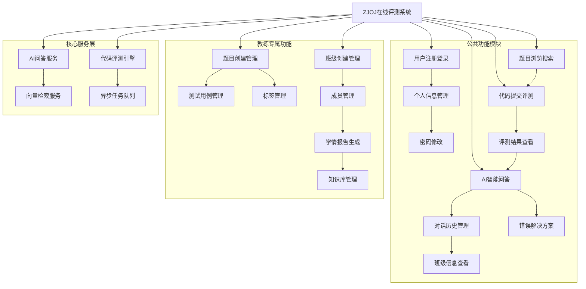

*图3-1 系统功能结构图*

## 3.2 系统架构设计

### 3.2.1 系统总体架构

ZJOJ在线评测系统采用前后端分离的B/S架构，基于Django MTV模式构建后端服务。系统整体分为三层：表现层、业务逻辑层和数据服务层。

**表现层**：前端采用Vue.js框架构建单页面应用（SPA），通过RESTful API与后端进行数据交互，实现响应式用户界面。

**业务逻辑层**：后端基于Django框架，采用MTV（Model-Template-View）架构模式：
- **模型层（Model）**：负责数据管理和业务逻辑，包括用户信息、题目数据、提交记录等
- **视图层（View）**：负责处理HTTP请求和业务逻辑控制，协调模型和模板之间的数据流动
- **模板层（Template）**：在前后端分离架构中，主要由前端Vue组件承担页面渲染职责

**数据服务层**：包括MySQL数据库、Redis缓存、ChromaDB向量数据库、go-judge沙箱服务等。

系统采用模块化设计，主要包含四个核心应用模块：
- **ojauth**：用户认证与权限管理模块
- **problem**：题目管理与代码评测模块
- **judge**：判题引擎与异步任务处理模块
- **ai_assistant**：AI智能助手与学情分析模块

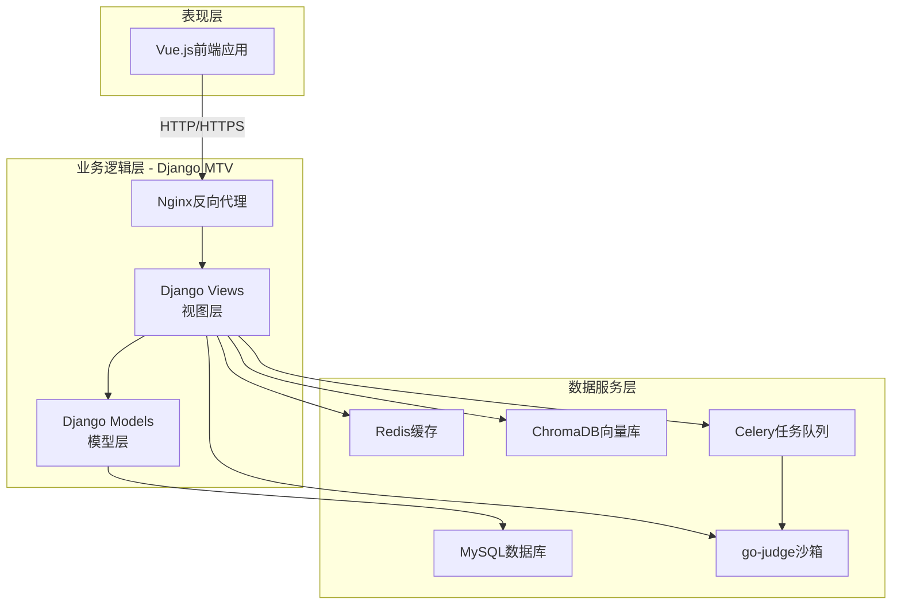

*图3-2 系统架构图*

## 3.3 功能模块设计

### 3.3.1 用户认证模块

用户认证模块主要实现用户的注册、登录、个人信息管理、密码修改等功能。

**用户注册**: 用户通过填写用户名、邮箱、手机号、真实姓名和密码进行注册，系统会验证信息的唯一性和合法性。

**用户登录**: 用户通过邮箱和密码进行登录，系统验证通过后生成JWT Token用于后续请求的身份验证。

**个人信息管理**: 用户可以修改自己的真实姓名、头像、个人简介等信息。

**密码修改**: 用户登录后可以修改自己的登录密码，需要验证原密码的正确性。

**角色权限**: 系统支持三种用户角色：学生(1)、教练(2)、管理员(3)，不同角色拥有不同的权限。

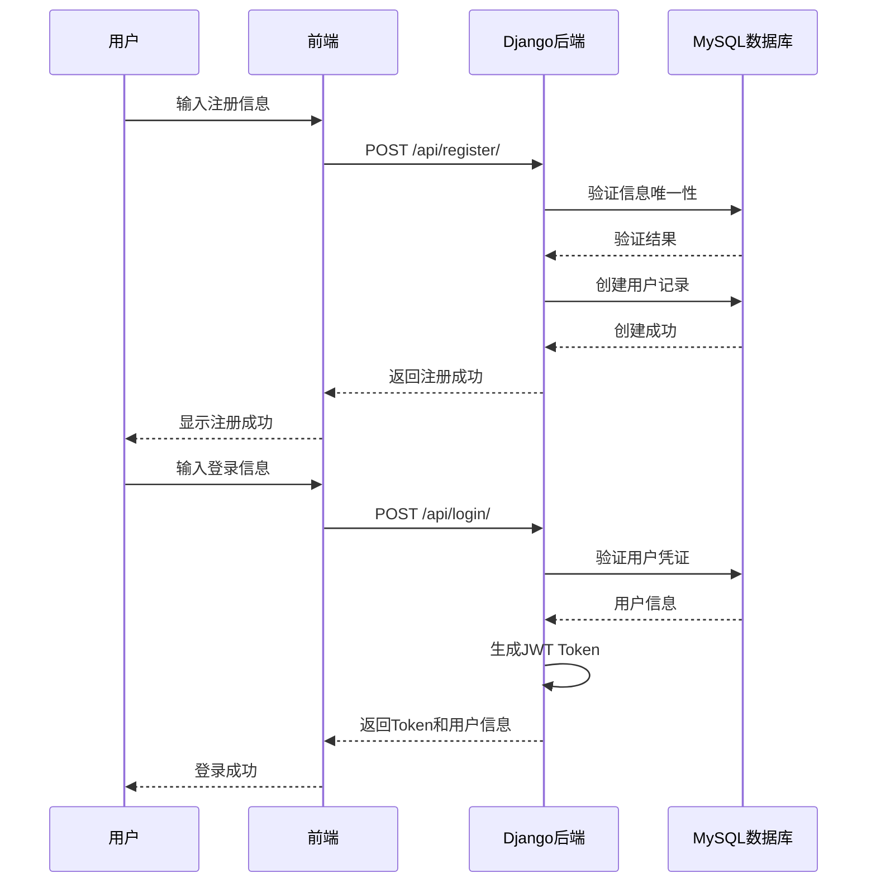

*图3-3 用户认证流程图*

### 3.3.2 题目管理模块

题目管理模块主要实现题目的创建、查询、更新、删除等功能。

**题目创建**: 管理员或教练可以创建新的编程题目，包括题目标题、描述、输入输出格式、样例、时间限制、内存限制等信息，并上传测试用例ZIP文件。

**题目查询**: 用户可以按标题搜索题目，按标签过滤题目，查看题目列表和详情。

**题目更新**: 题目创建者可以修改题目信息，包括描述、限制条件等。

**题目删除**: 题目创建者可以删除自己创建的题目。

**标签管理**: 系统支持为题目添加标签，便于分类和检索。

### 3.3.3 代码提交与评测模块

代码提交与评测模块是系统的核心功能，主要实现代码提交、自动评测、结果反馈等功能。

**代码提交**: 用户可以选择题目，选择编程语言(C/C++/Python/Java)，提交源代码进行评测。

**异步评测**: 系统使用Celery异步任务队列处理评测请求，避免阻塞主线程。

**沙箱执行**: 使用go-judge沙箱环境安全地执行用户代码，限制资源使用(时间、内存)。

**结果反馈**: 评测完成后，系统返回评测结果，包括状态(AC/WA/TLE/MLE/RE/CE)、得分、运行时间、内存使用等详细信息。

**测试点详情**: 系统记录每个测试点的详细评测结果，方便用户分析问题。

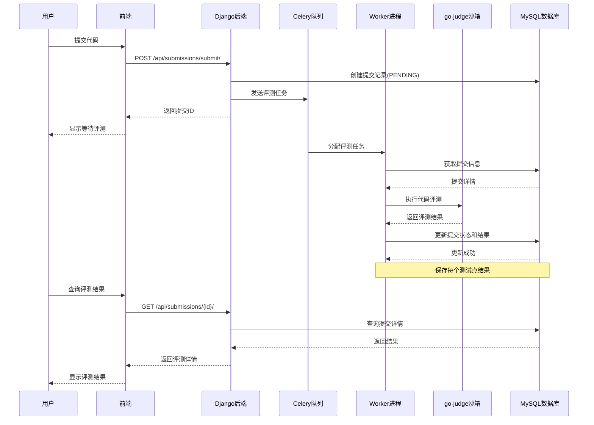

*图3-4 代码提交流程图*

### 3.3.4 AI助手模块

AI助手模块基于RAG(检索增强生成)技术，为用户提供智能问答服务。

**智能问答**: 用户可以提问编程相关问题，AI助手基于知识库生成准确回答。

**知识库检索**: 系统使用向量数据库(ChromaDB)存储知识库文档，通过相似度检索获取相关上下文。

**文本嵌入**: 使用text2vec-base-chinese模型将文本转换为768维向量，支持中文语义理解。

**对话历史**: 系统保存用户的对话历史记录，支持查看和管理。

**学情报告**: 系统可以生成学生个性化学情报告和班级共性学情报告，帮助教练了解学生学习情况。

**错误解决方案**: 当用户代码评测失败时，AI助手可以提供针对性的错误分析和解决方案。

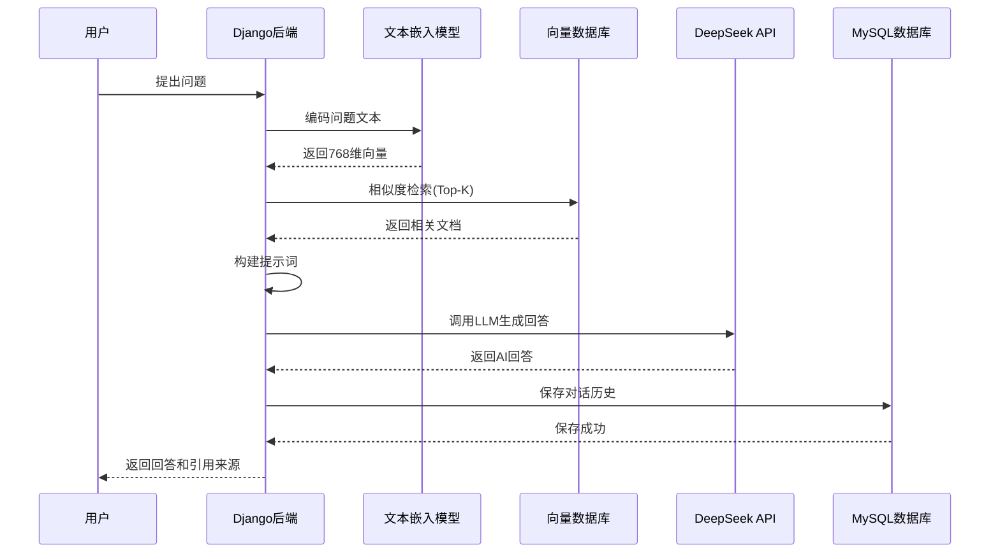

*图3-5 AI助手工作流程图*

### 3.3.5 班级管理模块

班级管理模块主要面向教练用户，支持班级的创建、成员管理等功能。

**班级创建**: 教练可以创建班级，设置班级名称和描述。

**成员管理**: 教练可以添加学生到班级，也可以从班级中移除学生。

**班级查看**: 学生可以查看自己加入的班级，教练可以查看自己管理的班级。

**权限控制**: 只有教练可以创建和管理班级，学生只能查看和加入班级。

### 3.3.6 管理员模块

管理员模块是本系统重要开发部分，它的使用对象是系统管理员，在进入管理员模块前，需要输入正确的用户姓名、密码，才能进入管理员模块。

**系统用户管理**: 管理员可以查看所有用户信息，管理用户角色和状态。

**题目管理**: 管理员可以创建、编辑、删除所有题目，不受创建者限制。

**班级管理**: 管理员可以查看所有班级信息，协助管理班级。

**AI知识库管理**: 管理员可以管理AI助手的知识库文档，添加、编辑、删除知识内容。

**系统监控**: 管理员可以查看系统运行状态，监控系统性能。

## 3.4 数据库设计

### 3.4.1 概念设计

E-R图一般是由实体、实体的属性与联系三个要素组成的。在规划系统中所使用的数据库实体对象及实体E-R图，则需要通过对系统的需求分析、业务流程设计和系统功能结构来确定的。

总体ER图如下图所示。

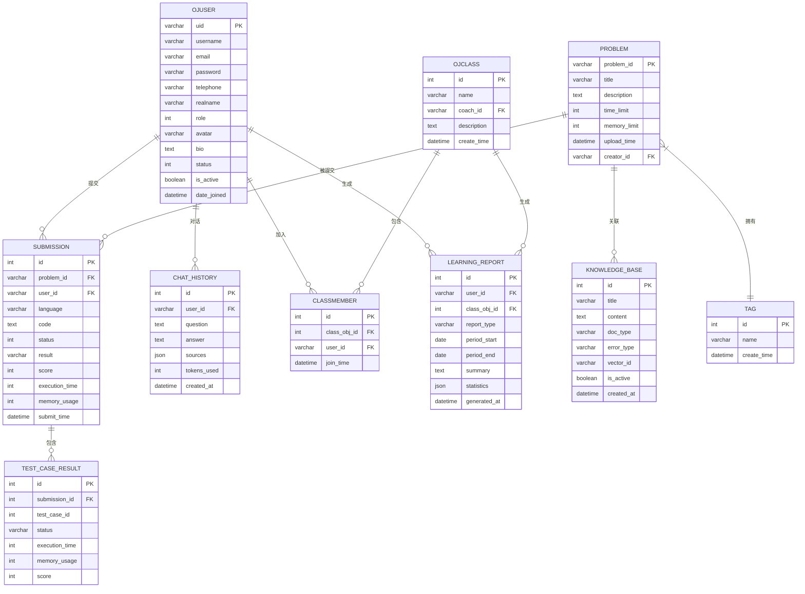

*图3-6 系统E-R图（Crow's Foot表示法）*

**Chen方法（陈氏ER图表示法）**

为了更清晰地展示实体间的关系，下面使用Chen方法重新绘制E-R图。Chen方法使用矩形表示实体、椭圆表示属性、菱形表示关系，是经典的ER图表示方法。

```mermaid
graph TB

        U["用户"]
        U1("用户UID")
        U2("用户名")
        U3("邮箱")
        U4("密码")
        U5("手机号")
        U6("真实姓名")
        U7("角色")

        U --- U1
        U --- U2
        U --- U3
        U --- U4
        U --- U5
        U --- U6
        U --- U7

        P["题目"]
        P1("题目编号")
        P2("标题")
        P3("描述")
        P4("时间限制")
        P5("内存限制")
        P6("上传时间")
        P --- P1
        P --- P2
        P --- P3
        P --- P4
        P --- P5
        P --- P6

    

        S["提交记录"]
        S1("提交ID")
        S2("编程语言")
        S3("代码")
        S4("状态")
        S5("结果")
        S6("得分")
        S7("运行时间")
        S8("内存使用")
        S9("提交时间")
        S --- S1
        S --- S2
        S --- S3
        S --- S4
        S --- S5
        S --- S6
        S --- S7
        S --- S8
        S --- S9

    
   
        T["标签"]
        T1("标签ID")
        T2("标签名")
        T --- T1
        T --- T2
 
    
  
        C["班级"]
        C1("班级ID")
        C2("班级名称")
        C3("班级描述")
        C4("创建时间")
        C --- C1
        C --- C2
        C --- C3
			C --- C4
            

        K["知识文档"]
        K1("文档ID")
        K2("标题")
        K3("内容")
        K4("文档类型")
        K5("错误类型")
        K --- K1
        K --- K2
        K --- K3
        K --- K4
        K --- K5
    

        H["对话历史"]
        H1("对话ID")
        H2("问题")
        H3("答案")

        H --- H1
        H --- H2
        H --- H3


        LR["学情报告"]
        LR1("报告ID")
        LR2("报告类型")
        LR3("开始日期")
        LR4("结束日期")
        LR5("总结内容")
        LR --- LR1
        LR --- LR2
        LR --- LR3
        LR --- LR4
        LR --- LR5

        TR["测试点结果"]
        TR1("结果ID")
        TR2("测试点ID")
        TR3("状态")
        TR4("运行时间")
        TR5("内存使用")
        TR6("得分")
        TR --- TR1
        TR --- TR2
        TR --- TR3
    		TR --- TR5
        TR --- TR6

    

        R1{"提交"}
        R2{"拥有"}
        R3{"包含"}
        R4{"属于"}
        R5{"关联"}
        R6{"对话"}
        R7{"生成"}

    
    U -->|1| R1
    R1 -->|N| S
    
    P -->|1| R1
    
    P -->|M| R2
    R2 -->|N| T
    
    S -->|1| R3
    R3 -->|N| TR
    
    U -->|M| R4
    R4 -->|N| C
    
    P -->|1| R5
    R5 -->|N| K
    
    U -->|1| R6
    R6 -->|N| H
    
    U -->|1| R7
    R7 -->|N| LR
    
    C -->|1| R7
```
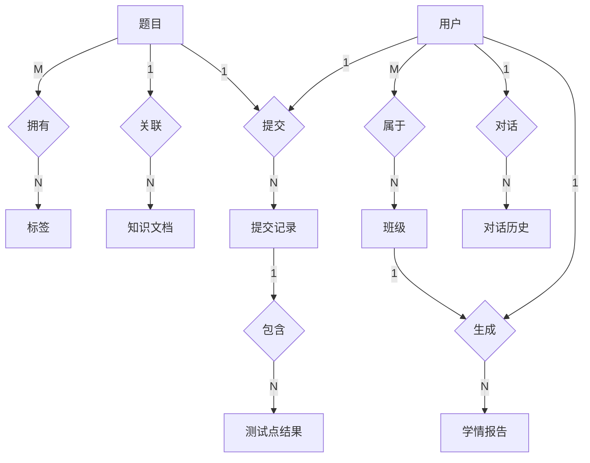

*图3-7 系统E-R图（Chen方法表示法）*

**图例说明**：
- **矩形框**：表示实体（Entity），如用户、题目、提交记录等
- **椭圆框**：表示实体的属性（Attribute），用连线连接到对应实体
- **菱形框**：表示实体间的关系（Relationship），如提交、拥有、包含等
- **连线上的标注**：1表示一端，N/M表示多端，体现一对多或多对多关系

### 3.4.2 逻辑设计

将实体属性模型转换为关系数据库应该遵循以下几个原则：

1. 一个实体转换后要对应一个关系。
2. 所有的主键必须要定义为非空（not null）。
3. 针对二元联系也应该按照一对多、弱对实、一对一和多对多等联系来定义外键。

得到数据库的关系后，设计如下表结构。

#### ojauth_ojuser (用户表)

| 字段名称 | 类型 | 长度 | 不是null | 主键 | 字段说明 |
|---------|------|------|---------|------|---------|
| uid | varchar | 22 | 是 | 主键 | 用户UID (Short UUID) |
| username | varchar | 150 | 是 | | 用户名 |
| email | varchar | 254 | 是 | | 邮箱地址 |
| password | varchar | 128 | 是 | | 密码 (PBKDF2加密) |
| telephone | varchar | 20 | 是 | | 手机号 |
| realname | varchar | 150 | 是 | | 真实姓名 |
| role | int | 11 | 是 | | 用户角色 (1-学生, 2-教练, 3-管理员) |
| avatar | varchar | 500 | 否 | | 头像URL |
| bio | text | 0 | 否 | | 个人简介 |
| status | int | 11 | 是 | | 用户状态 (1-激活, 2-未激活, 3-锁定) |
| is_active | boolean | 1 | 是 | | 是否激活 |
| is_staff | boolean | 1 | 是 | | 是否为工作人员 |
| date_joined | datetime | 0 | 是 | | 注册时间 |
| last_login | datetime | 0 | 否 | | 最后登录时间 |

#### problem_problem (题目表)

| 字段名称 | 类型 | 长度 | 不是null | 主键 | 字段说明 |
|---------|------|------|---------|------|---------|
| problem_id | varchar | 20 | 是 | 主键 | 题目编号 |
| title | varchar | 100 | 是 | | 题目标题 |
| description | text | 0 | 是 | | 题目描述 |
| time_limit | int | 11 | 是 | | 时间限制(ms) |
| memory_limit | int | 11 | 是 | | 内存限制(MB) |
| upload_time | datetime | 0 | 是 | | 上传时间 |
| update_time | datetime | 0 | 是 | | 更新时间 |
| creator_id | varchar | 22 | 否 | | 创建者UID (外键) |

#### problem_tag (标签表)

| 字段名称 | 类型 | 长度 | 不是null | 主键 | 字段说明 |
|---------|------|------|---------|------|---------|
| id | int | 11 | 是 | 主键 | 标签ID |
| name | varchar | 50 | 是 | | 标签名 |
| create_time | datetime | 0 | 是 | | 创建时间 |

#### problem_problem_tags (题目-标签关联表)

| 字段名称 | 类型 | 长度 | 不是null | 主键 | 字段说明 |
|---------|------|------|---------|------|---------|
| problem_id | varchar | 20 | 是 | 主键 | 题目ID (外键) |
| tag_id | int | 11 | 是 | 主键 | 标签ID (外键) |

#### submission (提交记录表)

| 字段名称 | 类型 | 长度 | 不是null | 主键 | 字段说明 |
|---------|------|------|---------|------|---------|
| id | int | 11 | 是 | 主键 | 提交ID |
| problem_id | varchar | 20 | 是 | | 题目ID (外键) |
| user_id | varchar | 22 | 是 | | 用户UID (外键) |
| language | varchar | 20 | 是 | | 编程语言 |
| code | text | 0 | 是 | | 源代码 |
| code_length | int | 11 | 是 | | 代码长度 |
| status | int | 11 | 是 | | 评测状态 (0-等待, 1-评测中, 2-已完成, 3-编译错误, 4-系统错误) |
| result | varchar | 10 | 否 | | 评测结果 (AC/WA/TLE/MLE/RE/CE/SE) |
| score | int | 11 | 是 | | 得分 (0-100) |
| execution_time | int | 11 | 是 | | 运行时间(ms) |
| memory_usage | int | 11 | 是 | | 内存使用(KB) |
| submit_time | datetime | 0 | 是 | | 提交时间 |
| judge_time | datetime | 0 | 否 | | 评测时间 |

#### test_case_result (测试点结果表)

| 字段名称 | 类型 | 长度 | 不是null | 主键 | 字段说明 |
|---------|------|------|---------|------|---------|
| id | int | 11 | 是 | 主键 | 结果ID |
| submission_id | int | 11 | 是 | | 提交ID (外键) |
| test_case_id | int | 11 | 是 | | 测试点ID |
| status | varchar | 10 | 是 | | 测试点状态 |
| execution_time | int | 11 | 是 | | 运行时间(ms) |
| memory_usage | int | 11 | 是 | | 内存使用(KB) |
| score | int | 11 | 是 | | 该测试点得分 |
| message | text | 0 | 否 | | 详细信息 |

#### ojauth_class (班级表)

| 字段名称 | 类型 | 长度 | 不是null | 主键 | 字段说明 |
|---------|------|------|---------|------|---------|
| id | int | 11 | 是 | 主键 | 班级ID |
| name | varchar | 100 | 是 | | 班级名称 |
| coach_id | varchar | 22 | 否 | | 教练UID (外键) |
| description | text | 0 | 否 | | 班级描述 |
| create_time | datetime | 0 | 是 | | 创建时间 |

#### ojauth_class_member (班级成员表)

| 字段名称 | 类型 | 长度 | 不是null | 主键 | 字段说明 |
|---------|------|------|---------|------|---------|
| id | int | 11 | 是 | 主键 | 成员ID |
| class_obj_id | int | 11 | 是 | | 班级ID (外键) |
| user_id | varchar | 22 | 是 | | 用户UID (外键) |
| join_time | datetime | 0 | 是 | | 加入时间 |

#### ai_assistant_knowledgebase (知识库表)

| 字段名称 | 类型 | 长度 | 不是null | 主键 | 字段说明 |
|---------|------|------|---------|------|---------|
| id | int | 11 | 是 | 主键 | 文档ID |
| title | varchar | 200 | 是 | | 标题 |
| content | text | 0 | 是 | | 内容 |
| doc_type | varchar | 20 | 是 | | 文档类型 |
| error_type | varchar | 50 | 否 | | 错误类型 |
| source | varchar | 500 | 否 | | 来源 |
| vector_id | varchar | 100 | 是 | | 向量ID |
| is_active | boolean | 1 | 是 | | 是否启用 |
| created_at | datetime | 0 | 是 | | 创建时间 |
| updated_at | datetime | 0 | 是 | | 更新时间 |

#### ai_assistant_chathistory (对话历史表)

| 字段名称 | 类型 | 长度 | 不是null | 主键 | 字段说明 |
|---------|------|------|---------|------|---------|
| id | int | 11 | 是 | 主键 | 对话ID |
| user_id | varchar | 22 | 是 | | 用户UID (外键) |
| question | text | 0 | 是 | | 问题 |
| answer | text | 0 | 是 | | 答案 |
| sources | json | 0 | 否 | | 引用来源 |
| model_used | varchar | 50 | 否 | | 使用的模型 |
| tokens_used | int | 11 | 否 | | 消耗Token数 |
| created_at | datetime | 0 | 是 | | 创建时间 |

#### ai_assistant_userprofile (用户AI配置表)

| 字段名称 | 类型 | 长度 | 不是null | 主键 | 字段说明 |
|---------|------|------|---------|------|---------|
| id | int | 11 | 是 | 主键 | 配置ID |
| user_id | varchar | 22 | 是 | | 用户UID (外键) |
| daily_quota | int | 11 | 是 | | 每日配额 |
| used_today | int | 11 | 是 | | 今日已用 |
| last_reset_date | date | 0 | 是 | | 上次重置日期 |
| max_history | int | 11 | 是 | | 最大历史记录数 |

#### ai_assistant_learningreport (学情报告表)

| 字段名称 | 类型 | 长度 | 不是null | 主键 | 字段说明 |
|---------|------|------|---------|------|---------|
| id | int | 11 | 是 | 主键 | 报告ID |
| user_id | varchar | 22 | 是 | | 用户UID (外键) |
| class_obj_id | int | 11 | 否 | | 班级ID (外键) |
| report_type | varchar | 10 | 是 | | 报告类型 |
| period_start | date | 0 | 是 | | 统计开始日期 |
| period_end | date | 0 | 是 | | 统计结束日期 |
| summary | text | 0 | 是 | | 总结内容 |
| statistics | json | 0 | 否 | | 统计数据 |
| recommendations | json | 0 | 否 | | 建议列表 |
| generated_at | datetime | 0 | 是 | | 生成时间 |

## 3.5 系统关键技术

### 3.5.1 JWT身份认证

系统采用JWT (JSON Web Token) 进行用户身份认证。JWT由三部分组成：头部(Header)、载荷(Payload)和签名(Signature)。用户登录成功后，服务器生成包含用户信息的JWT Token返回给客户端，客户端在后续请求中携带该Token，服务器验证Token的有效性来确认用户身份。

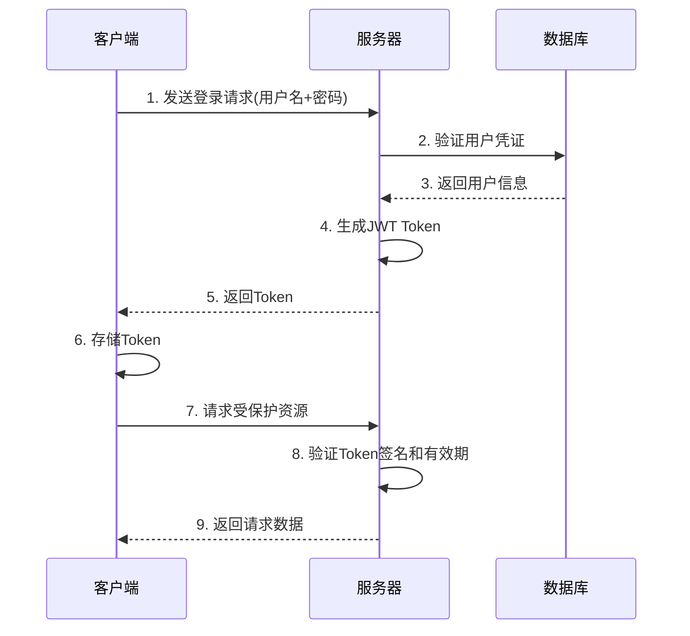

*图3-7 JWT认证流程图*

### 3.5.2 go-judge代码沙箱

系统使用go-judge作为代码执行沙箱，提供安全的代码执行环境。go-judge基于Linux cgroup和namespace技术，实现了资源限制(时间、内存、进程数)和文件系统隔离，确保用户代码的安全执行。

**核心技术**:
- **cgroup资源限制**: 控制CPU时间、内存使用、进程数量
- **namespace隔离**: 文件系统隔离、网络隔离
- **chroot根文件系统**: 限制可访问的文件范围
- **超时控制**: 精确到毫秒级的执行时间控制

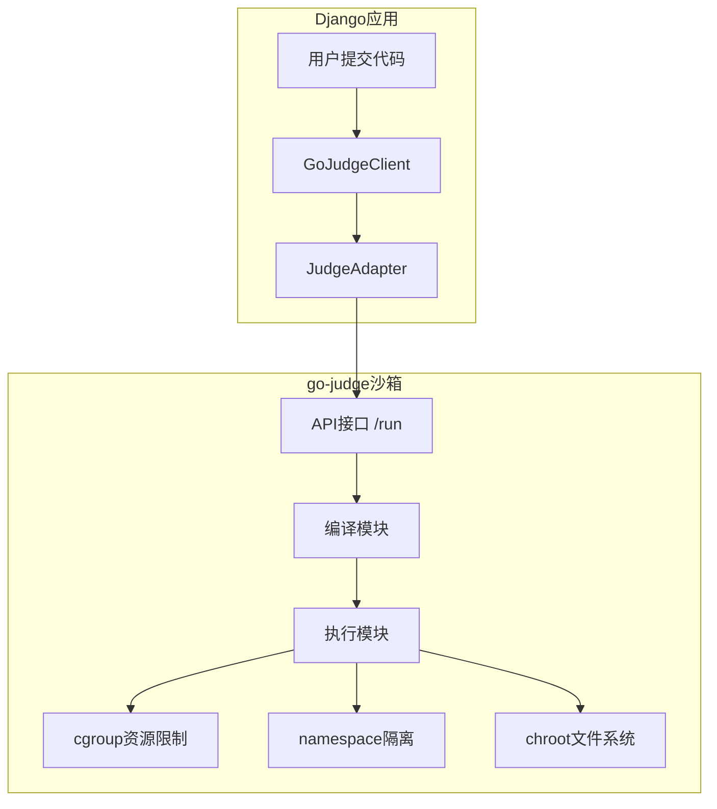

*图3-8 go-judge沙箱架构图*

### 3.5.3 RAG检索增强生成

AI助手模块采用RAG (Retrieval-Augmented Generation) 技术，结合向量检索和大语言模型生成能力。系统使用text2vec-base-chinese模型进行文本嵌入，ChromaDB作为向量数据库存储和检索知识库文档，DeepSeek API作为大语言模型生成回答。

**技术流程**:
1. **文本嵌入**: 将问题和文档转换为768维向量
2. **向量检索**: 在ChromaDB中进行相似度搜索，返回Top-K相关文档
3. **提示词构建**: 将相关文档和问题组合成提示词
4. **LLM生成**: 调用DeepSeek API生成最终回答

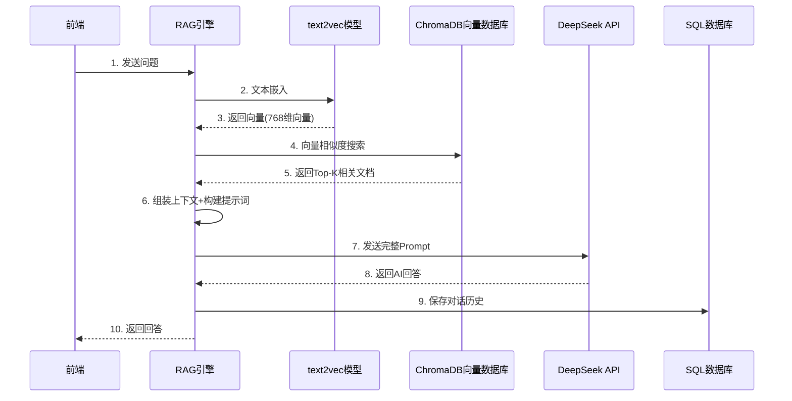

*图3-9 RAG技术流程图*

### 3.5.4 Celery异步任务队列

系统使用Celery处理异步任务，特别是代码评测任务。当用户提交代码后，系统将评测任务放入Celery队列，由Worker进程异步执行，避免阻塞主线程，提高系统响应速度。

**优势**:
- **解耦**: 将耗时的评测任务与HTTP请求分离
- **并发**: 支持多个Worker并行处理评测任务
- **可靠性**: 支持任务重试和失败处理
- **可扩展**: 可以轻松增加Worker数量提升处理能力

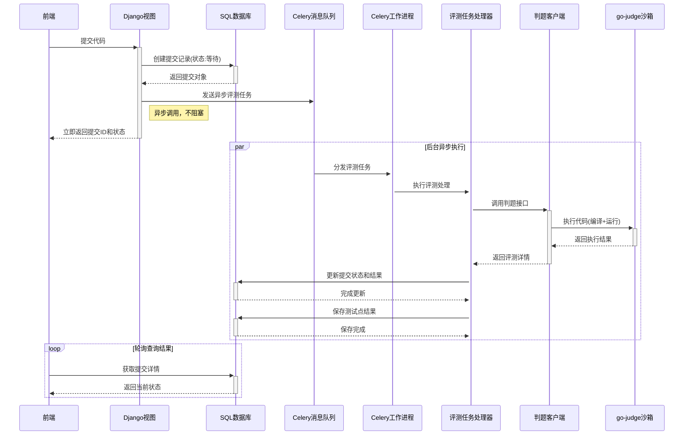

*图3-10 Celery异步任务处理流程图*

### 3.5.5 Django REST Framework

系统后端API基于Django REST Framework构建，提供RESTful风格的API接口。DRF通过中间件式的处理管道，对每个HTTP请求进行层层验证和处理。

**请求处理流程**:
1. **URL路由匹配** - 根据请求URL找到对应的视图
2. **身份认证** - 验证JWT Token，确认用户身份
3. **权限检查** - 检查用户是否有访问该接口的权限
4. **频率限制** - 检查API调用频率，防止滥用
5. **数据验证** - 序列化器验证请求数据的格式和合法性
6. **业务处理** - 执行视图方法，处理业务逻辑和数据库操作
7. **响应序列化** - 将数据对象序列化为JSON格式返回

**核心组件**:
- **Serializer**: 数据序列化、反序列化和验证
- **ViewSet**: 统一的CRUD操作封装
- **Authentication**: JWT Token认证机制
- **Permission**: 基于角色的细粒度权限控制
- **Throttling**: API调用频率限制

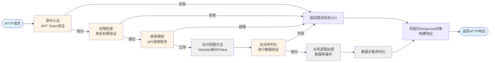

*图3-11 DRF核心组件工作流程图*

## 3.6 系统安全设计

### 3.6.1 数据安全

- **密码加密**: 使用Django内置的PBKDF2算法对用户密码进行加密存储
- **SQL注入防护**: 使用Django ORM进行数据库操作，防止SQL注入攻击
- **XSS防护**: 对用户输入进行转义处理，防止跨站脚本攻击
- **CSRF防护**: 使用Django CSRF中间件防止跨站请求伪造

### 3.6.2 权限控制

- **角色权限**: 基于用户角色(学生/教练/管理员)实现细粒度权限控制
- **JWT认证**: 使用JWT Token进行身份验证，确保API访问的安全性
- **权限中间件**: 自定义权限中间件，验证用户是否有权限执行特定操作
- **数据隔离**: 不同角色的用户只能访问授权的数据

### 3.6.3 代码沙箱安全

- **资源限制**: 限制用户代码的执行时间和内存使用，防止资源滥用
- **文件系统隔离**: 使用chroot和mount namespace隔离文件系统，防止恶意代码访问系统文件
- **网络禁用**: 沙箱内禁用网络访问，防止恶意代码外联
- **进程限制**: 限制可创建的进程数量，防止fork炸弹攻击

## 3.7 系统性能优化

### 3.7.1 数据库优化

- **索引优化**: 为常用查询字段添加索引，提高查询效率
  - 用户表: username, email, telephone唯一索引
  - 提交表: user_id, problem_id, submit_time复合索引
  - 对话历史表: user_id, created_at复合索引
- **查询优化**: 使用select_related和prefetch_related减少数据库查询次数
- **连接池**: 使用数据库连接池管理数据库连接

### 3.7.2 缓存策略

- **向量缓存**: 缓存常用文本的向量表示，减少重复计算
- **API缓存**: 缓存API响应结果，减少重复请求
- **编译缓存**: 缓存编译后的可执行文件，避免重复编译相同代码

### 3.7.3 异步处理

- **异步评测**: 使用Celery异步处理代码评测任务，提高系统并发能力
- **异步向量同步**: 使用线程异步同步知识库到向量数据库，减少响应时间
- **批量处理**: 支持批量导入题目和测试用例，提高数据处理效率

### 3.7.4 前端优化

- **懒加载**: 按需加载页面组件和资源
- **代码分割**: 将大型应用拆分为多个小块，减少初始加载时间
- **CDN加速**: 使用CDN分发静态资源，提高访问速度

---

**本章小结**: 本章详细介绍了ZJOJ在线评测系统的整体设计，包括系统架构、功能模块、数据库设计、关键技术和安全设计等方面。系统采用Django MTV架构，结合go-judge沙箱、Celery异步任务队列、RAG智能助手等先进技术，实现了安全、高效、智能的在线评测平台。下一章将详细介绍系统的具体实现过程和关键技术的应用。
