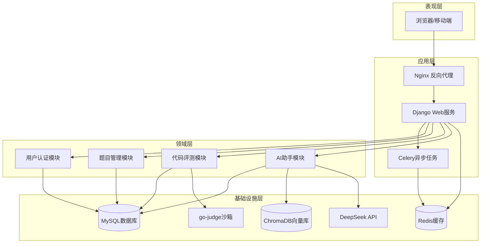
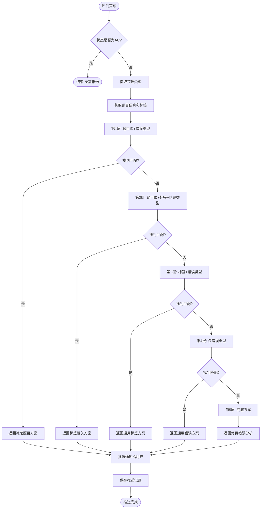
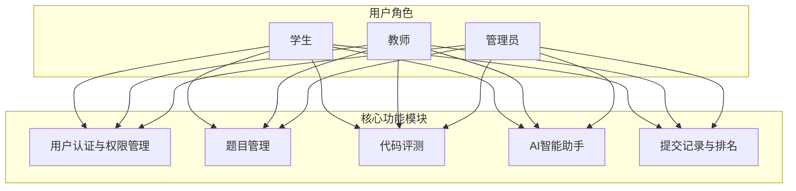
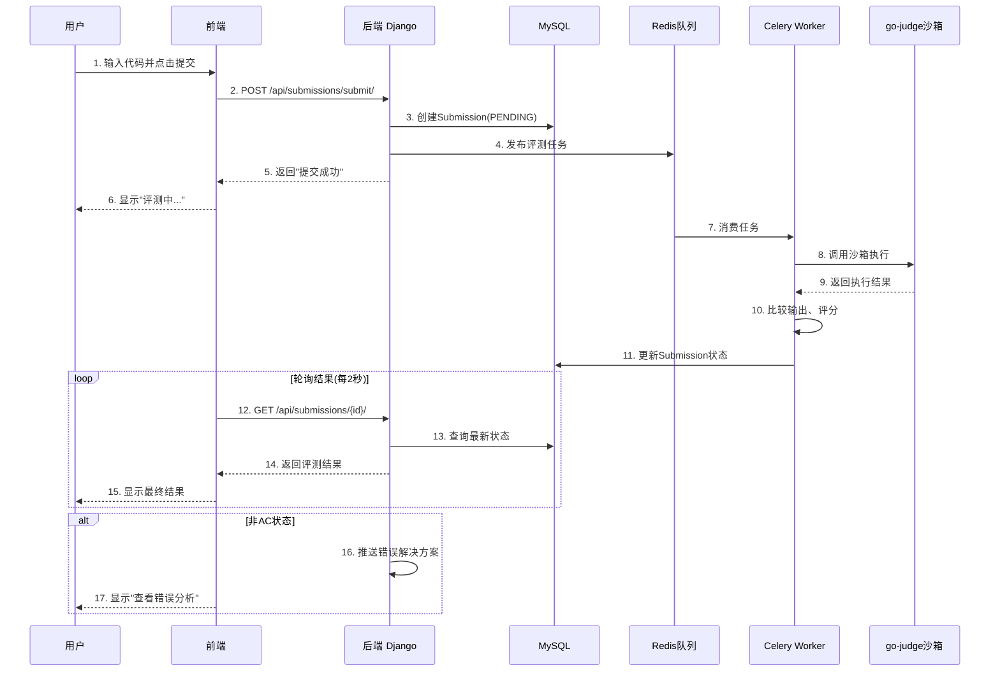
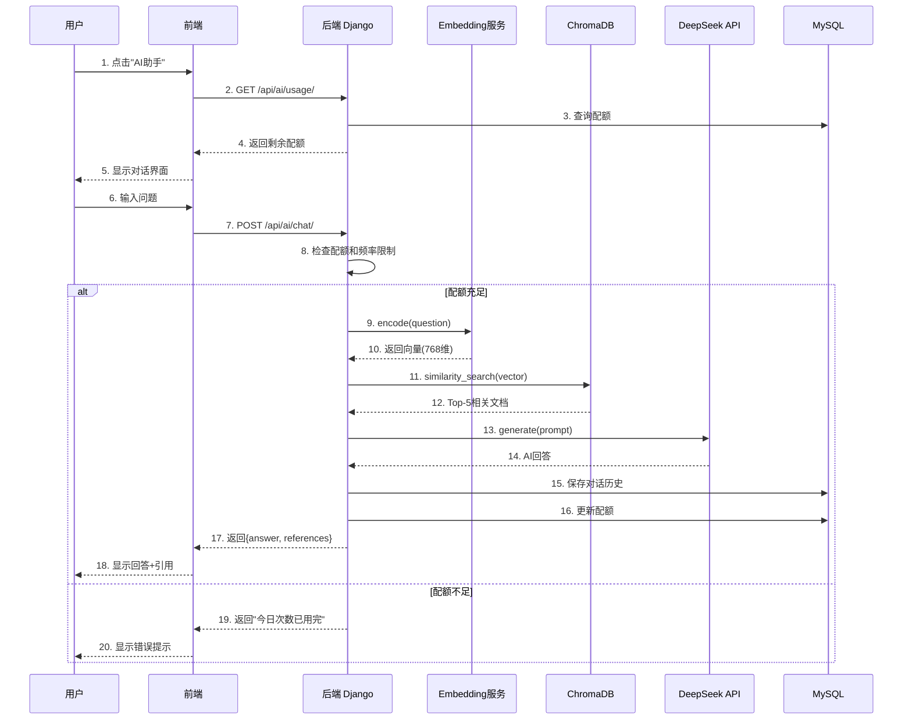
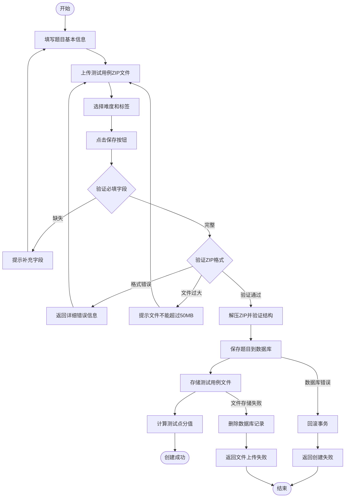

# 第三章 需求分析

## 3.1 引言

随着计算机科学的快速发展和编程教育的普及，在线评测系统（Online Judge System）已成为高校计算机专业教学、算法竞赛训练和程序员技能提升的重要工具。传统的代码评测方式依赖教师手动批改，存在效率低、反馈慢、主观性强等问题。ZJOJ（铸剑在线评测系统）旨在构建一个智能化、自动化的编程学习与评测平台，通过引入人工智能技术，为学生提供个性化的学习辅助和即时的错误诊断。

本章将从功能性需求和非功能性需求两个维度，对 ZJOJ 系统进行全面的分析与阐述。功能性需求包括用户认证与权限管理、题目管理、代码评测、AI 智能助手等核心模块；非功能性需求涵盖性能、安全性、可用性、可扩展性等方面。通过需求分析，明确系统的功能边界和技术指标，为后续的系统设计与实现奠定基础。

### 3.1.1 系统总体架构

ZJOJ 系统采用前后端分离的 B/S 架构，整体分为表现层、应用层、领域层和基础设施层四层结构：



**图 3-1 ZJOJ 系统总体架构图**

系统各层职责如下：

1. **表现层**：基于 Vue 3 + Element Plus 的前端单页应用，提供用户交互界面
2. **应用层**：Django REST Framework 提供 RESTful API，Nginx 作为反向代理和静态文件服务器，Celery 处理异步任务
3. **领域层**：包含四个核心业务模块，实现具体的业务逻辑
4. **基础设施层**：提供数据持久化、消息队列、代码沙箱、向量检索和 AI 能力支持

---

## 3.2 用户需求分析

### 3.2.1 目标用户群体

ZJOJ 系统面向三类主要用户群体，每类用户具有不同的使用场景和需求：

#### 1. 学生用户

**用户特征**：
- 计算机相关专业本科生或研究生
- 正在学习数据结构、算法设计等课程
- 准备参加 ACM/ICPC、蓝桥杯等编程竞赛
- 具备基础的编程能力，但缺乏系统的训练和即时反馈

**核心需求**：
- **便捷的题目练习**：能够浏览题目列表、查看题目详情、提交代码并获取即时评测结果
- **详细的错误诊断**：当代码出现错误时，希望获得具体的错误原因分析和改进建议，而不仅仅是"Wrong Answer"
- **个性化学习辅助**：遇到难题时，能够通过 AI 助手获得解题思路提示和相关知识点讲解
- **学习进度跟踪**：查看自己的提交历史、通过率统计、薄弱知识点分析
- **班级管理**：加入教师创建的班级，参与班级内的竞赛和作业

**典型使用场景**：
```
场景1：日常练习
学生小明在学习动态规划算法，他在 ZJOJ 平台上搜索"动态规划"标签的题目，
选择一道中等难度的背包问题，阅读题目描述后编写 C++ 代码并提交。
系统在 2 秒内返回评测结果"Accepted"，小明获得成就感并继续下一题。

场景2：错误调试
学生小红提交了一道图论题目，系统返回"Wrong Answer"。她点击"查看错误解决方案"，
系统推送了针对该题目的 WA 常见原因分析，包括边界条件处理、数据类型溢出等。
小红根据提示修改代码后重新提交，成功通过。

场景3：AI 问答
学生在做题时遇到不理解的概念，点击 AI 助手提问："请解释 Dijkstra 算法的原理"。
AI 助手基于 RAG 技术检索相关知识库，生成包含算法原理、伪代码、复杂度分析的详细回答，
并引用了平台上的相关题目作为练习推荐。
```

#### 2. 教师用户

**用户特征**：
- 高校计算机专业教师或培训机构讲师
- 负责算法课程教学和编程竞赛指导
- 需要管理多个班级的学生学习进度
- 关注教学效果和学生能力提升

**核心需求**：
- **题目管理**：能够创建、编辑、删除题目，上传测试用例，设置题目难度和标签
- **班级管理**：创建班级、邀请学生加入、分配作业和竞赛
- **学情分析**：查看班级整体学习情况、学生个人进度、常见错误类型统计
- **作业布置**：为学生布置课后作业，设置截止时间，自动收集提交记录
- **竞赛组织**：举办在线编程竞赛，实时排名，防止作弊

**典型使用场景**：
```
场景1：创建作业
张老师要为"数据结构"课程设计一次关于二叉树的作业。他在平台上创建 5 道二叉树相关题目，
设置难度为"中等"，添加标签"二叉树"、"递归"，然后将这些题目组成作业发布给"2024级计科1班"，
设置截止时间为下周日晚 23:59。

场景2：学情分析
张老师打开"学情分析报告"，系统显示班级整体通过率为 75%，其中"动态规划"专题通过率最低（仅 45%）。
报告还列出了常见错误类型分布：WA 占 60%、TLE 占 25%、RE 占 15%。
张老师决定在下节课重点讲解动态规划的常见陷阱。

场景3：竞赛监考
李老师组织了一场校内编程竞赛，参赛学生 50 人，比赛时长 3 小时。
他通过平台的"实时监控"功能查看每位学生的提交情况、排名变化，
系统自动检测代码相似度，标记出 2 对疑似抄袭的学生供教师审查。
```

#### 3. 系统管理员

**用户特征**：
- 负责平台运维和技术支持
- 关注系统稳定性、安全性和性能
- 需要处理用户反馈和系统故障

**核心需求**：
- **用户管理**：查看所有用户信息、禁用违规账号、重置密码
- **系统监控**：实时监控服务器状态、数据库性能、API 响应时间
- **数据备份**：定期备份数据库和用户文件，支持灾难恢复
- **配置管理**：管理系统参数、API Key、限流策略等
- **日志审计**：查看系统操作日志、异常日志，追踪问题根源

**典型使用场景**：
```
场景1：系统维护
管理员小王收到监控告警，发现 go-judge 沙箱服务响应时间超过 5 秒。
他登录服务器检查 Docker 容器状态，重启 go-judge 服务，问题解决。
随后他查看日志，发现是由于并发评测任务过多导致资源竞争，
于是调整 Celery Worker 的并发数从 2 增加到 4。

场景2：数据备份
每月 1 日凌晨 2 点，系统自动执行数据库备份脚本，将 MySQL 数据导出为 SQL 文件，
压缩后存储到云存储（OSS），保留最近 12 个月的备份。
同时备份用户上传的测试用例文件和头像图片。
```

---

### 3.2.2 用户角色与权限

ZJOJ 系统采用基于角色的访问控制（RBAC, Role-Based Access Control）模型，定义三种用户角色及其权限：

| 权限项 | 学生 | 教师 | 管理员 |
|--------|------|------|--------|
| **用户管理** | 查看/修改个人信息 | 查看本班学生信息 | 查看所有用户、禁用账号 |
| **题目浏览** | ✅ | ✅ | ✅ |
| **题目创建** | ❌ | ✅ | ✅ |
| **题目编辑** | ❌ | 仅自己创建的 | ✅ |
| **题目删除** | ❌ | 仅自己创建的 | ✅ |
| **代码提交** | ✅ | ✅ | ✅ |
| **提交查看** | 仅自己的 | 本班学生的 | 所有用户的 |
| **班级管理** | 加入班级 | 创建/管理班级 | 查看所有班级 |
| **AI 问答** | ✅ (每日限额) | ✅ (每日限额) | ✅ (无限制) |
| **学情分析** | 查看个人报告 | 查看班级报告 | 查看全局统计 |
| **系统配置** | ❌ | ❌ | ✅ |
| **数据备份** | ❌ | ❌ | ✅ |

**权限设计原则**：
1. **最小权限原则**：每个角色只拥有完成其任务所需的最小权限集
2. **职责分离**：不同角色的权限互不重叠，避免权限滥用
3. **继承关系**：管理员拥有所有权限，教师权限是学生权限的超集（部分除外）

---

## 3.3 功能性需求分析

### 3.3.1 用户认证与权限管理模块

#### 需求描述

提供安全、便捷的用户注册、登录、身份验证和权限控制功能，确保系统资源的安全访问。

#### 功能需求

**FR-001：用户注册**
- **输入**：用户名、密码、邮箱、角色（学生/教师）
- **处理**：
  - 验证用户名唯一性
  - 验证密码强度（至少 8 位，包含字母和数字）
  - 验证邮箱格式
  - 对用户密码进行哈希加密（PBKDF2 + SHA256）
  - 创建用户记录，默认角色为"学生"
- **输出**：注册成功提示，自动登录并返回 JWT Token
- **异常处理**：
  - 用户名已存在 → 返回"用户名已被注册"
  - 邮箱已注册 → 返回"该邮箱已绑定其他账号"
  - 密码强度不足 → 返回"密码需至少 8 位且包含字母和数字"

**FR-002：用户登录**
- **输入**：用户名/邮箱、密码
- **处理**：
  - 验证用户名和密码匹配
  - 检查账号是否被禁用
  - 生成 JWT Token（有效期 24 小时）
  - 记录登录日志（IP、时间）
- **输出**：JWT Token、用户基本信息（ID、用户名、角色、头像）
- **异常处理**：
  - 用户名或密码错误 → 返回"用户名或密码错误"（不区分具体错误，防止枚举攻击）
  - 账号被禁用 → 返回"账号已被禁用，请联系管理员"

**FR-003：Token 验证与刷新**
- **输入**：JWT Token
- **处理**：
  - 验证 Token 签名有效性
  - 检查 Token 是否过期
  - 从 Token 中提取用户 ID 和角色
  - 查询数据库获取最新用户信息
- **输出**：用户对象（用于后续请求的身份识别）
- **异常处理**：
  - Token 无效 → 返回 401 Unauthorized
  - Token 过期 → 返回 401，前端引导用户重新登录

**FR-004：用户信息管理**
- **输入**：用户 ID、待更新字段（昵称、头像、简介等）
- **处理**：
  - 验证用户只能修改自己的信息
  - 验证输入数据合法性
  - 更新数据库记录
- **输出**：更新后的用户信息
- **异常处理**：
  - 尝试修改他人信息 → 返回 403 Forbidden
  - 头像文件格式不支持 → 返回"仅支持 JPG、PNG 格式"

**FR-005：班级管理**
- **输入**：班级名称、描述、邀请码
- **处理**：
  - 教师创建班级，生成唯一邀请码
  - 学生使用邀请码加入班级
  - 教师可查看班级成员列表
- **输出**：班级信息、成员列表
- **异常处理**：
  - 邀请码错误 → 返回"邀请码无效"
  - 重复加入 → 返回"您已是该班级成员"

#### 业务规则

1. **密码安全**：禁止明文存储密码，必须使用加盐哈希
2. **Token 有效期**：Access Token 24 小时，Refresh Token 7 天
3. **登录失败限制**：连续 5 次登录失败后锁定账号 15 分钟
4. **会话管理**：同一用户最多同时登录 3 个设备，超出后踢出最早登录的设备

---

### 3.3.2 题目管理模块

#### 需求描述

提供题目的创建、编辑、删除、查询和分类管理功能，支持多种编程语言和测试用例管理。

#### 功能需求

**FR-006：题目创建**
- **输入**：
  - 题目标题、描述（Markdown 格式）
  - 输入格式、输出格式
  - 样例输入、样例输出
  - 时间限制（ms）、内存限制（MB）
  - 难度等级（简单/中等/困难）
  - 标签列表（动态规划、图论、字符串等）
  - 测试用例 ZIP 文件
- **处理**：
  - 验证必填字段完整性
  - 解析 Markdown 描述，检查语法
  - 解压 ZIP 文件，验证测试用例格式（`testdata/{n}.in` 和 `{n}.out`）
  - 计算测试点数量，设置每个测试点分值（100 / 测试点数）
  - 保存题目信息到数据库
  - 存储测试用例文件到媒体目录（`media/problems/{id}/testcases.zip`）
- **输出**：题目 ID、创建成功提示
- **异常处理**：
  - 缺少必填字段 → 返回"请填写完整题目信息"
  - 测试用例格式错误 → 返回"测试用例格式不正确，应为 testdata/{n}.in 和 {n}.out"
  - ZIP 文件过大（>50MB）→ 返回"测试用例文件不能超过 50MB"

**FR-007：题目查询与筛选**
- **输入**：筛选条件（关键词、标签、难度、创建者）
- **处理**：
  - 支持模糊搜索标题和描述
  - 支持按标签过滤（多选）
  - 支持按难度排序
  - 支持分页（每页 20 条）
- **输出**：题目列表（含标题、难度、标签、通过率、提交数）
- **性能要求**：查询响应时间 < 500ms（10000 道题规模）

**FR-008：题目详情查看**
- **输入**：题目 ID
- **处理**：
  - 查询题目详细信息
  - 渲染 Markdown 描述为 HTML
  - 统计该题目的提交数、通过率、平均得分
  - 查询当前用户的提交历史（如有）
- **输出**：题目详情（标题、描述、输入输出格式、样例、限制条件、统计信息）

**FR-009：题目编辑与删除**
- **输入**：题目 ID、更新字段
- **处理**：
  - 验证用户权限（仅创建者或管理员可编辑）
  - 更新数据库记录
  - 如更新测试用例，删除旧文件，保存新文件
- **输出**：更新成功提示
- **异常处理**：
  - 无权限编辑 → 返回 403 Forbidden
  - 题目已被引用（有提交记录）→ 警告"修改可能影响已有提交记录"

**FR-010：测试用例管理**
- **输入**：题目 ID、新的测试用例 ZIP 文件
- **处理**：
  - 验证 ZIP 文件格式
  - 备份原有测试用例
  - 替换为新文件
  - 重新计算测试点数量和分值
- **输出**：更新成功提示
- **异常处理**：
  - 格式错误 → 返回详细错误信息（缺失的文件名）
  - 文件损坏 → 返回"ZIP 文件损坏，无法解压"

#### 业务规则

1. **题目可见性**：默认公开，教师可设置为"仅班级可见"
2. **测试用例保密**：学生只能看到样例输入输出，无法下载完整测试用例
3. **标签管理**：标签由管理员预定义，教师只能选择已有标签，不能随意创建
4. **难度评定**：初始难度由创建者设定，系统根据通过率自动调整（通过率 >80% → 简单，50%-80% → 中等，<50% → 困难）

---

### 3.3.3 代码评测模块

#### 需求描述

提供安全、高效的代码编译、执行和评测功能，支持多种编程语言，返回详细的评测结果和错误信息。

#### 功能需求

**FR-011：代码提交**
- **输入**：
  - 题目 ID
  - 源代码
  - 编程语言（C/C++/Python/Java）
- **处理**：
  - 验证代码长度（不超过 100KB）
  - 验证语言是否在支持列表中
  - 创建 Submission 记录，状态设为"PENDING"
  - 异步触发评测任务（Celery）
- **输出**：提交 ID、"提交成功，评测中..."提示
- **异常处理**：
  - 代码过长 → 返回"代码长度不能超过 100KB"
  - 不支持的语言 → 返回"暂不支持该编程语言"

**FR-012：代码编译**
- **输入**：源代码、编程语言
- **处理**：
  - C/C++：调用 `g++` 编译，设置 `-O2` 优化
  - Java：调用 `javac` 编译
  - Python：跳过编译，直接执行
  - 捕获编译错误信息（stderr）
- **输出**：
  - 成功：生成可执行文件
  - 失败：返回编译错误信息（CE 状态）
- **性能要求**：编译时间 < 10 秒

**FR-013：代码执行与资源限制**
- **输入**：可执行文件、测试用例输入、时间限制、内存限制
- **处理**：
  - 调用 go-judge 沙箱执行代码
  - 设置 cgroup 资源限制：
    - CPU 时间：题目设定的时间限制（ms）
    - 内存：题目设定的内存限制（MB）
    - 进程数：最多 50 个（防止 fork bomb）
  - 禁用网络访问
  - 文件系统隔离（chroot）
  - 捕获 stdout、stderr、退出码、运行时间、内存使用
- **输出**：执行结果（stdout、stderr、exit_code、time、memory）
- **异常处理**：
  - 超时 → 返回 TLE（Time Limit Exceeded）
  - 超内存 → 返回 MLE（Memory Limit Exceeded）
  - 运行时错误 → 返回 RE（Runtime Error）及错误信息

**FR-014：输出比较与评分**
- **输入**：实际输出、期望输出
- **处理**：
  - 规范化空白字符（去除首尾空格、合并连续空格、忽略行尾空格）
  - 逐行比较
  - 判断是否完全匹配
  - 计算该测试点得分（通过则得满分，否则 0 分）
- **输出**：测试点状态（AC/WA）、得分
- **特殊规则**：
  - 浮点数比较：允许误差 ±1e-6
  - 多解问题：支持 Special Judge（自定义校验器，未来扩展）

**FR-015：评测结果聚合**
- **输入**：所有测试点的评测结果
- **处理**：
  - 计算总分（各测试点得分之和）
  - 确定最终状态（取最差状态：SE > CE > RE > TLE > MLE > WA > AC）
  - 计算最大运行时间和内存使用
  - 更新 Submission 记录
- **输出**：
  - 最终状态（AC/WA/TLE/MLE/RE/CE/SE）
  - 总分（0-100）
  - 总运行时间（ms）
  - 总内存使用（KB）
  - 各测试点详细结果列表

**FR-016：评测结果查询**
- **输入**：提交 ID
- **处理**：
  - 查询 Submission 记录
  - 如状态仍为"PENDING"，返回"评测中"
  - 如已完成，返回详细结果
- **输出**：评测结果（状态、得分、时间、内存、各测试点详情）
- **前端交互**：前端每 2 秒轮询一次，直到状态变为非"PENDING"

#### 业务规则

1. **评测优先级**：按提交时间顺序排队，先进先出（FIFO）
2. **重试机制**：如评测过程出现系统错误（SE），自动重试最多 2 次
3. **并发限制**：每个用户同时最多有 5 个待评测的提交，超出则拒绝新提交
4. **评测超时**：单个测试点执行时间不超过题目限制的 2 倍，防止死循环占用资源
5. **结果缓存**：相同代码、相同题目的提交，如已有评测结果，可直接复用（未来优化）

---

### 3.3.4 AI 智能助手模块

#### 需求描述

基于 RAG（检索增强生成）架构，提供智能问答、错误解决方案推送、学情分析等 AI 辅助功能，帮助学生高效学习和调试代码。

#### 功能需求

**FR-017：AI 智能问答**
- **输入**：
  - 用户问题（文本）
  - 可选上下文（题目 ID、错误类型等）
- **处理**：
  - 检查用户当日配额（学生/教师每日 20 次）
  - 检查频率限制（60 秒内最多 10 次）
  - 使用 text2vec 模型将问题转换为向量（768 维）
  - 在 ChromaDB 中检索 Top-5 相关文档（余弦相似度）
  - 组装提示词（系统提示 + 检索到的知识 + 用户问题）
  - 调用 DeepSeek API 生成回答
  - 保存对话历史到数据库
  - 更新用户使用配额
- **输出**：
  - AI 回答（Markdown 格式）
  - 引用来源列表（文档标题、相似度）
  - 剩余配额
- **异常处理**：
  - 配额用完 → 返回"今日提问次数已用完，明日重置"
  - 频率超限 → 返回"请求过于频繁，请稍后再试"
  - DeepSeek API 失败 → 返回"AI 服务暂时不可用，请稍后重试"

**FR-018：知识库管理**
- **输入**：
  - 文档标题、内容、类型（题目解析/错误解决方案/算法模板）
  - 关联标签、错误类型
- **处理**：
  - 验证文档内容完整性
  - 使用 text2vec 模型将文档内容转换为向量
  - 存储到 ChromaDB（向量 + 元数据）
  - 存储到 MySQL（文档基本信息）
- **输出**：文档 ID、存储成功提示
- **批量导入**：支持从 Markdown 文件批量导入知识库文档

**FR-019：错误解决方案推送**
- **触发条件**：用户提交代码后，评测结果为非 AC（WA/TLE/RE/MLE/CE）
- **处理**：
  - 提取错误类型（WA/TLE/RE 等）
  - 获取题目信息和标签
  - 执行 5 层优先级查询策略：
    1. 题目 ID + 错误类型（最精确）
    2. 题目 ID + 标签 + 错误类型
    3. 标签 + 错误类型
    4. 仅错误类型（通用方案）
    5. 兜底方案（常见错误分析）
  - 返回匹配的解决方案（完整内容，不截断）
  - 推送通知给用户（WebSocket 或前端轮询）
- **输出**：
  - 解决方案标题
  - 解决方案内容（Markdown 格式，包含代码示例）
  - 错误类型
  - 来源（特定题目/通用方案）



**图 3-7 错误解决方案推送流程图**

**FR-020：学情分析报告**
- **输入**：用户 ID（学生）或班级 ID（教师）
- **处理**：
  - 查询用户/班级的所有提交记录
  - 统计分析：
    - 总提交数、通过数、通过率
    - 各难度题目的完成情况
    - 各标签专题的掌握程度
    - 常见错误类型分布（WA/TLE/RE 占比）
    - 学习时间分布（按天/周统计）
  - 生成可视化图表数据（ECharts 格式）
  - 给出个性化建议（基于薄弱知识点）
- **输出**：
  - 统计数据（JSON 格式）
  - 图表数据（折线图、柱状图、饼图）
  - 文字建议（"您在动态规划专题的通过率较低，建议多做相关练习"）

**FR-021：对话历史管理**
- **输入**：用户 ID
- **处理**：
  - 查询用户最近的 100 条对话记录
  - 支持按时间排序、关键词搜索
  - 支持删除单条对话或清空全部历史
- **输出**：对话列表（问题、回答、时间）
- **隐私保护**：用户只能查看自己的对话历史

#### 业务规则

1. **配额管理**：
   - 学生/教师：每日 20 次提问，60 秒内最多 10 次
   - 管理员：无限制
   - 配额每日零点自动重置

2. **缓存策略**：
   - 相同问题的回答缓存 24 小时（基于问题哈希）
   - 缓存命中时直接返回，不调用 DeepSeek API

3. **降级策略**：
   - DeepSeek API 不可用时，返回预设的常见问题答案
   - Embedding 模型加载失败时，降级为关键词匹配

4. **内容安全**：
   - 过滤敏感词汇（政治、暴力、色情等）
   - 记录所有问答日志，用于审计和优化

---

### 3.3.5 提交记录与排名模块

#### 需求描述

提供提交记录的查询、筛选、统计功能，以及实时排行榜展示，激励学生积极参与练习和竞赛。

#### 功能需求

**FR-022：提交记录查询**
- **输入**：筛选条件（用户、题目、状态、语言、时间范围）
- **处理**：
  - 支持多条件组合筛选
  - 支持按时间、得分、运行时间排序
  - 支持分页（每页 20 条）
- **输出**：提交列表（题目、用户、状态、得分、时间、内存、提交时间）

**FR-023：提交详情查看**
- **输入**：提交 ID
- **处理**：
  - 查询提交详细信息
  - 展示源代码（带语法高亮）
  - 展示各测试点结果（状态、时间、内存）
  - 展示评测日志（编译信息、错误信息）
- **输出**：提交详情页面
- **权限控制**：学生只能查看自己的提交详情，教师可查看本班学生，管理员可查看所有

**FR-024：实时排行榜**
- **输入**：题目 ID 或竞赛 ID
- **处理**：
  - 查询所有用户的最佳提交（最高得分、最短时间）
  - 按得分降序、时间升序排序
  - 实时更新（每次有新提交时刷新）
- **输出**：排行榜（排名、用户、得分、时间、提交次数）

**FR-025：个人统计面板**
- **输入**：用户 ID
- **处理**：
  - 统计总提交数、通过数、通过率
  - 统计各语言的提交分布
  - 统计各难度题目的完成情况
  - 计算连续打卡天数
- **输出**：个人统计数据（图表 + 文字）

#### 业务规则

1. **排行榜去重**：同一用户对同一题目只显示最佳成绩
2. **防作弊**：检测代码相似度，标记疑似抄袭的提交
3. **隐私保护**：用户可选择隐藏自己的排名（匿名模式）

---

## 3.4 非功能性需求分析

### 3.4.1 性能需求

#### 响应时间要求

| 操作类型 | 响应时间要求 | 说明 |
|----------|-------------|------|
| **页面加载** | < 2 秒 | 首屏加载时间（FCP） |
| **API 请求** | < 500ms | 普通查询接口（题目列表、用户信息） |
| **代码提交** | < 1 秒 | 提交接口响应（不含评测时间） |
| **评测完成** | < 30 秒 | 从提交到返回结果的总时间（含排队） |
| **AI 问答** | < 10 秒 | 从提问到返回回答的时间 |
| **数据库查询** | < 100ms | 简单查询（主键索引） |
| **复杂查询** | < 1 秒 | 多表 JOIN、聚合统计 |

#### 吞吐量要求

| 指标 | 要求 | 说明 |
|------|------|------|
| **并发用户数** | ≥ 500 | 同时在线用户数 |
| **QPS（查询）** | ≥ 100 | 每秒查询请求数 |
| **QPS（提交）** | ≥ 10 | 每秒代码提交数 |
| **评测并发** | ≥ 20 | 同时执行的评测任务数 |
| **数据库连接池** | 50 | 最大数据库连接数 |

#### 资源利用率要求

| 资源 | 要求 | 说明 |
|------|------|------|
| **CPU 使用率** | < 70% | 正常负载下 |
| **内存使用率** | < 80% | 正常负载下 |
| **磁盘 I/O** | < 80% | 正常负载下 |
| **网络带宽** | < 70% | 正常负载下 |

---

### 3.4.2 安全性需求

#### 认证与授权安全

1. **密码安全**：
   - 使用 PBKDF2 + SHA256 哈希算法
   - 盐值长度 ≥ 16 字节
   - 迭代次数 ≥ 100,000 次
   - 禁止明文传输密码（HTTPS）

2. **Token 安全**：
   - JWT 签名算法：HS256
   - Secret Key 长度 ≥ 32 字节
   - Access Token 有效期：24 小时
   - Refresh Token 有效期：7 天
   - Token 泄露后可主动撤销

3. **会话管理**：
   - 同一用户最多 3 个并发会话
   - 闲置 30 分钟自动登出
   - 登录失败 5 次后锁定 15 分钟

#### 代码沙箱安全

1. **资源隔离**：
   - 使用 Linux cgroup 限制 CPU、内存、进程数
   - 文件系统隔离（chroot）
   - 网络禁用（防止外联）
   - 特权指令禁用（防止提权）

2. **恶意代码防护**：
   - 检测 fork bomb（进程数限制 50）
   - 检测死循环（超时强制终止）
   - 检测系统调用（禁用危险 syscall）
   - 文件大小限制（防止磁盘填满）

3. **沙箱逃逸防护**：
   - 禁用 ptrace、mount 等危险系统调用
   - 限制内核版本（≥ 3.10）
   - 定期更新 go-judge 版本修复漏洞

#### 数据安全

1. **数据传输加密**：
   - 全站 HTTPS（TLS 1.2+）
   - API 请求签名验证
   - 敏感数据（密码、Token）不在日志中记录

2. **数据存储加密**：
   - 密码哈希存储
   - 敏感配置项加密（数据库密码、API Key）
   - 定期备份数据，备份文件加密存储

3. **SQL 注入防护**：
   - 使用 Django ORM，避免原始 SQL
   - 参数化查询
   - 输入验证和清洗

4. **XSS 防护**：
   - Django 模板自动转义
   - CSP（Content Security Policy）头部
   - HTTP-only Cookie

#### API 安全

1. **速率限制**：
   - 匿名用户：100 次/小时
   - 认证用户：1000 次/小时
   - AI 问答：20 次/天，10 次/分钟

2. **CORS 配置**：
   - 仅允许信任的域名跨域访问
   - 禁止通配符 `*`
   - 携带凭证时需明确指定域名

3. **输入验证**：
   - 所有 API 参数必须验证类型、长度、格式
   - 文件上传限制类型和大小
   - 防止路径遍历攻击（`../`）

---

### 3.4.3 可用性需求

#### 系统可用性

| 指标 | 要求 | 说明 |
|------|------|------|
| **系统可用率** | ≥ 99.5% | 全年停机时间 < 44 小时 |
| **故障恢复时间** | < 30 分钟 | MTTR（平均修复时间） |
| **数据备份频率** | 每日 1 次 | 全量备份 |
| **数据保留时间** | ≥ 12 个月 | 备份文件保留期 |

#### 用户体验

1. **界面友好性**：
   - 符合 Material Design 设计规范
   - 响应式布局，支持桌面端和移动端
   - 清晰的导航和面包屑
   - 友好的错误提示（非技术术语）

2. **操作便捷性**：
   - 常用操作 ≤ 3 步完成
   - 支持键盘快捷键（Ctrl+Enter 提交代码）
   - 表单自动保存草稿
   - 撤销操作支持（删除确认）

3. **可访问性**：
   - 符合 WCAG 2.1 AA 标准
   - 支持屏幕阅读器
   - 色盲友好配色
   - 字体大小可调

#### 国际化支持（未来扩展）

- 支持中文、英文切换
- 日期、时间、数字格式本地化
- RTL（从右到左）语言支持

---

### 3.4.4 可靠性需求

#### 容错能力

1. **服务降级**：
   - DeepSeek API 不可用时，AI 问答降级为关键词匹配
   - go-judge 服务不可用时，提交队列等待而非直接失败
   - 数据库主从切换时，读操作自动切换到从库

2. **异常处理**：
   - 所有 API 返回统一的错误格式
   - 记录详细错误日志（堆栈、请求参数）
   - 用户友好的错误提示（不暴露技术细节）

3. **数据一致性**：
   - 使用数据库事务保证原子性
   - 分布式锁防止并发冲突
   - 最终一致性（异步任务）

#### 灾备能力

1. **数据备份**：
   - 每日凌晨 2:00 自动备份 MySQL 数据库
   - 备份文件存储到云存储（OSS/S3）
   - 保留最近 12 个月的备份
   - 每月进行一次恢复演练

2. **故障转移**：
   - MySQL 主从复制，主库故障时自动切换
   - Redis Sentinel 高可用
   - Nginx 负载均衡，后端服务多实例部署

3. **监控告警**：
   - 监控系统资源（CPU、内存、磁盘、网络）
   - 监控服务健康状态（HTTP 健康检查）
   - 监控业务指标（提交数、通过率、API 错误率）
   - 异常时发送告警（邮件、短信、钉钉）

---

### 3.4.5 可扩展性需求

#### 水平扩展

1. **Web 服务扩展**：
   - Gunicorn 支持多 Worker 进程
   - Nginx 负载均衡，支持动态添加后端实例
   - 无状态设计，会话存储在 Redis

2. **数据库扩展**：
   - MySQL 主从复制，读写分离
   - 分库分表（按用户 ID 哈希）
   - 冷热数据分离（历史提交归档）

3. **评测服务扩展**：
   - go-judge 多实例部署，负载均衡
   - Celery Worker 动态扩缩容
   - 任务队列优先级调度

#### 垂直扩展

1. **服务器升级**：
   - 增加 CPU 核心数提高并发处理能力
   - 增加内存支持更多同时在线用户
   - 升级 SSD 加快数据库 I/O

2. **缓存优化**：
   - Redis 缓存热点数据（题目列表、用户信息）
   - CDN 加速静态资源（JS、CSS、图片）
   - 浏览器缓存策略（ETag、Cache-Control）

#### 功能扩展

1. **插件系统**（未来）：
   - 代码风格检查插件
   - 代码查重插件
   - 性能分析插件

2. **多语言支持**（未来）：
   - 国际化（i18n）
   - 多语言界面
   - 时区支持

3. **移动端应用**（未来）：
   - iOS/Android App
   - 小程序
   - PWA（渐进式 Web 应用）

---

### 3.4.6 兼容性需求

#### 浏览器兼容性

| 浏览器 | 最低版本 | 说明 |
|--------|---------|------|
| **Chrome** | 90+ | 推荐使用 |
| **Firefox** | 88+ | 完全支持 |
| **Safari** | 14+ | 完全支持 |
| **Edge** | 90+ | 完全支持 |
| **移动端** | iOS 14+, Android 10+ | 响应式适配 |

#### 编程语言兼容性

| 语言 | 版本 | 编译器/解释器 |
|------|------|--------------|
| **C** | C11 | gcc 9.0+ |
| **C++** | C++17 | g++ 9.0+ |
| **Python** | 3.8+ | python3 |
| **Java** | 11+ | openjdk 11 |

#### 操作系统兼容性

- **服务端**：Ubuntu 20.04 LTS / 22.04 LTS
- **客户端**：Windows 10+, macOS 10.15+, Linux, iOS, Android

---

### 3.4.7 可维护性需求

#### 代码质量

1. **代码规范**：
   - Python：遵循 PEP 8 规范
   - JavaScript：遵循 ESLint 规则
   - Vue：遵循 Vue Style Guide
   - 注释覆盖率 ≥ 30%

2. **单元测试**：
   - 核心模块单元测试覆盖率 ≥ 80%
   - API 接口集成测试覆盖率 ≥ 70%
   - 自动化测试流水线（CI/CD）

3. **文档完整性**：
   - API 文档（Swagger/OpenAPI）
   - 数据库设计文档（ER 图、表结构）
   - 部署文档（Docker Compose、环境变量）
   - 开发文档（架构设计、模块说明）

#### 日志与监控

1. **日志分级**：
   - DEBUG：开发调试信息
   - INFO：正常业务流程
   - WARNING：潜在问题
   - ERROR：错误异常
   - CRITICAL：严重故障

2. **日志保留**：
   - 应用日志：保留 30 天
   - 访问日志：保留 90 天
   - 审计日志：保留 12 个月

3. **监控指标**：
   - 系统指标：CPU、内存、磁盘、网络
   - 应用指标：QPS、响应时间、错误率
   - 业务指标：用户数、提交数、通过率

---

## 3.5 用例分析

### 3.5.1 用例图



**图 3-2 ZJOJ 系统用例图**

### 3.5.2 核心用例描述

#### 用例 1：提交代码评测

**用例名称**：提交代码评测  
**参与者**：学生、教师  
**前置条件**：
- 用户已登录
- 题目存在且可见

**主流程**：



**图 3-3 代码提交流程时序图**

1. 用户进入题目详情页
2. 选择编程语言
3. 在代码编辑器中输入代码
4. 点击"提交"按钮
5. 系统验证代码格式和长度
6. 系统创建 Submission 记录，状态为"PENDING"
7. 系统异步触发评测任务
8. 系统返回"提交成功，评测中..."
9. 前端每 2 秒轮询一次评测状态
10. 评测完成后，显示结果（状态、得分、时间、内存）
11. 如为非 AC 状态，推送错误解决方案

**备选流程**：
- 5a. 代码格式错误 → 返回错误提示，不创建提交记录
- 7a. 评测队列已满 → 返回"系统繁忙，请稍后重试"
- 10a. 评测超时（>60 秒）→ 返回"评测超时，请联系管理员"

**后置条件**：
- Submission 记录状态更新为最终结果
- 用户可查看提交详情
- 排行榜可能更新

**异常处理**：
- 网络中断 → 前端显示"网络连接失败，请检查网络"
- 服务器错误 → 返回 500，记录错误日志

---

#### 用例 2：AI 智能问答

**用例名称**：AI 智能问答  
**参与者**：学生、教师  
**前置条件**：
- 用户已登录
- 当日配额未用完

**主流程**：



**图 3-4 AI问答流程时序图**

1. 用户点击"AI 助手"按钮
2. 系统显示对话界面和使用统计
3. 用户在输入框中输入问题
4. 用户点击"发送"或按 Ctrl+Enter
5. 系统检查配额和频率限制
6. 系统将问题转换为向量
7. 系统在 ChromaDB 中检索相关知识
8. 系统组装提示词并调用 DeepSeek API
9. 系统接收 AI 回答并保存对话历史
10. 系统更新用户配额
11. 系统显示回答和引用来源

**备选流程**：
- 5a. 配额用完 → 返回"今日提问次数已用完"
- 5b. 频率超限 → 返回"请求过于频繁，请稍后再试"
- 8a. DeepSeek API 失败 → 返回"AI 服务暂时不可用"

**后置条件**：
- 对话历史保存到数据库
- 用户配额减少 1

**异常处理**：
- 网络超时 → 返回"请求超时，请重试"
- 内容违规 → 返回"问题包含敏感内容，请修改后重试"

---

#### 用例 3：创建题目

**用例名称**：创建题目  
**参与者**：教师、管理员  
**前置条件**：
- 用户已登录且具有教师或管理员权限

**主流程**：



**图 3-5 题目创建流程图**

1. 用户点击"创建题目"按钮
2. 系统显示题目创建表单
3. 用户填写题目信息（标题、描述、输入输出格式、样例等）
4. 用户上传测试用例 ZIP 文件
5. 用户选择难度等级和标签
6. 用户点击"保存"按钮
7. 系统验证必填字段完整性
8. 系统解压 ZIP 文件并验证格式
9. 系统保存题目信息到数据库
10. 系统存储测试用例文件
11. 系统返回"创建成功"和题目 ID

**备选流程**：
- 7a. 缺少必填字段 → 高亮缺失字段，提示用户补充
- 8a. ZIP 格式错误 → 返回详细错误信息（缺失的文件名）
- 8b. 文件过大（>50MB）→ 返回"文件不能超过 50MB"

**后置条件**：
- 题目记录创建成功
- 测试用例文件存储到媒体目录
- 题目默认可见（除非设置为"仅班级可见"）

**异常处理**：
- 数据库写入失败 → 回滚事务，返回"创建失败，请重试"
- 文件存储失败 → 删除数据库记录，返回"文件上传失败"

---

## 3.6 数据需求分析

### 3.6.1 数据实体

ZJOJ 系统涉及的主要数据实体包括：

| 实体 | 说明 | 主要属性 |
|------|------|----------|
| **User** | 用户 | ID、用户名、密码哈希、邮箱、角色、头像、创建时间 |
| **Class** | 班级 | ID、名称、描述、邀请码、创建者、创建时间 |
| **Problem** | 题目 | ID、标题、描述、输入格式、输出格式、时间限制、内存限制、难度、标签、测试用例文件 |
| **Tag** | 标签 | ID、名称、颜色 |
| **Submission** | 提交记录 | ID、题目 ID、用户 ID、代码、语言、状态、得分、时间、内存、提交时间、评测时间 |
| **TestCase** | 测试用例 | ID、题目 ID、输入文件、输出文件、分值 |
| **KnowledgeBase** | 知识库文档 | ID、标题、内容、类型、标签、错误类型、向量嵌入 |
| **Conversation** | 对话历史 | ID、用户 ID、问题、回答、引用文档、时间 |
| **AIUsage** | AI 使用记录 | ID、用户 ID、日期、使用次数、剩余配额 |

### 3.6.2 数据关系

```mermaid
erDiagram
    User ||--o{ Submission : creates
    User ||--o{ Conversation : has
    User ||--o{ AIUsage : tracks
    User }|--o{ ClassMember : belongs_to
    
    Problem ||--o{ Submission : receives
    Problem ||--o{ TestCase : contains
    Problem }|--o{ ProblemTag : has
    
    Tag ||--o{ ProblemTag : categorized_by
    
    Class ||--o{ ClassMember : includes
    
    KnowledgeBase ||--o{ Conversation : referenced_in
    
    User {
        int id PK
        string username UK
        string password
        string email UK
        string role
        string avatar
        datetime created_at
    }
    
    Problem {
        int id PK
        string title
        text description
        int time_limit
        int memory_limit
        string difficulty
        string testcases_file
        int created_by FK
        datetime created_at
    }
    
    Submission {
        int id PK
        int problem_id FK
        int user_id FK
        text code
        string language
        string status
        int score
        int time_used
        int memory_used
        datetime submitted_at
        datetime judged_at
    }
    
    TestCase {
        int id PK
        int problem_id FK
        string input_file
        string output_file
        int score
    }
    
    Tag {
        int id PK
        string name UK
        string color
    }
    
    Class {
        int id PK
        string name
        string description
        string invite_code UK
        int created_by FK
        datetime created_at
    }
    
    KnowledgeBase {
        int id PK
        string title
        text content
        string doc_type
        string error_type
        vector embedding
        datetime created_at
    }
    
    Conversation {
        int id PK
        int user_id FK
        text question
        text answer
        json references
        datetime created_at
    }
    
    AIUsage {
        int id PK
        int user_id FK
        date usage_date
        int used_count
        int remaining_quota
    }
```

**图 3-6 ZJOJ 系统 ER 图（实体关系图）**

### 3.6.3 数据量估算

| 数据类型 | 日均增长 | 年增长率 | 3年预估总量 |
|----------|---------|---------|------------|
| **用户数** | 10 人 | 20% | 15,000 人 |
| **题目数** | 2 道 | 10% | 3,000 道 |
| **提交记录** | 500 条 | 30% | 1,000,000 条 |
| **对话记录** | 200 条 | 50% | 300,000 条 |
| **知识库文档** | 5 篇 | 20% | 5,000 篇 |

**存储空间估算**：
- MySQL 数据库：约 50GB（3年）
- 测试用例文件：约 100GB（3年）
- ChromaDB 向量库：约 10GB（3年）
- 日志文件：约 200GB/年

---

## 3.7 本章小结

本章从用户需求、功能性需求、非功能性需求三个维度对 ZJOJ 系统进行了全面的需求分析。

**用户需求方面**，明确了学生、教师、管理员三类用户的核心诉求和使用场景，设计了基于 RBAC 的权限模型，确保系统资源的安全访问。

**功能性需求方面**，详细分析了五大核心模块：
1. **用户认证与权限管理**：提供安全的注册、登录、Token 验证和班级管理功能
2. **题目管理**：支持题目的 CRUD 操作、标签分类和测试用例管理
3. **代码评测**：基于 go-judge 沙箱实现安全、高效的代码编译、执行和评测
4. **AI 智能助手**：基于 RAG 架构提供智能问答、错误解决方案推送和学情分析
5. **提交记录与排名**：提供丰富的查询、统计和排行榜功能

**非功能性需求方面**，制定了严格的性能、安全、可用性、可靠性、可扩展性、兼容性和可维护性指标，确保系统能够满足生产环境的要求。

通过用例分析和数据需求分析，进一步明确了系统的业务流程和数据模型，为下一章的系统设计提供了清晰的指导和依据。

下一步，第四章将基于本章的需求分析，进行系统的总体设计和详细设计，包括架构设计、数据库设计、接口设计等。

---

## 附录：本章图表清单

| 图号 | 图名 | 说明 |
|------|------|------|
| 图 3-1 | ZJOJ 系统总体架构图 | 展示四层架构及各组件关系 |
| 图 3-2 | ZJOJ 系统用例图 | 展示三类用户及其可用功能 |
| 图 3-3 | 代码提交流程时序图 | 展示从提交到评测完成的完整流程 |
| 图 3-4 | AI问答流程时序图 | 展示 RAG 问答的完整交互过程 |
| 图 3-5 | 题目创建流程图 | 展示题目创建的步骤和异常处理 |
| 图 3-6 | ZJOJ 系统 ER 图 | 展示9个核心实体及其关系 |
| 图 3-7 | 错误解决方案推送流程图 | 展示5层优先级查询策略 |
